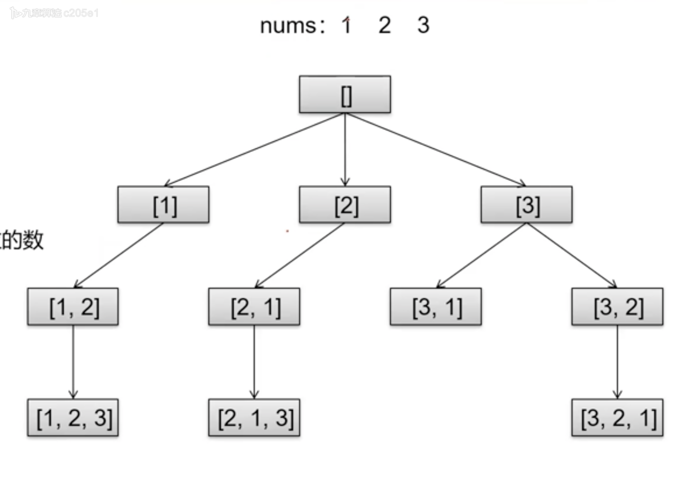
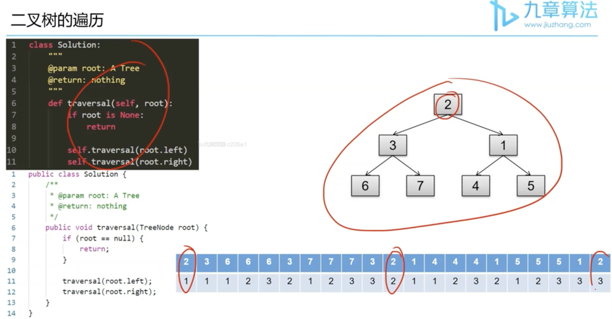
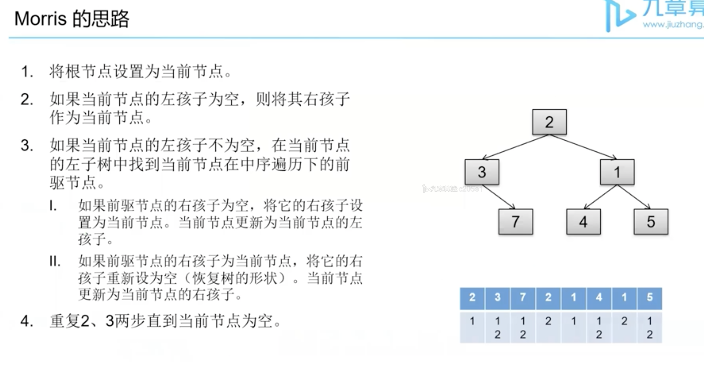
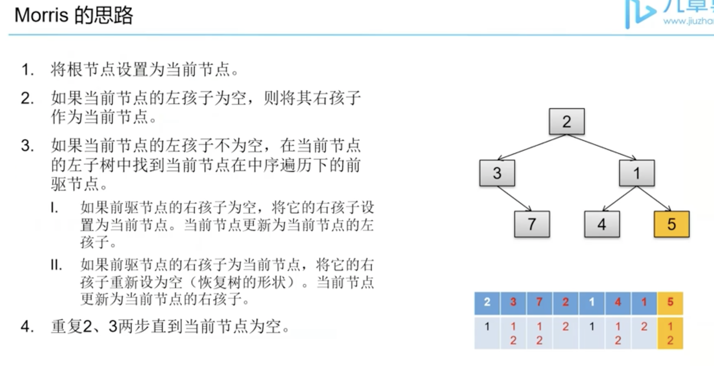
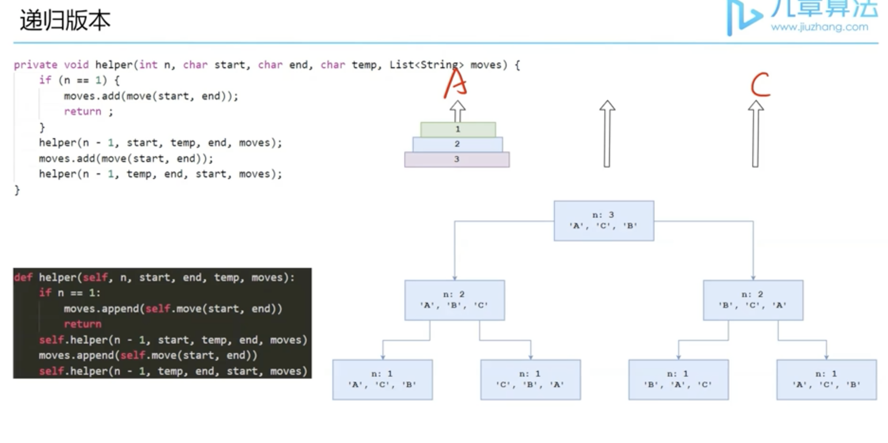
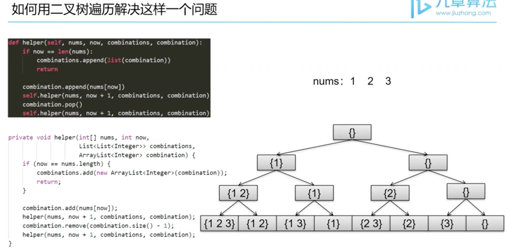
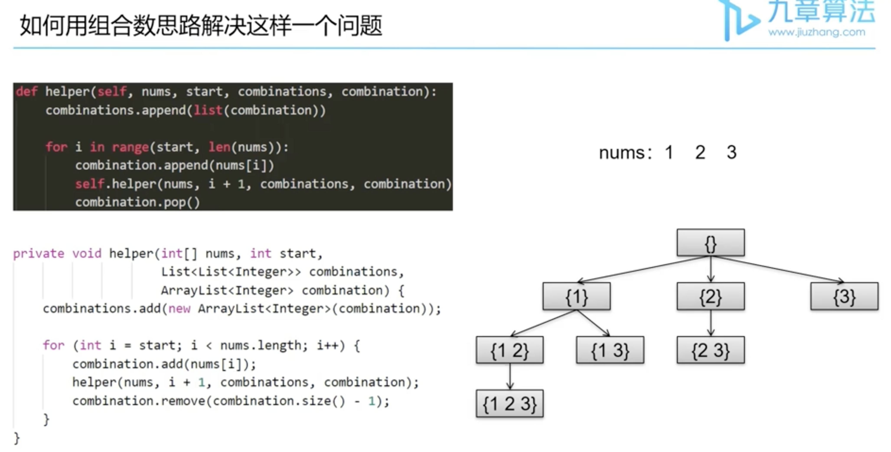
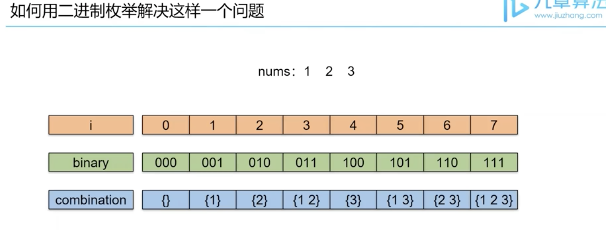
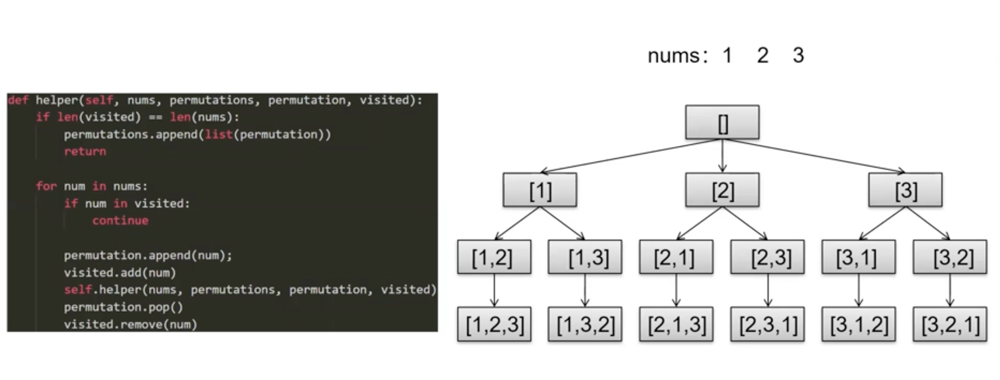
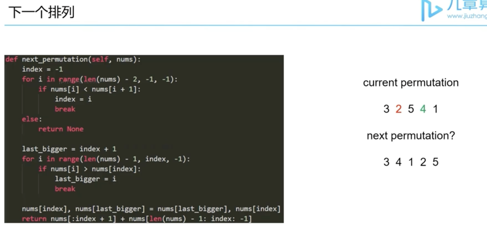

+++
title = 'Recursion'
date = 2022-06-17T10:36:13-04:00
+++

Covered all topics of Recursion
<!--more-->

<!-- vim-markdown-toc GFM -->

* [Chapter 1: 参数传递和递归](#chapter-1-参数传递和递归)
* [Chapter 2: 单向递归--递归vs循环](#chapter-2-单向递归--递归vs循环)
  * [二阶阶乘](#二阶阶乘)
    * [普通递归](#普通递归)
    * [普通递归 --> 尾递归](#普通递归----尾递归)
    * [尾递归 --> 迭代](#尾递归----迭代)
  * [颠倒二进制位](#颠倒二进制位)
    * [普通递归](#普通递归-1)
    * [普通递归 --> 尾递归](#普通递归----尾递归-1)
    * [尾递归 --> 迭代](#尾递归----迭代-1)
  * [Exercise: 寻找最大值](#exercise-寻找最大值)
    * [普通递归](#普通递归-2)
    * [普通递归 --> 尾递归](#普通递归----尾递归-2)
    * [尾递归 --> 迭代](#尾递归----迭代-2)
* [Chapter 3: 单向递归--递归的妙用](#chapter-3-单向递归--递归的妙用)
  * [两两交换链表中的节点](#两两交换链表中的节点)
    * [递归的方式](#递归的方式)
    * [迭代的方式](#迭代的方式)
  * [经典二分查找问题](#经典二分查找问题)
    * [普通写法的递归方式: Time Limit Exceeded](#普通写法的递归方式-time-limit-exceeded)
    * [二分查找的递归方式](#二分查找的递归方式)
  * [快速幂](#快速幂)
    * [普通写法的递归方式:](#普通写法的递归方式)
      * [递归求解a^n](#递归求解an)
      * [递归求解(a^n) % b: Fail](#递归求解an--b-fail)
    * [快速幂的递归方式: Pass](#快速幂的递归方式-pass)
    * [快速幂的迭代形式: Pass](#快速幂的迭代形式-pass)
  * [Exercise: 14. 二分查找](#exercise-14-二分查找)
    * [classic method](#classic-method)
    * [recursion method](#recursion-method)
    * [recursion method version 2](#recursion-method-version-2)
  * [Exercise: 458. 目标最后位置](#exercise-458-目标最后位置)
    * [classic method](#classic-method-1)
    * [recursion method](#recursion-method-1)
    * [recursion method version 2](#recursion-method-version-2-1)
  * [In summary:](#in-summary)
* [Chapter 4: 双向递归--二叉树的遍历与递归树](#chapter-4-双向递归--二叉树的遍历与递归树)
  * [二叉树的深度优先遍历](#二叉树的深度优先遍历)
  * [递归，二叉树的遍历：](#递归二叉树的遍历)
  * [斐波那契数列](#斐波那契数列)
    * [memorization of fibonacci](#memorization-of-fibonacci)
  * [汉诺塔](#汉诺塔)
  * [Exercise: 1300. 巴什博弈](#exercise-1300-巴什博弈)
    * [memorization optimization](#memorization-optimization)
    * [递归的核心思想：由大化小：Best Solution](#递归的核心思想由大化小best-solution)
  * [In summary](#in-summary-1)
* [Chapter 5: 双向递归--二叉树的分治](#chapter-5-双向递归--二叉树的分治)
  * [分治法 vs 递归](#分治法-vs-递归)
  * [适合分治法的数据结构](#适合分治法的数据结构)
  * [二叉树上分治模版(template of Divide and Conquer for Binary Tree)](#二叉树上分治模版template-of-divide-and-conquer-for-binary-tree)
  * [二叉树的最大深度](#二叉树的最大深度)
  * [最大二叉树](#最大二叉树)
  * [通过遍历序确定二叉树(important)](#通过遍历序确定二叉树important)
    * [前序遍历和中序遍历树构造二叉树](#前序遍历和中序遍历树构造二叉树)
    * [中序遍历和后序遍历树构造二叉树](#中序遍历和后序遍历树构造二叉树)
    * [前序遍历和后序遍历树构造二叉树](#前序遍历和后序遍历树构造二叉树)
* [Chapter 6: 多向递归--组合类问题](#chapter-6-多向递归--组合类问题)
  * [子集](#子集)
    * [1. 二叉树遍历解法](#1-二叉树遍历解法)
    * [2. 组合数解法](#2-组合数解法)
  * [子集II: ????](#子集ii-)
    * [1. 二叉树遍历解法](#1-二叉树遍历解法-1)
    * [2. 组合数解法](#2-组合数解法-1)
  * [数字组合](#数字组合)
    * [1. 二叉树遍历解法](#1-二叉树遍历解法-2)
    * [2. 组合数解法](#2-组合数解法-2)
  * [Exercise: 1208. 目标和](#exercise-1208-目标和)
    * [1. Solution](#1-solution)
      * [Wrong answer: counter will always be 0](#wrong-answer-counter-will-always-be-0)
      * [Approach 1.1 for python: Time Limit Exceeded](#approach-11-for-python-time-limit-exceeded)
      * [Approach 1.2 for python: Time Limit Exceeded](#approach-12-for-python-time-limit-exceeded)
      * [Approach 1.3 for python: Time Limit Exceeded](#approach-13-for-python-time-limit-exceeded)
    * [2. 组合数解法](#2-组合数解法-3)
* [Chapter 7: 多向递归--排列类问题](#chapter-7-多向递归--排列类问题)
  * [全排列](#全排列)
    * [排列问题递归树](#排列问题递归树)
  * [带重复元素的排列](#带重复元素的排列)
    * [如何从全排列问题转化过来](#如何从全排列问题转化过来)
  * [第k个排列](#第k个排列)
    * [求解第k个排列](#求解第k个排列)
    * [求解一个排列是第几个排列](#求解一个排列是第几个排列)
  * [下一个排列（非递归）](#下一个排列非递归)
  * [Exercise: 990. 美丽排列](#exercise-990-美丽排列)
* [Chapter 8: 非递归--二叉树类](#chapter-8-非递归--二叉树类)
  * [递归改非递归](#递归改非递归)
  * [用栈实现二叉树非递归遍历](#用栈实现二叉树非递归遍历)
    * [前序遍历](#前序遍历)
    * [中序遍历](#中序遍历)
    * [后序遍历](#后序遍历)
  * [用Morris算法实现二叉树非递归遍历](#用morris算法实现二叉树非递归遍历)
    * [前序遍历](#前序遍历-1)
    * [中序遍历](#中序遍历-1)
    * [后序遍历](#后序遍历-1)
      * [先右子树再左子树的前序遍历 VS 后序遍历](#先右子树再左子树的前序遍历-vs-后序遍历)
      * [如何通过Morris解决后序遍历：先将问题转化成异样的前序遍历，然后再翻转Morris的结果](#如何通过morris解决后序遍历先将问题转化成异样的前序遍历然后再翻转morris的结果)
  * [两种解法对比](#两种解法对比)
  * [Exercise: 169. 汉诺塔](#exercise-169-汉诺塔)
* [Chapter 9: 非递归--排列组合类](#chapter-9-非递归--排列组合类)
  * [组合类问题非递归（三种解法）](#组合类问题非递归三种解法)
    * [二叉树遍历解法](#二叉树遍历解法)
    * [组合数思路解法](#组合数思路解法)
    * [二进制枚举解法](#二进制枚举解法)
  * [排列类问题非递归](#排列类问题非递归)
    * [用手写栈模拟递归解法](#用手写栈模拟递归解法)
    * [下一个排列解法](#下一个排列解法)

<!-- vim-markdown-toc -->

## Chapter 1: 参数传递和递归
> 栈空间一般用于存放对象的引用，值类型变量和函数调用信息，堆空间才是用于存放对象本身的

> . and [] 修改的是对象本身，不是引用

递归的三要素：Recursion  
  1. 递归的定义（代表什么含义，接受什么参数，返回什么值）  
  2. 递归的拆解（把大问题拆成小问题)   
  3. 递归的出口（到什么时候结束）

```python
# 1. 递归的定义
def print_n(n):
  # 3. 递归的出口
  if n < 1:
    return

  # 2. 递归的拆解
  print_n(n - 1)
  print(n)
```

> 时间复杂度： 迭代O(n), 递归O(n)  
> 空间复杂度： 迭代O(1), 递归O(n)

内存中的堆和栈：
  1. 堆空间：
    - 存放new得到的对象  
    - 无限制（剩余内存的大小） 
  2. 栈空间：
    - 存放对象的引用  
    - 值类型变量  
    - C++函数中的数组  
    - 有限制，一般很小，MB量级  
    - 函数调用栈  

递归需谨慎：
  - 递归调用容易爆栈
  - 人为调用栈不会爆栈
  - 除非C/C++的函数中定义大数组——危险行为

```python
import sys

limit = sys.getrecursionlimit()
sys.setrecursionlimit(...)
```

## Chapter 2: 单向递归--递归vs循环

### 二阶阶乘
- [Lintcode 771](https://www.lintcode.com/problem/771/)

#### 普通递归
1. 递归的定义
  - doubleFactorial(n)
  - 接收一个正整数n
  - 返回n的二阶阶乘

2. 递归的拆解
  - 求解doubleFactorial(n - 2)
  - 在doubleFactorial(n - 2)的基础上乘n

3. 递归的出口
  - doubleFactorial(1) = 1
  - doubleFactorial(2) = 2

```c++
class Solution {
 public:
  long long doubleFactorial(int n) {
    if (n <= 2) {
      return n;
    }
    long long temp = doubleFactorial(n - 2);
    return n * temp;
  }
};
```

```python
class Solution:
    def double_factorial(self, n: int) -> int:
        if n <= 2:
            return n
        temp = self.double_factorial(n - 2)
        return n * temp
```

```c++
class Solution {
 public:
  long long doubleFactorial(int n) {
    if (n <= 2) {
      return n;
    }
    return n * doubleFactorial(n - 2);
  }
};
```

```python
class Solution:
    def double_factorial(self, n: int) -> int:
        if n <= 2:
            return n
        return n * self.double_factorial(n - 2)
```

#### 普通递归 --> 尾递归

尾递归：
1. 尾递归的特点：
  - 函数中所有递归形式的调用都出现在函数的末尾
  - 递归调用不属于表达式的一部分（在回归过程中不用做任何操作）

2. 尾递归的作用：
  - 尾递归的调用不会在栈中去创建一个新的
  - 而是覆盖当前的活动记录

3. 为什么可以尾递归：
  - 在回归过程中不用做任何操作

```c++
// 在回归过程中不能做任何操作
// 事先处理掉乘n的操作
// 把结果作为参数传递给递归函数

class Solution {
 public:
  long long doubleFactorial(int n) {
    return doubleFactorial(n , 1);
  }
 private:
  long long doubleFactorial(int n, long long result) {
    if (n <= 2) {
      return n * result;
    }
    return doubleFactorial(n - 2, n * result);
  }
};
```

```python
class Solution:
    def double_factorial(self, n, result=1):
        if n <= 2:
            return n * result
        return self.double_factorial(n - 2, n * result)
```

不是所有语言都支持尾递归优化：
  - 不支持：python, java, C++
  - 支持：kotlin(tailrec)
  - 以上四种语言都支持**尾递归写法**，但是支持**尾递归优化**都只有kotlin

#### 尾递归 --> 迭代 

尾递归优化：就是把递归改成迭代形式

不支持尾递归优化的语言，解决stackoverflow：
    把递归改成迭代形式
    Note：所谓的尾递归优化，就是把递归改成迭代形式。所以如果语言不支持尾递归优化，需要手动将尾递归改成迭代形式。
            支持尾递归优化的语言，是由编译器自动将尾递归的代码翻译成迭代形式的代码。
    
    如何改成迭代：
        模拟递归中调用下一层的参数传递过程:
            1.先做完本层递归的事儿
            2.再计算出下一层递归的各个参数
            3.然后把值赋给当前层的各个参数
    template:(C++)
        public:
          ReturnType FunctionName(parameters) {
            while (true) {
              do something ...
              get new parameters
              parameters = new parameters
            }
          }
    template:(python)
        def functionName(parameters):
            while True:
                do something ...
                get new parameters
                parameters = new parameters

```c++
class Solution {
 public:
  long long doubleFactorial(int n) {
    return doubleFactorial(n , 1);
  }
 private:
  long long doubleFactorial(int n, long long result) {
    while (true) {
      // do something
      if (n <= 2) {
        return n * result;
      }

      // get new parameters
      int next_n = n - 2;
      long next_result = n * result;

      // parameters = new parameters
      n = next_n;
      result = next_result;
    }
  }
};
```

```python
class Solution:
  def doubleFactorial(self, n, result=1):
    while True:
      # do something
      if n <= 2:
        return n * result

      # get new parameters
      next_n, next_result = n - 2, n * result

      # parameters = new parameters
      n, result = next_n, next_result
```

### 颠倒二进制位 
- [Lintcode 1333](https://www.lintcode.com/problem/1333)

#### 普通递归
1. 递归的定义
  - reverseBits(n, pos)
  - 翻转一个pos位无符号整数n的二进制位并返回
  Hints: 把n看成长度为pos的一个数组

2. 递归的拆解
  - 求出n的最后一位二进制位last
  - 翻转n前面的pos-1位
  - 把last放到最前面

3. 递归的出口
  - n只有1位
  - pos == 1

```c++
class Solution {
 public:
  long long reverseBits(long long n) {
    return reverseBits(n, 32);
  }
 private:
  long long reverseBits(long long n, int pos) {
    if (pos == 1) {
      return n;
    }
    long long last = n & 1;
    long long ret = reverseBits(n >> 1, pos - 1);
    long long result = (last << (pos - 1)) + ret;
    return result;
  }
};
```

```python
class Solution:
  def reverse_bits(self, n: int, pos=32) -> int:
    if pos == 1:
      return n
    last = n & 1
    ret = self.reverse_bits(n >> 1, pos - 1)
    result = (last << (pos - 1)) + ret
    return result
```

#### 普通递归 --> 尾递归
- 在回归过程中不能做任何操作
- 事先处理掉 (last << (pos - 1)) + ret 的操作
- 事先把(last << (post - 1)) 加到result里
- 再把result作为参数传给下一层递归

```c++
class Solution {
 public:
  long long reverseBits(long long n) {
    return reverseBits(n, 32, 0);
  }
 private:
  long long reverseBits(long long n, int pos, long long result) {
    if (pos == 1) {
      return n + result;
    }
    long long last = n & 1;
    result += last << (pos - 1);
    return reverseBits(n >> 1, pos - 1, result);
  }
};
```

```python
class Solution:
  def reverse_bits(self, n, pos=32, result=0) -> int:
    if pos == 1:
      return n + result
    last = n & 1
    result += (last << (pos - 1))
    return self.reverse_bits(n >> 1, pos - 1, result)
```

#### 尾递归 --> 迭代 
- do something?
  - pos == 1
  - last = n & 1

- get new parameters
  - new_n = n >> 1
  - new_pos = pos - 1
  - new_result = result + last << (pos - 1)

- parameters = new parameters
  - n = new_n
  - pos = new_pos
  - result = new_result

```c++
class Solution {
 public:
  long long reverseBits(long long n) {
    return reverseBits(n, 32, 0);
  }
 private:
  long long reverseBits(long long n, int pos, long long result) {
    while (true) {
      // do something
      if (pos == 1) {
        return n + result;
      }
      long long last = n & 1;

      // get new parameters
      long long new_n = n >> 1;
      int new_pos = pos - 1; 
      long long new_result = result + (last << (pos - 1));

      // parameters = new parameters
      n = new_n;
      pos = new_pos;
      result = new_result;
    }
  }
};
```

```python
class Solution:
  def reverse_bits(self, n, pos=32, result=0) -> int:
    while True:
      # do something
      if pos == 1:
        return n + result
      last = n & 1

      # get new parameters
      new_n, new_pos, new_result = n >> 1, pos - 1, result + (last << (pos - 1))

      # parameters = new parameters
      n, pos, result = new_n, new_pos, new_result
```

### Exercise: 寻找最大值
- [Lintcode 297](https://www.lintcode.com/problem/297/)

#### 普通递归
1. 递归的定义
  - maxNum(nums, index)

2. 递归的拆解
  - nums[index] vs maxNum(...) 

3. 递归的出口
  - index = nums.size() - 1

```c++
class Solution {
 public:
  int maxNum(std::vector<int>& nums) {
    return maxNum(nums, 0);
  }
 private:
  int maxNum(std::vector<int>& nums, int index) {
    if (index == nums.size() - 1) {
      return nums[index];
    }
    int ret = maxNum(nums, index + 1);
    return nums[index] > ret ? nums[index] : ret;
  }
};
```

```python
from typing import (
  List,
)
class Solution:
  def max_num(self, nums: List[int], index=0) -> int:
    if index == len(nums) - 1:
      return nums[index]
    ret = self.max_num(nums, index + 1)
    return nums[index] if nums[index] > ret else ret
```

#### 普通递归 --> 尾递归
```c++
class Solution {
 public:
  int maxNum(std::vector<int>& nums) {
    return maxNum(nums, 0, nums[0]);
  }
 private:
  int maxNum(std::vector<int>& nums, int index, int result) {
    if (index == nums.size() - 1) {
      return nums[index] > result ? nums[index] : result;
    }
    result = result > nums[index] ? result : nums[index];
    return maxNum(nums, index + 1, result);
  }
};
```

```python
from typing import (
  List,
)
class Solution:
  def max_num(self, nums: List[int], index=0, result=float("-inf")) -> int:
    if index == len(nums) - 1:
      return nums[index] if nums[index] > result else result

    result = result if result > nums[index] else nums[index]
    return self.max_num(nums, index + 1, result)
```

#### 尾递归 --> 迭代
```c++
class Solution {
 public:
  int maxNum(std::vector<int>& nums) {
    return maxNum(nums, 0, nums[0]);
  }
 private:
  int maxNum(std::vector<int>& nums, int index, int result) {
    while (true) {

      if (index == nums.size() - 1) {
        return nums[index] > result ? nums[index] : result;
      }

      int new_index = index + 1;
      int new_result = result > nums[index] ? result : nums[index];

      index = new_index;
      result = new_result;
    }
  }
};
```

```python
from typing import (
  List,
)
class Solution:
  def max_num(self, nums: List[int], index=0, result=float("-inf")) -> int:
    while True:
      if index == len(nums) - 1:
        return nums[index] if nums[index] > result else result

      new_index, new_result = index + 1, result if result > nums[index] else nums[index]
      index, result = new_index, new_result
```

## Chapter 3: 单向递归--递归的妙用 
### 两两交换链表中的节点
- [Lintcode 451](https://www.lintcode.com/problem/451)

#### 递归的方式
1. 递归的定义
  - swapPairs(head)
  - 两两交换链表head中的节点
  - 返回交换后的链表表头

2. 递归的拆解
  - 取下head中的前两个节点并交换
  - swapPairs(head.next.next)
  - 连接前两个节点和后面部分链表

3. 递归的出口
  - 链表中节点数量不足两个
  - 不用交换，直接返回当前表头

```cpp
class Solution {
 public:
  ListNode* swapPairs(ListNode* head) {
    if (head == nullptr || head->next == nullptr) {
      return head;
    }

    ListNode* first = head;
    ListNode* second = head->next;
    ListNode* suffix = swapPairs(second->next);

    second->next = first;
    first->next = suffix;
    return second;
  }
};
```

```python
from lintcode import (
    ListNode,
)
class Solution:
  def swap_pairs(self, head: ListNode) -> ListNode:
    if head is None or head.next is None:
      return head

    first, second = head, head.next
    suffix = self.swap_pairs(second.next)

    second.next = first
    first.next = suffix
    return second
```

#### 迭代的方式
```cpp
class Solution {
 public:
  ListNode* swapPairs(ListNode* head) {
    ListNode* dummy = new ListNode(0);
    dummy->next = head;

    head = dummy;
    while (head->next != nullptr && head->next->next != nullptr) {
      ListNode* first = head->next;
      ListNode* second = first->next;
      // head->first->second->...
      // => head->second->first->...
      head->next = second;
      first->next = second->next;
      second->next = first;

      head = first;
    }
    return dummy->next;
  }
};
```

```python
from lintcode import (
    ListNode,
)
class Solution:
  def swap_pairs(self, head: ListNode) -> ListNode:
    dummy = ListNode(0)
    dummy.next = head

    head = dummy
    while head.next is not None and head.next.next is not None:
      first = head.next
      second = head.next.next
      # head->first->second->...
      # => head->second->first->...
      head.next = second
      first.next = second.next
      second.next = first

      head = first
    return dummy.next
```

### 经典二分查找问题
- [Lintcode 457](https://www.lintcode.com/problem/457/)

#### 普通写法的递归方式: Time Limit Exceeded
1. 递归的定义
  - findPosition(nums, start, end, target)
  - 在nums数组[start, end]区间上查找target

2. 递归的拆解
  - findPosition(nums, start + 1, end, target)

3. 递归的出口 
  - start > end:
    - return -1
  - nums[start] == target:
    - return start

```c++
class Solution {
 public:
  int findPosition(std::vector<int>& nums, int target) {
    return findPosition(nums, 0, nums.size() - 1, target);
  }
 private:
  int findPosition(std::vector<int>& nums, int start, int end, int& target) {
    if (start > end) {
      return -1;
    }
    if (nums[start] == target) {
      return start;
    }
    return findPosition(nums, start + 1, end, target);
 }
};
```

```python
class Solution:
  def findPosition(self, nums, target, start=0, end=None):
    if end is None:
      end = len(nums) - 1
    if start > end:
      return -1
    if nums[start] == target:
      return start
    return self.findPosition(nums, target, start + 1, end)
```

#### 二分查找的递归方式
1. 递归的定义
  - findPosition(nums, start, end, target)
  - 在nums数组[start, end]区间上查找target

2. 递归的拆解
  - 找到start到end这个范围的中间值middle
  - 如果middle这个位置小了
    - findPosition(nums, middle + 1, end, target)
  - 如果middle这个位置大了
    - findPosition(nums, start, middle - 1, target)

3. 递归的出口
  - start > end;
    - return -1
  - nums[middle] == target:
    - return middle

```c++
class Solution {
 public:
  int findPosition(std::vector<int>& nums, int target) {
    return findPosition(nums, 0, nums.size() - 1, target);
  }
 private:
  int findPosition(std::vector<int>& nums, int start, int end, int& target) {
    if (start > end) {
      return -1;
    }

    int middle = start + (end - start) / 2;
    if (nums[middle] < target) {
      findPosition(nums, middle + 1, end, target);
    } else if (nums[middle] > target) {
      findPosition(nums, start, middle - 1, target);
    } else {
      return middle;
    }
 }
};
```

```python
class Solution:
  def findPosition(self, nums, target):
    return self.findPosition_helper(nums, 0, len(nums) - 1, target)
  
  def findPosition_helper(self, nums, start, end, target):
    if start > end:
      return -1
    middle = (start + end) // 2
    if nums[middle] < target:
      # keyword return is requried????
      return self.findPosition_helper(nums, middle + 1, end, target)
    elif nums[middle] > target:
      # keyword return is requried????
      return self.findPosition_helper(nums, start, middle - 1, target)
    else:
      return middle
```

> python doesn't support function overloading

### 快速幂 
- [Lintcode 140](https://www.lintcode.com/problem/140/)

#### 普通写法的递归方式: 
##### 递归求解a^n
1. 递归的定义
  - fastPower(a, n)
  - 计算a^n

2. 递归的拆解
  - a * fastPower(a, n - 1)

3. 递归的出口
  - n == 0
    - return 1

同余定理：
  x * y % z = (x % z) * (y % z) % z

  1. a % b = (a + b) % b
           = (a + 2 * b) % b
           ...
           = (a + k * b) % b, k 是任意整数
  2. x 和 (x % z) 取余相差了整数个z
  3. y 和 (y % z) 取余相差了整数个z

##### 递归求解(a^n) % b: Fail
1. 递归的定义
  - fastPower(a, b, n)
  - 计算(a^n) % b

2. 递归的拆解
  - 同余定理
  - (x * y) % z --> ((x % z) * (y % z)) % z
  - x --> a
  - y --> a^(n - 1)
  - z --> b

3. 递归的出口
  - n == 0
    - return 1 % b

递归时间复杂度 = 函数参数的可能组合 * 每层递归的处理时间    
  - 函数参数的可能组合 O(n)   
  - 每层递归的时间 O(1)

```cpp
class Solution {
 public:
  int fastPower(int a, int b, int n) {
    if (n == 0) {
      return 1 % b;
    }
    int x = a % b;
    int y = fastPower(a, b, n - 1);
    return x * y % b;
  }
};
```


```python
class Solution:
  def fast_power(self, a: int, b: int, n: int) -> int:
    if n == 0:
      return 1 % b
    x = a % b
    y = self.fast_power(a, b, n - 1)
    return x * y % b
```

#### 快速幂的递归方式: Pass
1. 递归的定义
  - fastPower(a, b, n)
  - 计算(a^n) % b

2. 递归的拆解
  - n % 2 == 0
    - x --> a^(n/2)
    - y --> a^(n/2)
  - n % 2 == 1
    - x --> a^(n/2)
    - y --> a^(n/2) * a
  - z --> b

3. 递归的出口
  - n == 0
    - return 1 % b

```cpp
class Solution {
 public:
  int fastPower(int a, int b, int n) {
    if (n == 0) {
      return 1 % b;
    }

    // here must be long long, cannot be int
    long long x = fastPower(a, b, n / 2);
    long long y = n % 2 != 0 ? (x * a % b) : x;

    return x * y % b;
  }
};
```


```python
class Solution:
  def fast_power(self, a: int, b: int, n: int) -> int:
    if n == 0:
      return 1 % b

    x = self.fast_power(a, b, n // 2)
    y = x * a % b if n % 2 != 0 else x
    return x * y % b
```

#### 快速幂的迭代形式: Pass
```cpp
class Solution {
 public:
  int fastPower(int a, int b, int n) {
    int result = 1 % b;

    while (n != 0) {
      if (n % 2 == 1) {
        result = (long long)result * a % b;
      }
      a = (long long)a * a % b;
      n /= 2;
    }
    return result;
  }
};
```

```python
class Solution:
  def fast_power(self, a: int, b: int, n: int) -> int:
    result = 1 % b

    while n != 0:
      if n % 2 == 1:
        result = result * a % b
      a = a * a % b
      n //= 2
    return result 
```

### Exercise: 14. 二分查找
- [Lintcode 14](https://www.lintcode.com/problem/14/)

#### classic method
```c++
class Solution {
 public:
  int binarySearch(std::vector<int>& nums, int target) {
    if (nums.size() == 0) {
      return -1;
    }
    int left = 0;
    int right = nums.size() - 1;
    while (left + 1 < right) {
      int mid = left + (right - left) / 2;
      if (nums[mid] > target) {
        right = mid;
      } else if (nums[mid] < target) {
        left = mid;
      } else {
        right = mid;
      }
    }

    if (nums[left] == target) {
      return left;
    }
    if (nums[right] == target) {
      return right;
    }
    return -1;
  }
};
```

#### recursion method
```c++
class Solution {
 public:
  int binarySearch(std::vector<int>& nums, int target) {
    return binarySearch(nums, target, 0, nums.size() - 1);
  }
 private:
  int binarySearch(std::vector<int>& nums, int target, int start, int end) {
    if (start > end) {
      return -1;
    }

    // optional base case
    if (nums[start] == target) {
      return start;
    }
    
    int mid = start + (end - start) / 2;

    if (nums[mid] > target) {
      return binarySearch(nums, target, start, mid - 1);
    } else if (nums[mid] < target) {
      return binarySearch(nums, target, mid + 1, end);
    } else {
      if (mid - 1 >= 0 && nums[mid - 1] == nums[mid]) {
        return binarySearch(nums, target, start, mid - 1);
      } else {
        return mid;
      }
    }
  }
};
```

```python
class Solution:
  def binarySearch(self, nums, target):
    return self._binary_search_helper(nums, target, 0, len(nums) - 1)
  
  def _binary_search_helper(self, nums, target, start, end):
    if start > end:
      return -1
    
    mid = (start + end) // 2
    if nums[mid] < target:
      # return keyword is required
      return self._binary_search_helper(nums, target, mid + 1, end)
    elif nums[mid] > target:
      # return keyword is required
      return self._binary_search_helper(nums, target, start, mid - 1)
    else:
      if mid - 1 >= 0 and nums[mid - 1] == nums[mid]:
        return self._binary_search_helper(nums, target, start, mid - 1)
      else:
        return mid
```


#### recursion method version 2
```c++
class Solution {
 public:
  int binarySearch(std::vector<int>& nums, int target) {
    return binarySearch(nums, target, 0, nums.size() - 1);
  }

  int binarySearch(std::vector<int>& nums, int target, int left, int right) {
    if (left > right) {
      return -1;
    }

    int mid = left + (right - left) / 2;
    if (nums[mid] < target) {
      return binarySearch(nums, target, mid + 1, right);
    } 
    if (nums[mid] > target) {
      return binarySearch(nums, target, left, mid - 1);
    } 

    int temp = binarySearch(nums, target, left, mid - 1);
    if (temp != -1) {
      return temp;
    }

    return mid;
  }
};
```

### Exercise: 458. 目标最后位置 
- [Lintcode 458](https://www.lintcode.com/problem/458/)

#### classic method
```c++
class Solution {
 public:
  int lastPosition(std::vector<int>& nums, int target) {
    if (nums.size() == 0) {
      return -1;
    }

    int left = 0;
    int right = nums.size() - 1;
    while (left + 1 < right) {
      int mid = left + (right - left) / 2;
      if (nums[mid] > target) {
        right = mid;
      } else if (nums[mid] < target) {
        left = mid;
      } else {
        left = mid;
      }
    }
    
    if (nums[right] == target) {
      return right;
    } else if (nums[left] == target) {
      return left;
    }
    return -1;
  }
};
```

#### recursion method
```c++
class Solution {
 public:
  int lastPosition(std::vector<int>& nums, int target) {
    return lastPosition(nums, target, 0, nums.size() - 1);
  }

  int lastPosition(std::vector<int>& nums, int target, int left, int right) {
    if (left > right) {
      return -1;
    }
    if (nums[right] == target) {
      return right;
    }

    int mid = left + (right - left) / 2;
    if (nums[mid] < target) {
      return lastPosition(nums, target, mid + 1, right);
    } else if (nums[mid] > target) {
      return lastPosition(nums, target, left, mid - 1);
    } else {
      if (mid + 1 <= nums.size() - 1 && nums[mid + 1] == nums[mid]) {
        return lastPosition(nums, target, mid + 1, right);
      } else {
        return mid;
      }
    }
  }
};
```

```python
from typing import (
    List,
)
class Solution:
  def last_position(self, nums: List[int], target: int) -> int:
    return self._last_position_helper(nums, target, 0, len(nums) - 1)

  def _last_position_helper(self, nums, target, left, right):
    if left > right:
      return -1

    if nums[right] == target:
      return right

    mid = (left + right) // 2
    if nums[mid] < target:
      return self._last_position_helper(nums, target, mid + 1, right)
    elif nums[mid] > target:
      return self._last_position_helper(nums, target, left, mid - 1)
    else:
      if mid + 1 < len(nums) - 1 and nums[mid + 1] == nums[mid]:
        return self._last_position_helper(nums, target, mid + 1, right)
      else:
        return mid
```

#### recursion method version 2
```c++
class Solution {
 public:
  int lastPosition(std::vector<int>& nums, int target) {
    return lastPosition(nums, target, 0, nums.size() - 1);
  }

  int lastPosition(std::vector<int>& nums, int target, int left, int right) {
    if (left > right) {
      return -1;
    }

    int mid = left + (right - left) / 2;
    if (nums[mid] < target) {
      return lastPosition(nums, target, mid + 1, right);
    } 
    if (nums[mid] > target) {
      return lastPosition(nums, target, left, mid - 1);
    } 

    int temp = lastPosition(nums, target, mid + 1, right);
    if (temp != -1) {
      return temp;
    }

    return mid;
  }
};
```

### In summary:
- 两两交换链表中的节点
  - 递归比迭代更加好想，好写，不易出bug
  - 但是递归有可能发生爆栈

- 经典二分查找问题 和 快速幂问题
  - 和递归的核心思想由大化小完美贴合的两个算法
  - 换种递归拆分的方法会让时间复杂度和栈深度降低很多
  - 由于每次砍掉一半，递归深度不会太深，没有爆栈风险

## Chapter 4: 双向递归--二叉树的遍历与递归树

### 二叉树的深度优先遍历
- 前序遍历(Preorder Traversal)
  - 根节点 -> 左子树 -> 右子树
  - Root   -> Left   -> Right

- 中序遍历
  - 左子树 -> 根节点 -> 右子树
  - Left   -> Root   -> Right

- 后序遍历
  - 左子树 -> 右子树 -> 根节点 
  - Left   -> Right  -> Root


### 递归，二叉树的遍历：
- [Lintcode 66 preorder](https://www.lintcode.com/problem/66/)
- [Lintcode 67 inorder](https://www.lintcode.com/problem/67/)
- [Lintcode 68 postorder](https://www.lintcode.com/problem/68/)

1. 递归的定义
  - preorderTraversal(root) ---- 前序遍历
  - inorderTraversal(root) ---- 中序遍历
  - postorderTraversal(root) ---- 后序遍历

2. 递归的拆解
  - 先处理自己    再处理左子树  然后处理右子树 ---- 前序遍历
  - 先处理左子树  再处理自己    然后处理右子树 ---- 中序遍历
  - 先处理左子树  再处理右子树  然后处理自己 ---- 后序遍历

3. 递归的出口
  - root是一颗空树 ---- 前序遍历、中序遍历、后序遍历

```c++
class Solution {
 public:
  std::vector<int> preorderTraversal(TreeNode* root) {
    std::vector<int> nodes;
    preorder_traversal(root, nodes);
    return nodes;
  }
 private:
  void preorder_traversal(TreeNode* root, std::vector<int>& nodes) {
    if (root == nullptr) {
      return;
    }
    nodes.push_back(root->val);
    preorder_traversal(root->left, nodes);
    preorder_traversal(root->right, nodes);
  }
};
```

```python
from typing import (
    List,
)
from lintcode import (
    TreeNode,
)
class Solution:
  def preorder_traversal(self, root: TreeNode) -> List[int]:
    nodes = list()
    self.preorder_traversal_helper(root, nodes)
    return nodes

  def preorder_traversal_helper(self, root, nodes):
    if root is None:
      return

    nodes.append(root.val)
    self.preorder_traversal_helper(root.left, nodes)
    self.preorder_traversal_helper(root.right, nodes)
```

### 斐波那契数列
- 递归树(后序遍历)
- [Lintcode 366 fibonacci](https://www.lintcode.com/problem/366/)

1. 递归的定义
  - fibonacci(n)
  - 求解斐波那契数列第n项

2. 递归的拆解
  - fibonacci(n) = fibonacci(n - 1) + fibonacci(n - 2)

3. 递归的出口
  - fibonacci(1) = 0
  - fibonacci(2) = 1

```c++
// Time Limit Exceeded
class Solution {
 public:
  int fibonacci(int n) {
    if (n <= 2) {
      return n - 1;
    }
    return fibonacci(n - 1) + fibonacci(n - 2);
  }
};
```

#### memorization of fibonacci
```c++
class Solution {
 public:
  int fibonacci(int n) {
    std::unordered_map<int, int> memo;
    return fibonacci(n, memo);
  }
 private:
  int fibonacci(int n, std::unordered_map<int, int>& memo) {
    if (memo.find(n) != memo.end()) {
      return memo[n];
    }

    if (n <= 2) {
      return n - 1;
    }
    int result = fibonacci(n - 1, memo) + fibonacci(n - 2, memo);

    memo[n] = result;
    return result;
  }
};
```

```python
class Solution:
  def fibonacci(self, n: int, memo = None) -> int:
    if memo is None:
      memo = dict()
    if n in memo:
      return memo[n]

    if n <= 2:
      return n - 1
    result = self.fibonacci(n - 1, memo) + self.fibonacci(n - 2, memo)
    memo[n] = result
    return result
```

### 汉诺塔
- 递归树(中序遍历)
- 拆解的时候只考虑当前层
- [Lintcode 169 tower of Hanoi](https://www.lintcode.com/problem/169/)

1. 递归的定义
  - helper(n, start, end, temp, moves)
  - 把n个盘子从start移到end
  - 可以借助temp进行移动
  - 移动的方案存到moves里

2. 递归的拆解
  - 把前n - 1个盘子从start移到temp
    - helper(n - 1, start, temp, end, moves)
  - 把第n个盘子从start移到end
  - 把前n-1个盘子从temp移到end
    - helper(n - 1, temp, end, start, moves)

3. 递归的出口
  - n == 1
  - 直接把盘子从start移到end

```c++
class Solution {
 public:
  std::vector<std::string> towerOfHanoi(int n) {
    std::vector<std::string> moves;
    towerOfHanoi(n, 'A', 'C', 'B', moves);
    return moves;
  }
 private:
  void towerOfHanoi(int n, char start, char end, char temp, std::vector<std::string>& moves) {
    if (n == 1) {
      moves.push_back(move(start, end));
      return; // don't forgot this return
    }

    towerOfHanoi(n - 1, start, temp, end, moves);
    moves.push_back(move(start, end));
    towerOfHanoi(n - 1, temp, end, start, moves);
  }

  std::string move(char start, char end) {
    return std::string() + "from " + start + " to " + end;
  }
};
```

```python
from typing import (
    List,
)
class Solution:
  def tower_of_hanoi(self, n: int) -> List[str]:
    moves = list()
    self.helper(n, 'A', 'C', 'B', moves)
    return moves

  def helper(self, n, start, end, temp, moves):
    if n == 1:
      moves.append(self.move(start, end))
      return # don't forgot this return

    self.helper(n - 1, start, temp, end, moves)
    moves.append(self.move(start, end))
    self.helper(n - 1, temp, end, start, moves)

  def move(self, start, end):
    return "from " + start + " to " + end
```

### Exercise: 1300. 巴什博弈
- [Lintcode 1300](https://www.lintcode.com/problem/1300/)

1. 递归的定义
  - canWinBash(n)
  - 有n个石子，先手拿能否获胜

2. 递归的拆解
  - canWinBash(n - 1) ==> 拿走1个
  - canWinBash(n - 2) ==> 拿走2个
  - canWinBash(n - 3) ==> 拿走3个

3. 递归的出口
  - n <= 3

```c++
// Time Limit Exceeded
class Solution {
 public:
  bool canWinBash(int n) {
    if (n <= 3) {
      return true;
    }
    return !canWinBash(n - 1) || !canWinBash(n - 2) || !canWinBash(n - 3);
  }
};
```

```python
# Time Limit Exceeded
class Solution:
  def can_win_bash(self, n: int) -> bool:
    if n <= 3:
      return True;
    return not self.can_win_bash(n - 1) \
           or not self.can_win_bash(n - 2) \
           or not self.can_win_bash(n - 3)
```

#### memorization optimization

```c++
// Time Limit Exceeded
class Solution {
 public:
  bool canWinBash(int n) {
    std::unordered_map<int, bool> memo;
    bool result = canWinBash(n, memo);
    return result;
  }
 private:
  bool canWinBash(int n, std::unordered_map<int, bool>& memo) {
    if (memo.find(n) != memo.end()) {
      return memo[n];
    }
    if (n <= 3) {
      return true;
    }

    bool temp = !canWinBash(n - 1) || !canWinBash(n - 2) || !canWinBash(n - 3);
    memo[n] = temp;

    return temp;
  }
};
```

#### 递归的核心思想：由大化小：Best Solution
```c++
class Solution {
 public:
  bool canWinBash(int n) {
    return n % 4 != 0;
  }
};
```

```python
class Solution:
  def can_win_bash(self, n: int) -> bool:
    return n % 4 != 0
```

### In summary
- 斐波那契数列
  - 有递归式的数列可以直接根据递归式写递归
  - 递归树(后序遍历)

- 汉诺塔
  - 递归的时候只考虑当前层，否则参数多转移多的递归会很乱
  - 递归树(中序遍历)


## Chapter 5: 双向递归--二叉树的分治

### 分治法 vs 递归
分治法：分治法 是一种 算法
递归：递归 是一种 程序设计方式

### 适合分治法的数据结构
1. 数组：一个大数组可以拆分为若干个不相交的子数组
2. 二叉树：整棵二叉树的左子树和右子树都是二叉树

### 二叉树上分治模版(template of Divide and Conquer for Binary Tree)
```c++
class Solution {
 public:
  返回结果类型 DivideConquer(TreeNode* root) {
    if (root == nullptr) {
      处理空树应该返回的结果
    }

    // if (root->left == nullptr && root->right == nullptr) {
    //   处理叶子应该返回的结果
    //   如果叶子的返回结果可以通过两个空节点的返回结果得到
    //   就可以省略这一段代码
    //   一般可省略
    // }

    左子树的返回结果 = DivideConquer(root->left)
    右子树的返回结果 = DivideConquer(root->right)
    整棵树的结果 = 按照一定方法合并左右子树的结果
  }
};
```

```python
def devide_conquer(root):
  if root is None:
    处理空树应该返回的结果

  # if root.left is None and root.right is None:
  #   处理叶子应该返回的结果
  #   如果叶子的返回结果可以通过两个空节点的返回结果得到
  #   就可以省略这一段代码
  #   一般可省略

  左子树的返回结果 = self.divide_conquer(root.left)
  右子树的返回结果 = self.divide_conquer(root.right)
  整棵树的结果 = 按照一定方法合并左右子树的结果
```

### 二叉树的最大深度
- [Lintcode 97](https://www.lintcode.com/problem/97)

1. 递归的定义
  - maxDepth(root)
  - 以root为根的二叉树的最大深度是多少

2. 递归的拆解
  - maxDepth(root.left)
  - maxDepth(root.right)

3. 递归的出口
  - root是一棵空树的根

```c++
class Solution {
 public:
  int maxDepth(TreeNode* root) {
    if (root == nullptr) {
      return 0;
    }

    return std::max(maxDepth(root->left), maxDepth(root->right)) + 1;
  }
};
```

```python
from lintcode import (
    TreeNode,
)
class Solution:
  def max_depth(self, root: TreeNode) -> int:
    if root is None:
      return 0

    return max(self.max_depth(root.left), self.max_depth(root.right)) + 1
```

### 最大二叉树
- [Lintcode 1106](https://www.lintcode.com/problem/1106/)

1. 递归的定义
  - buildTree(nums, start, end)
  - 以nums数组的start～end区间构建最大二叉树

2. 递归的拆解
  - 找到nums数组start～end区间上的最大元素位置记做position
  - root = nums[position]
  - root.left = buildTree(nums, start, position - 1);
  - root.right = buildTree(nums, position + 1, end);

3. 递归的出口
  - nums数组或start～end区间为空的时候

```c++
class Solution {
 public:
  TreeNode* constructMaximumBinaryTree(std::vector<int>& nums) {
    return buildTree(nums, 0, nums.size() - 1);
  }
 private:
  TreeNode* buildTree(std::vector<int>& nums, int start, int end) {
    if (start > end) {
      return nullptr;
    }
    int position = start;
    for (int i = start + 1; i <= end; ++i) {
      if (nums[i] > nums[position]) {
        position = i;
      }
    }

    TreeNode* root = new TreeNode(nums[position]);
    root->left = buildTree(nums, start, position - 1);
    root->right = buildTree(nums, position + 1, end);
    return root;
  }
};
```

```python
from typing import (
    List,
)
from lintcode import (
    TreeNode,
)
class Solution:
  def construct_maximum_binary_tree(self, nums: List[int]) -> TreeNode:
    return self.buildTree(nums, 0, len(nums) - 1)

  def buildTree(self, nums, start, end):
    if start > end:
      return None

    position = start
    for i in range(start + 1, end + 1):
      if nums[i] > nums[position]:
        position = i

    root = TreeNode(nums[position])
    root.left = self.buildTree(nums, start, position - 1)
    root.right = self.buildTree(nums, position + 1, end)
    return root
```

### 通过遍历序确定二叉树(important)

#### 前序遍历和中序遍历树构造二叉树
> 唯一  
- [Lintcode 73](https://www.lintcode.com/problem/73)

1. 递归的定义
  - buildTree(preorder, pre_start, pre_end, inorder, in_start, in_end)
  - 以preorder数组的pre_start~pre_end区间为前序遍历
  - 以inorder数组的in_start~in_end区间为中序遍历
  - 构建二叉树

2. 递归的拆解
- preorder[pre_start]: 前序遍历第一个访问到的节点必是根
- inorder中preorder[pre_start]左边的部分是左子树，右边的部分是右子树
- root.left = buildTree(preorder, pre_start + 1, pre_start + leftLen, inorder, in_start, position - 1)
- root.right = buildTree(preorder, pre_end - rightLen + 1, pre_end, inorder, position + 1, in_end)

3. 递归的出口
  - preorder数组或inorder数组区间为空的时候

```c++
class Solution {
 public:
  TreeNode* buildTree(std::vector<int>& preorder, std::vector<int>& inorder) {
    return buildTree(preorder, 0, preorder.size() - 1,
                     inorder, 0, inorder.size() - 1);
  }
 private:
  TreeNode* buildTree(std::vector<int>& preorder, int pre_start, int pre_end,
                      std::vector<int>& inorder, int in_start, int in_end) {
    if (pre_start > pre_end) {
      return nullptr;
    }
    if (in_start > in_end) {
      return nullptr;
    }

    TreeNode* root = new TreeNode(preorder[pre_start]);
    int position = FindPosition(inorder, preorder[pre_start]);
    int left_len = position - in_start;
    int right_len = in_end - position;
    root->left = buildTree(preorder, pre_start + 1, pre_start + left_len,
                           inorder, in_start, position - 1);
    root->right = buildTree(preorder, pre_end - right_len + 1, pre_end,
                            inorder, position + 1, in_end);
    return root;
  }
  
  int FindPosition(std::vector<int>& nums, int target) {
    for (int i = 0; i < nums.size(); ++i) {
      if (nums[i] == target) {
        return i;
      }
    }
    return -1;
  }
};
```

```python
from typing import (
    List,
)
from lintcode import (
    TreeNode,
)
class Solution:
  def build_tree(self, preorder: List[int], inorder: List[int]) -> TreeNode:
    return self.build_tree_helper(preorder, 0, len(preorder) - 1,
                                  inorder, 0, len(inorder) - 1)

  def build_tree_helper(self, preorder, pre_start, pre_end, inorder, in_start, in_end):
    if pre_start > pre_end:
      return None
    if in_start > in_end:
      return None

    root = TreeNode(preorder[pre_start])
    position = inorder.index(preorder[pre_start])

    left_len = position - in_start
    right_len = in_end - position

    root.left = self.build_tree_helper(preorder, pre_start + 1, pre_start + left_len,
                                       inorder, in_start, position - 1)
    root.right = self.build_tree_helper(preorder, pre_end - right_len + 1, pre_end,
                                        inorder, position + 1, in_end)
    return root
```


#### 中序遍历和后序遍历树构造二叉树
> 唯一  
- [Lintcode 72](https://www.lintcode.com/problem/73)

```c++
class Solution {
 public:
  TreeNode* buildTree(std::vector<int>& inorder, std::vector<int>& postorder) {
    return buildTree(postorder, 0, postorder.size() - 1,
                     inorder, 0, inorder.size() - 1);
  }
 private:
  TreeNode* buildTree(std::vector<int>& postorder, int post_start, int post_end,
                      std::vector<int>& inorder, int in_start, int in_end) {
    if (post_start > post_end) {
      return nullptr;
    }
    if (in_start > in_end) {
      return nullptr;
    }

    int position = FindPosition(inorder, postorder[post_end]);
    int left_len = position - in_start;
    int right_len = in_end - position;

    TreeNode* root = new TreeNode(postorder[post_end]);
    root->left = buildTree(postorder, post_start, post_start + left_len - 1,
                           inorder, in_start, position - 1);
    root->right = buildTree(postorder, post_end - right_len, post_end - 1,
                            inorder, position + 1, in_end);
    return root;
  }
  
  int FindPosition(std::vector<int>& nums, int target) {
    for (int i = 0; i < nums.size(); ++i) {
      if (nums[i] == target) {
        return i;
      }
    }
    return -1;
  }
};
```

```python
from typing import (
    List,
)
from lintcode import (
    TreeNode,
)
class Solution:
  def build_tree(self, inorder: List[int], postorder: List[int]) -> TreeNode:
    return self.build_tree_helper(postorder, 0, len(postorder) - 1,
                                  inorder, 0, len(inorder) - 1)

  def build_tree_helper(self, postorder, post_start, post_end, inorder, in_start, in_end):
    if post_start > post_end:
      return None
    if in_start > in_end:
      return None

    root = TreeNode(postorder[post_end])
    position = inorder.index(postorder[post_end])

    left_len = position - in_start
    right_len = in_end - position

    root.left = self.build_tree_helper(postorder, post_start, post_start + left_len - 1,
                                       inorder, in_start, position - 1)
    root.right = self.build_tree_helper(postorder, post_end - right_len, post_end - 1,
                                        inorder, position + 1, in_end)
    return root
```


#### 前序遍历和后序遍历树构造二叉树
> 不唯一  
- [Lintcode 1593](https://www.lintcode.com/problem/1593/)

1. 递归的定义
  - buildTree(pre, preStart, preEnd, post, postStart, postEnd)
  - 以pre数组的preStart ~ preEnd区间为前序遍历
  - 以post数组的postStart ~ postEnd区间为后序遍历
  - 构建二叉树

2. 递归的拆解
  - pre[preStart]: 前序遍历第一个访问到的节点必是根
  - ***post中pre[preStart + 1]以及左边的部分是左子树，右边的部分是右子树***
  - root.left = buildTree(pre, preStart + 1, preStart + leftLen, post, postStart, postStart + leftLen - 1)
  - root.right = buildTree(pre, preEnd - rightLen + 1, preEnd, post, postEnd - rightLen, postEnd - 1)

3. 递归的出口
  - pre数组或post数组区间为空的时候

```c++
class Solution {
 public:
  TreeNode* constructFromPrePost(std::vector<int>& pre, std::vector<int>& post) {
    return BuildTree(pre, 0, pre.size() - 1, post, 0, post.size() - 1);
  }

 private:
  TreeNode* BuildTree(std::vector<int>& pre, int pre_start, int pre_end,
                      std::vector<int>& post, int post_start, int post_end) {
    if (pre_start > pre_end) {
      return nullptr;
    }
    if (post_start > post_end) {
      return nullptr;
    }

    // here is optional
    if (pre[pre_start] != post[post_end]) {
      return nullptr;
    }

    TreeNode* root = new TreeNode(pre[pre_start]);
    
    // here is required. 是递归出口。这里属于模版里面需要特殊处理的叶子节点。如果不处理叶子节点，后面pre_start + 1, 就会数组越界。如果不是叶子节点，就再处理后面的左子树和右子树。
    if (pre_start == pre_end || post_start == post_end) {
      return root;
    }

    int position = FindPosition(post, pre[pre_start + 1]);
    int left_len = position - post_start + 1;
    int right_len = post_end - position - 1;

    // 将争议节点并入左子树
    root->left = BuildTree(pre, pre_start + 1, pre_start + left_len,
                           post, post_start, post_start + left_len - 1);
    root->right = BuildTree(pre, pre_end - right_len + 1, pre_end,
                            post, post_end - right_len, post_end - 1);
    return root;
  }

  int FindPosition(std::vector<int>& nums, int target) {
    for (int i = 0; i < nums.size(); ++i) {
      if (nums[i] == target) {
        return i;
      }
    }
    return -1;
  }
};
```

```python
from typing import (
    List,
)
from lintcode import (
    TreeNode,
)
class Solution:
  def construct_from_pre_post(self, pre: List[int], post: List[int]) -> TreeNode:
    return self.build_tree(pre, 0, len(pre) - 1, post, 0, len(post) - 1)
  
  def build_tree(self, pre, pre_start, pre_end, post, post_start, post_end):
    if pre_start > pre_end:
      return None
    if post_start > post_end:
      return None

    if pre[pre_start] != post[post_end]:
      return None
    
    root = TreeNode(pre[pre_start])
    # leaf node
    if pre_start == pre_end or post_start == post_end:
      return root
    
    position = post.index(pre[pre_start + 1])
    left_len = position - post_start + 1
    right_len = post_end - position - 1

    root.left = self.build_tree(pre, pre_start + 1, pre_start + left_len,
                                post, post_start, post_start + left_len - 1)
    root.right = self.build_tree(pre, pre_end - right_len + 1, pre_end,
                                 post, post_end - right_len, post_end - 1)
    return root
```

## Chapter 6: 多向递归--组合类问题

### 子集
- [Lintcode 17](https://www.lintcode.com/problem/17)

#### 1. 二叉树遍历解法
> 类似于单向递归

1. 递归的定义
  - helper(nums, start, end, combinations, combination)
  - ==> 由于end在递归调用中没有发生变化，所以可以抹掉end
  - helper(nums, start, combinations, combination)

2. 递归的拆解
  - 选取第start个数
  - 不选第start个数

3. 递归的出口
  - start~end区间为空的时候
  - =>
  - start越出nums范围的时候

```c++
class Solution {
 public:
  std::vector<std::vector<int>> subsets(std::vector<int>& nums) {
    std::vector<std::vector<int>> combinations;
    std::vector<int> combination;
    std::sort(nums.begin(), nums.end());
    Helper(nums, 0, combinations, combination);
    return combinations;
  }
 private:
  void Helper(std::vector<int>& nums, 
              int start,
              std::vector<std::vector<int>>& combinations,
              std::vector<int>& combination) {
    if (start == nums.size()) {
      combinations.push_back(combination); // push_back make a copy of the argument and stores it in the vector
      return; // let return void
    }

    combination.push_back(nums[start]);
    Helper(nums, start + 1, combinations, combination);
    combination.pop_back();
    Helper(nums, start + 1, combinations, combination);
  }
};
```

```python
from typing import (
    List,
)
class Solution:
  def subsets(self, nums: List[int]) -> List[List[int]]:
    combinations = list()
    nums.sort() # required in this question
    self.helper(nums, 0, combinations, None)
    return combinations
  
  def helper(self, nums, start, combinations, combination):
    if combination == None:
      combination = list()

    if start == len(nums): # ==, not >
      combinations.append(list(combination)) # deep copy by list(...)
      return
    
    combination.append(nums[start])
    self.helper(nums, start + 1, combinations, combination)
    combination.pop()
    self.helper(nums, start + 1, combinations, combination)
```

#### 2. 组合数解法
> 优化: 铲除多余节点
> 和之前写的递归套路不太一样
1. 状态的转移放在了for循环里
2. 递归的隐式出口

```c++
class Solution {
 public:
  std::vector<std::vector<int>> subsets(std::vector<int>& nums) {
    std::vector<std::vector<int>> combinations;
    std::vector<int> combination;
    std::sort(nums.begin(), nums.end());
    Helper(nums, 0, combinations, combination);
    return combinations;
  }
 private:
  void Helper(std::vector<int>& nums, 
              int start,
              std::vector<std::vector<int>>& combinations,
              std::vector<int>& combination) {
    // 树上没有重复的节点，每一个节点都是需要的子集
    combinations.push_back(combination);

    // 从start开始往后找
    for (int i = start; i < nums.size(); ++i) {
      combination.push_back(nums[i]);
      Helper(nums, i + 1, combinations, combination);
      combination.pop_back();
    }
  }
};
```

```python
from typing import (
    List,
)
class Solution:
  def subsets(self, nums: List[int]) -> List[List[int]]:
    combinations = list()
    nums.sort() 
    self.helper(nums, 0, combinations, None)
    return combinations
  
  def helper(self, nums, start, combinations, combination):
    if combination == None:
      combination = list()

    # 树上没有重复的节点，每一个节点都是需要的子集
    combinations.append(list(combination)) 
    
    # 从start开始往后找
    for i in range(start, len(nums)):
      combination.append(nums[i])
      self.helper(nums, i + 1, combinations, combination)
      combination.pop()
```

### 子集II: ????
- [Lintcode 18](https://www.lintcode.com/problem/18/)

#### 1. 二叉树遍历解法
1. 递归的定义
  - helper(nums, start, combinations, combination, refuse)
  - refuse 表示前面相同的数字是否都拿走了，如果有一个没拿走，我就不能拿当前这个数 

2. 递归的拆解
  - 选取第start个数
  - 不选第start个数

3. 递归的出口
  - start越出nums范围的时候

```c++
class Solution {
 public:
  std::vector<std::vector<int>> subsetsWithDup(std::vector<int>& nums) {
    std::vector<std::vector<int>> combinations;
    std::vector<int> combination;
    std::sort(nums.begin(), nums.end());
    Helper(nums, 0, combinations, combination, false);
    return combinations;
  }
 private:
  void Helper(std::vector<int>& nums,
              int start,
              std::vector<std::vector<int>>& combinations,
              std::vector<int>& combination,
              bool refuse) {
    if (start == nums.size()) {
      combinations.push_back(combination);
      return;
    }

    Helper(nums, start + 1, combinations, combination, true);

    if (refuse && nums[start] == nums[start - 1]) {
      return;
    }

    combination.push_back(nums[start]);
    Helper(nums, start + 1, combinations, combination, false);
    combination.pop_back();
  }
};
```

```python
from typing import (
    List,
)
class Solution:
  def subsets_with_dup(self, nums: List[int]) -> List[List[int]]:
    combinations = list()
    nums.sort() 
    self.helper(nums, 0, combinations, None, False)
    return combinations
  
  def helper(self, nums, start, combinations, combination, refuse):
    if combination == None:
      combination = list()

    if start == len(nums):
      combinations.append(list(combination)) 
      return
    
    self.helper(nums, start + 1, combinations, combination, True)

    if refuse and nums[start] == nums[start - 1]:
      return
    
    combination.append(nums[start])
    self.helper(nums, start + 1, combinations, combination, False)
    combination.pop()
```

#### 2. 组合数解法

```c++
// Mine version
class Solution {
 public:
  std::vector<std::vector<int>> subsetsWithDup(std::vector<int>& nums) {
    std::vector<std::vector<int>> combinations;
    std::vector<int> combination;
    std::sort(nums.begin(), nums.end());
    Helper(nums, 0, combinations, combination);
    return combinations;
  }
 private:
  void Helper(std::vector<int>& nums, 
              int start,
              std::vector<std::vector<int>>& combinations,
              std::vector<int>& combination) {
    // 去重
    if (std::find(combinations.begin(), combinations.end(), combination) == combinations.end()) {
        combinations.push_back(combination);  
    }
    
    for (int i = start; i < nums.size(); ++i) {
      combination.push_back(nums[i]);
      Helper(nums, i + 1, combinations, combination);
      combination.pop_back();
    }
  }
};
```

```c++
// Official version
class Solution {
 public:
  std::vector<std::vector<int>> subsetsWithDup(std::vector<int>& nums) {
    std::vector<std::vector<int>> combinations;
    std::vector<int> combination;
    std::sort(nums.begin(), nums.end());
    Helper(nums, 0, combinations, combination);
    return combinations;
  }
 private:
  void Helper(std::vector<int>& nums, 
              int start,
              std::vector<std::vector<int>>& combinations,
              std::vector<int>& combination) {
    combinations.push_back(combination);  
    
    for (int i = start; i < nums.size(); ++i) {
      if (i != start && nums[i] == nums[i - 1]) {
        continue;
      }
      combination.push_back(nums[i]);
      Helper(nums, i + 1, combinations, combination);
      combination.pop_back();
    }
  }
};
```

```python
# Mine version
from typing import (
    List,
)
class Solution:
  def subsetsWithDup(self, nums: List[int]) -> List[List[int]]:
    combinations = list()
    nums.sort() 
    self.helper(nums, 0, combinations, None)
    return combinations
  
  def helper(self, nums, start, combinations, combination):
    if combination == None:
      combination = list()

    # 去重
    if combination not in combinations:
      combinations.append(list(combination)) 
    
    for i in range(start, len(nums)):
      combination.append(nums[i])
      self.helper(nums, i + 1, combinations, combination)
      combination.pop()
```

```python
# Official version
from typing import (
    List,
)
class Solution:
  def subsetsWithDup(self, nums: List[int]) -> List[List[int]]:
    combinations = list()
    nums.sort() 
    self.helper(nums, 0, combinations, None)
    return combinations
  
  def helper(self, nums, start, combinations, combination):
    if combination == None:
      combination = list()

    combinations.append(list(combination)) 
    
    for i in range(start, len(nums)):
      if i != start and nums[i] == nums[i - 1]:
        continue
      combination.append(nums[i])
      self.helper(nums, i + 1, combinations, combination)
      combination.pop()
```

### 数字组合
- [Lintcode 135](https://www.lintcode.com/problem/135/)

#### 1. 二叉树遍历解法

1. 递归的定义
  - helper(nums, now, combinations, combination)

2. 递归的拆解
  - 选取第now个数
    - 选取某个数之后，还能再选这个数
  - 不选第now个数
    - 不选某个数之后，就不能再选这个数

3. 递归的出口
  - 选取的数的和 到达target的时候 
  - now越过nums范围的时候


```c++
class Solution {
 public:
  std::vector<std::vector<int>> combinationSum(std::vector<int>& candidates, int target) {
    std::vector<std::vector<int>> combinations;
    std::vector<int> combination;
    // remove duplicates and sort
    std::set<int> candidates_set{candidates.begin(), candidates.end()};
    candidates = {candidates_set.begin(), candidates_set.end()};
    Helper(candidates, 0, combinations, combination, target);
    return combinations;
  }
 private:
  void Helper(std::vector<int>& nums,
              int now,  
              std::vector<std::vector<int>>& combinations,
              std::vector<int>& combination,
              int target) {
    if (target <= 0) {
      if (target == 0) {
        combinations.push_back(combination);
      }
      return;
    }

    if (now >= nums.size()) {
      return;
    }

    combination.push_back(nums[now]);
    Helper(nums, now, combinations, combination, target - nums[now]);
    combination.pop_back();
    Helper(nums, now + 1, combinations, combination, target);
  }
};
```

```python
from typing import (
    List,
)
class Solution:
  def combination_sum(self, candidates: List[int], target: int) -> List[List[int]]:
    combinations = list()
    candidates = sorted(set(candidates))
    self._helper(candidates, 0, combinations, None, target)
    return combinations

  def _helper(self, nums, now, combinations, combination, target):
    if combination is None:
      combination = list()
    if target <= 0:
      if target == 0:
        combinations.append(list(combination)) # copy value
      return
    
    if now >= len(nums):
      return
    
    combination.append(nums[now])
    self._helper(nums, now, combinations, combination, target - nums[now])
    combination.pop()
    self._helper(nums, now + 1, combinations, combination, target)
```

#### 2. 组合数解法

1. 递归的定义
  - helper(nums, start, combinations, combination)

2. 递归的拆解
  - 选取第start个数
    - 选取某个数之后，还能再选这个数
  - 不选第start个数
    - 不选某个数之后，就不能再选这个数

3. 递归的出口
  - 选取的数的和 到达target的时候 
  - start越过nums范围的时候

```c++
class Solution {
 public:
  std::vector<std::vector<int>> combinationSum(std::vector<int>& candidates, int target) {
    std::vector<std::vector<int>> combinations;
    std::vector<int> combination;
    std::set<int> candidates_set{candidates.begin(), candidates.end()};
    candidates = {candidates_set.begin(), candidates_set.end()};
    Helper(candidates, 0, combinations, combination, target);
    return combinations;
  }
 private:
  void Helper(std::vector<int>& nums, 
              int now,
              std::vector<std::vector<int>>& combinations,
              std::vector<int>& combination,
              int target) {
    if (target == 0) { // target == 0 instead of target - nums[start] == 0
      combinations.push_back(combination);
      return;
    }
    for (int i = now; i < nums.size(); ++i) {
      if (target - nums[i] >= 0) { // needed
        combination.push_back(nums[i]);
        Helper(nums, i, combinations, combination, target - nums[i]); // i instead of i + 1
        combination.pop_back();
      }
    }
  }
};
```

```python
from typing import (
    List,
)
class Solution:
  def combination_sum(self, candidates: List[int], target: int) -> List[List[int]]:
    combinations = list()
    candidates = sorted(set(candidates))
    self._helper(candidates, 0, combinations, None, target)
    return combinations

  def _helper(self, nums, start, combinations, combination, target):
    if combination is None:
      combination = list()

    if target == 0:
      combinations.append(list(combination))
      return

    for i in range(start, len(nums)):
      if (target - nums[i] >= 0):
        combination.append(nums[i])
        self._helper(nums, i, combinations, combination, target - nums[i])
        combination.pop()
```

### Exercise: 1208. 目标和
- [Lintcode 1208](https://www.lintcode.com/problem/1208/)

#### 1. Solution
1. 递归的定义
  // 全子集的二叉树解法
  - helper(nums, start, combinations, combination) 
    start --> now_index
    combinations --> counter // counter 储存最终找到的方案数量
    combination --> now_sum // combination 记录当前所选取的这些方案。 对于当前问题我们不关心+1-2...， 我们只关心他们最终的和, 不关心是怎么得出这个和的 
    // s 用于比较 now_sum

  // 当前问题
  - helper(nums, now_index, now_sum, s, counter)

2. 递归的拆解
  // 全子集的二叉树解法
  - 选取第 start 个数
  - 不选第 start 个数

  // 当前问题
  - 第 now_index 个数前面放 '+'
  - 第 now_index 个数前面放 '-'

3. 递归的出口
  // 全子集的二叉树解法
  - start 越出 nums 范围的时候

  // 当前问题
  - now_index 越出 nums 范围的时候

##### Wrong answer: counter will always be 0
```c++
class Solution {
 public:
  int findTargetSumWays(std::vector<int>& nums, int s) {
    int counter = 0;
    helper(nums, 0, 0, s, counter);
    return counter;
  }
 private:
  void helper(std::vector<int>& nums, int now_index, int now_sum, int s, int counter) {
  // void helper(std::vector<int>& nums, int now_index, int now_sum, int s, int& counter) { // corrected
    if (now_index == nums.size()) {
      counter += now_sum == s ? 1 : 0;
      return;
    }

    now_sum += nums[now_index];
    helper(nums, now_index + 1, now_sum, s, counter);
    now_sum -= nums[now_index];

    now_sum -= nums[now_index];
    helper(nums, now_index + 1, now_sum, s, counter);
    now_sum += nums[now_index];
  }
};
```

```python
from typing import (
    List,
)
class Solution:
  def find_target_sum_ways(self, nums: List[int], s: int) -> int:
    counter = 0
    self.helper(nums, 0, 0, s, counter)
    return counter

  def helper(self, nums, now_index, now_sum, s, counter):
    if now_index == len(nums):
      counter += 1 if now_sum == s else 0
      return

    now_sum += nums[now_index]
    self.helper(nums, now_index + 1, now_sum, s, counter)
    now_sum -= nums[now_index]

    now_sum -= nums[now_index]
    self.helper(nums, now_index + 1, now_sum, s, counter)
    now_sum += nums[now_index]
```

##### Approach 1.1 for python: Time Limit Exceeded
```python
from typing import (
    List,
)

class Result:
  def __init__(self, val):
    self.val = val

class Solution:
  def find_target_sum_ways(self, nums: List[int], s: int) -> int:
    # counter = 0
    counter = Result(0)
    self.helper(nums, 0, 0, s, counter)
    # return counter
    return counter.val

  def helper(self, nums, now_index, now_sum, s, counter):
    if now_index == len(nums):
      # counter += 1 if now_sum == s else 0
      counter.val += 1 if now_sum == s else 0
      return

    now_sum += nums[now_index]
    self.helper(nums, now_index + 1, now_sum, s, counter)
    now_sum -= nums[now_index]

    now_sum -= nums[now_index]
    self.helper(nums, now_index + 1, now_sum, s, counter)
    now_sum += nums[now_index]
```

##### Approach 1.2 for python: Time Limit Exceeded
```python
from typing import (
    List,
)
class Solution:
  def find_target_sum_ways(self, nums: List[int], s: int) -> int:
    # counter = 0
    counter = [0]
    self.helper(nums, 0, 0, s, counter)
    # return counter
    return counter[0]

  def helper(self, nums, now_index, now_sum, s, counter):
    if now_index == len(nums):
      # counter += 1 if now_sum == s else 0
      counter[0] += 1 if now_sum == s else 0
      return

    now_sum += nums[now_index]
    self.helper(nums, now_index + 1, now_sum, s, counter)
    now_sum -= nums[now_index]

    now_sum -= nums[now_index]
    self.helper(nums, now_index + 1, now_sum, s, counter)
    now_sum += nums[now_index]
```


##### Approach 1.3 for python: Time Limit Exceeded
```python
from typing import (
    List,
)
class Solution:
  def find_target_sum_ways(self, nums: List[int], s: int) -> int:
    # counter = 0
    # self.helper(nums, 0, 0, s, counter)
    # return counter
    return self.helper(nums, 0, 0, s)

  # def helper(self, nums, now_index, now_sum, s, counter):
  def helper(self, nums, now_index, now_sum, s):
    if now_index == len(nums):
      # counter += 1 if now_sum == s else 0
      return 1 if now_sum == s else 0

    counter = 0

    now_sum += nums[now_index]
    # self.helper(nums, now_index + 1, now_sum, s, counter)
    counter += self.helper(nums, now_index + 1, now_sum, s)
    now_sum -= nums[now_index]

    now_sum -= nums[now_index]
    # self.helper(nums, now_index + 1, now_sum, s, counter)
    counter += self.helper(nums, now_index + 1, now_sum, s)
    now_sum += nums[now_index]

    return counter
```


#### 2. 组合数解法

1. 递归的定义
  - helper(nums, start_index, now_sum, s)

2. 递归的拆解
  - 在 start_index 后面的位置中选择一个
  - 将其符号修改成 '+' 并进入递归下一层

3. 递归的出口
  - start_index 越出 nums 范围的时候

```c++
// Accepted
#include <numeric> // include numeric for std::accumulate

class Solution {
 public:
  int findTargetSumWays(std::vector<int>& nums, int s) {
    int now_sum = -std::accumulate(nums.begin(), nums.end(), 0);
    return helper(nums, 0, now_sum, s);
  }
 private:
  int helper(std::vector<int>& nums, int start_index, int now_sum, int s) {
    int counter = now_sum == s ? 1 : 0;

    for (int i = start_index; i < nums.size(); ++i) {
      now_sum += 2 * nums[i];
      counter += helper(nums, i + 1, now_sum, s);
      now_sum -= 2 * nums[i];
    }

    return counter;
  }
};
```

```python
# Time limit exceeded
from typing import (
    List,
)
class Solution:
  def find_target_sum_ways(self, nums: List[int], s: int) -> int:
    now_sum = -sum(nums)
    return self.helper(nums, 0, now_sum, s)

  def helper(self, nums, start_index, now_sum, s):
    counter = 1 if now_sum == s else 0

    for i in range(start_index, len(nums)):
      now_sum += 2 * nums[i]
      counter += self.helper(nums, i + 1, now_sum, s)
      now_sum -= 2 * nums[i]

    return counter
```

## Chapter 7: 多向递归--排列类问题
### 全排列
- [Lintcode 15](https://www.lintcode.com/problem/15/)


#### 排列问题递归树

1. 递归的定义
  - helper(nums, permutations, permutation, visited)
  - 不需要 start 和 end 两个指针

2. 递归的拆解
  - 在 nums 里选择一个还未选择的数

3. 递归的出口
  - 所有数都被选中的时候
    - visited 的大小达到了 length
    - 或者 permutation 的大小达到了 length

```c++
class Solution {
 public:
  std::vector<std::vector<int>> permute(std::vector<int>& nums) {
    std::vector<std::vector<int>> permutations;
    std::vector<int> permutation;
    std::unordered_set<int> visited;
    helper(nums, permutations, permutation, visited);
    return permutations;
  }
 private:
  void helper(std::vector<int>& nums, 
              std::vector<std::vector<int>>& permutations, 
              std::vector<int>& permutation, 
              std::unordered_set<int>& visited) {
    if (visited.size() == nums.size()) {
      permutations.push_back(permutation);
      return; // can be ignored
    }
    
    for (int i = 0; i < nums.size(); ++i) {
      if (visited.find(nums[i]) != visited.end()) {
        continue;
      }

      permutation.push_back(nums[i]);
      visited.insert(nums[i]);
      helper(nums, permutations, permutation, visited);
      permutation.pop_back();
      visited.erase(nums[i]);
    }
  }
};
```
> return?

```python
from typing import (
  List,
)
class Solution:
  def permute(self, nums: List[int]) -> List[List[int]]:
    permutations = list()
    self.helper(nums, permutations, None, None)
    return permutations

  def helper(self, nums, permutations, permutation, visited):
    if permutation is None:
      permutation = list()
    if visited is None:
      visited = set()

    if len(visited) == len(nums):
      permutations.append(list(permutation))
      return # can be ignored

    for num in nums:
      if num in visited:
        continue

      permutation.append(num)
      visited.add(num)
      self.helper(nums, permutations, permutation, visited)
      permutation.pop()
      visited.remove(num)
```
> return?


### 带重复元素的排列
- [Lintcode 16](https://www.lintcode.com/problem/16/)

1. 递归的定义
    - helper(nums, permutations, permutation, visited)

2. 递归的拆解
    - 在 nums 里选择一个还未选择的数
    - 且这个数前面相同的数都被选过了

3. 递归的出口
    - 所有数都被选中的时候


#### 如何从全排列问题转化过来
```c++
class Solution {
 public:
  std::vector<std::vector<int>> permuteUnique(std::vector<int>& nums) {
    std::vector<std::vector<int>> permutations;
    std::sort(nums.begin(), nums.end()); // important
    std::vector<int> permutation;
    std::vector<bool> visited(nums.size(), false);
    helper(nums, permutations, permutation, visited);
    return permutations;
  }
 private:
  void helper(std::vector<int>& nums,
              std::vector<std::vector<int>>& permutations,
              std::vector<int>& permutation,
              std::vector<bool>& visited) {
    if (permutation.size() == nums.size()) {
      permutations.push_back(permutation);
      return;
    }

    for (int i = 0; i < nums.size(); ++i) {
      if (visited[i]) {
        continue;
      }

      if (i - 1 >= 0 && nums[i] == nums[i - 1] && !visited[i - 1]) {
        continue;
      }

      permutation.push_back(nums[i]);
      visited[i] = true;
      helper(nums, permutations, permutation, visited);
      permutation.pop_back();
      visited[i] = false;
    }
  }
};
```

```python
from typing import (
    List,
)
class Solution:
  def permute_unique(self, nums: List[int]) -> List[List[int]]:
    permutations = list()
    nums = sorted(nums) # sort
    self.helper(nums, permutations, None, None)
    return permutations

  def helper(self, nums, permutations, permutation, visited):
    if permutation is None:
      permutation = list()
    if visited is None:
      visited = [False] * len(nums)

    if len(permutation) == len(nums):
      permutations.append(list(permutation))
      return # can be ignored

    for i in range(len(nums)):
      if visited[i]:
        continue

      if i - 1 >= 0 and nums[i] == nums[i - 1] and not visited[i - 1]:
        continue

      permutation.append(nums[i])
      visited[i] = True
      self.helper(nums, permutations, permutation, visited)
      permutation.pop()
      visited[i] = False
```

### 第k个排列
- [Lintcode 388](https://www.lintcode.com/problem/388)

1. 递归的定义
    - helper(nums, k, result)
    - 由于每次修改的位置在中间
    - 无法为 nums 添加 start 和 end 两个指针

2. 递归的拆解
    - 找到第 k 个排列的第一个元素
    - 再用剩下的元素到下一层构造后面的部分

3. 递归的出口
    - nums 数组为空的时候

```c++
class Solution {
 public:
  std::string getPermutation(int n, int k) {
    std::vector<int> nums(n);
    for (int i = 0; i < n; ++i) {
      nums[i] = i + 1;
    }
    std::string result;
    helper(nums, k, result);
    return result;
  }
 private:
  void helper(std::vector<int>& nums,
              int k,
              std::string& result) {
    if (nums.size() == 0) {
      return;
    }

    // e.g. numbers of result after fixing the first element
    int factorial = 1;
    for (int i = 1; i < nums.size(); ++i) {
      factorial *= i;
    }

    int first = (k - 1) / factorial;
    result += std::to_string(nums[first]);
    nums.erase(nums.begin() + first);
    helper(nums, (k - 1) % factorial + 1, result); // ???
  }
};
```

```python
class Solution:
  def get_permutation(self, n: int, k: int) -> str:
    nums = list(range(1, n + 1))
    result = list()
    self.helper(nums, k, result)
    return "".join(result)

  def helper(self, nums, k, result):
    if not nums:
      return

    # e.g. numbers of result after fixing the first element
    factorial = 1
    for i in range(1, len(nums)):
      factorial *= i

    first = (k - 1) // factorial
    result.append(str(nums[first]))
    nums.pop(first)
    print(nums)
    self.helper(nums, (k - 1) % factorial + 1, result) # ???
```

#### 求解第k个排列

#### 求解一个排列是第几个排列

### 下一个排列（非递归）
- [Lintcode 52](https://www.lintcode.com/problem/52/)
```c++
class Solution {
 public:
  std::vector<int> nextPermutation(std::vector<int>& nums) {
    int index = -1;
    // e.g. nums={3,2,5,4,1}, find index of 2
    for (int i = nums.size() - 2; i >= 0; --i) {
      if (nums[i] < nums[i + 1]) {
        index = i;
        break;
      }
    }

    if (index == -1) {
      reverse(nums, 0, nums.size() - 1);
      return nums;
    }
    
    // set initial last_bigger is index of 5, and then find the smallest bigger number than 2
    int last_bigger = index + 1;
    for (int i = nums.size() - 1; i > index; --i) {
      if (nums[i] > nums[index]) {
        last_bigger = i;
        break;
      }
    }

    // e.g. {3,2,5,4,1} --> {3,4,5,2,1}
    int temp = nums[index];
    nums[index] = nums[last_bigger];
    nums[last_bigger] = temp;

    // e.g. {3,4,5,2,1} --> {3,4,1,2,5}
    reverse(nums, index + 1, nums.size() - 1);
    return nums;
  }
 private:
  void reverse(std::vector<int>& nums, int start, int end) {
    while (start < end) {
      int temp = nums[start];
      nums[start] = nums[end];
      nums[end] = temp;
      ++start;
      --end;
    }
  }
};
```

```python
from typing import (
    List,
)
class Solution:
  def next_permutation(self, nums: List[int]) -> List[int]:
    index = -1
    for i in range(len(nums) - 2, -1, -1):
      if nums[i] < nums[i + 1]:
        index = i
        break
    else:
      return nums[::-1]

    last_bigger = index + 1
    for i in range(len(nums) - 1, index, -1):
      if nums[i] > nums[index]:
        last_bigger = i
        break

    nums[index], nums[last_bigger] = nums[last_bigger], nums[index]
    return nums[: index + 1] + nums[len(nums) - 1 : index : -1]
```


### Exercise: 990. 美丽排列
- [Lintcode 990](https://www.lintcode.com/problem/990/)

1. 递归的定义
    - helper(n, visited, counter)
    - 不需要知道具体排列
    - 把返回值用上可以省略 counter

2. 递归的拆解
    - 选一个还未选择的且能放到第`i`位的数

3. 递归的出口
    - 所有数都被选中的时候



```c++
class Solution {
 public:
  int countArrangement(int N) {
    std::unordered_set<int> visited;
    return helper(N, visited);
  }
 private:
  int helper(int n, std::unordered_set<int>& visited) {
    if (visited.size() == n) {
      return 1;
    }

    int counter = 0;

    for (int num = 1; num <= n; ++num) {
      if (visited.find(num) != visited.end()) {
        continue;
      }

      // (visited.size() + 1) 代表`i`
      if (num % (visited.size() + 1) != 0
          && (visited.size() + 1) % num != 0) {
        continue;
      }

      visited.insert(num);
      counter += helper(n, visited);
      visited.erase(num);
    }

    return counter;
  }
};
```

```python
class Solution:
  def count_arrangement(self, n: int) -> int:
    return self.helper(n, None)

  def helper(self, n, visited):
    if visited is None:
      visited = set()

    if len(visited) == n:
      return 1

    counter = 0

    for num in range(1, n + 1):
      if num in visited:
        continue

      # (visited.size() + 1) 代表`i`
      if num % (len(visited) + 1) and (len(visited) + 1) % num:
        continue

      visited.add(num)
      counter += self.helper(n, visited)
      visited.remove(num)

    return counter
```

## Chapter 8: 非递归--二叉树类
### 递归改非递归
- 尾递归
  - 改成迭代形式：只要是线性递归，都能改成迭代形式 
- 非尾递归
  - 模拟系统调用栈：当遇到非线性递归（二叉递归，多叉递归）
- 用特殊思路来完成递归要做的事儿
  - Morris算法
  - 不算是递归改成非递归

### 用栈实现二叉树非递归遍历


#### 前序遍历
- [Lintcode 66](https://www.lintcode.com/problem/66/)
```c++
#include <deque>

struct State {
  State(TreeNode* node, int count)
    : node(node), count(count) {}

  TreeNode* node;
  int count;
};

class Solution {
 public:
  std::vector<int> preorderTraversal(TreeNode* root) {
    std::deque<State*> stack;
    stack.push_back(new State(root, 0));
    std::vector<int> values;

    while (!stack.empty()) {
      State* now = stack.back();
      stack.pop_back();
      TreeNode* node = now->node;
      int count = now->count;

      if (node == nullptr) {
        continue;
      }

      if (count == 0) {
        stack.push_back(new State(node, 3)); // can be ignore
        stack.push_back(new State(node->right, 0));
        stack.push_back(new State(node, 2)); // can be ignore
        stack.push_back(new State(node->left, 0));
        stack.push_back(new State(node, 1));
      }

      if (count == 1) {
        values.push_back(node->val);
      }
    }

    return values;
  }
};
```

```python
from typing import (
  List,
)
from lintcode import (
  TreeNode,
)
class Solution:
  def preorder_traversal(self, root: TreeNode) -> List[int]:
    stack = [(root, 0)]
    values = []

    while stack:
      node, count = stack.pop()
      if node is None:
        continue

      if count == 0:
        stack.append((node, 3)) # can be ignore
        stack.append((node.right, 0))
        stack.append((node, 2)) # can be ignore
        stack.append((node.left, 0))
        stack.append((node, 1))

      if count == 1:
        values.append(node.val)

    return values
```


#### 中序遍历
- [Lintcode 67](https://www.lintcode.com/problem/67/)

```c++
#include <deque>

struct State {
  State(TreeNode* node, int count)
    : node(node), count(count) {}

  TreeNode* node;
  int count;
};

class Solution {
 public:
  std::vector<int> inorderTraversal(TreeNode* root) {
    std::deque<State*> stack;
    stack.push_back(new State(root, 0));
    std::vector<int> values;

    while (!stack.empty()) {
      State* now = stack.back();
      stack.pop_back();
      TreeNode* node = now->node;
      int count = now->count;

      if (node == nullptr) {
        continue;
      }

      if (count == 0) {
        stack.push_back(new State(node, 3)); // can be ignore
        stack.push_back(new State(node->right, 0));
        stack.push_back(new State(node, 2));
        stack.push_back(new State(node->left, 0));
        stack.push_back(new State(node, 1)); // can be ignore
      }

      if (count == 2) {
        values.push_back(node->val);
      }
    }

    return values;
  }
};
```

```python
from typing import (
  List,
)
from lintcode import (
  TreeNode,
)
class Solution:
  def inorder_traversal(self, root: TreeNode) -> List[int]:
    stack = [(root, 0)]
    values = []

    while stack:
      node, count = stack.pop()
      if node is None:
        continue

      if count == 0:
        stack.append((node, 3)) # can be ignore
        stack.append((node.right, 0))
        stack.append((node, 2))
        stack.append((node.left, 0))
        stack.append((node, 1)) # can be ignore

      if count == 2:
        values.append(node.val)

    return values
```

#### 后序遍历
- [Lintcode 68](https://www.lintcode.com/problem/68/)

```c++
#include <deque>

struct State {
  State(TreeNode* node, int count)
    : node(node), count(count) {}

  TreeNode* node;
  int count;
};

class Solution {
 public:
  std::vector<int> postorderTraversal(TreeNode* root) {
    std::deque<State*> stack;
    stack.push_back(new State(root, 0));
    std::vector<int> values;

    while (!stack.empty()) {
      State* now = stack.back();
      stack.pop_back();
      TreeNode* node = now->node;
      int count = now->count;

      if (node == nullptr) {
        continue;
      }

      if (count == 0) {
        stack.push_back(new State(node, 3));
        stack.push_back(new State(node->right, 0));
        stack.push_back(new State(node, 2)); // can be ignore
        stack.push_back(new State(node->left, 0));
        stack.push_back(new State(node, 1)); // can be ignore
      }

      if (count == 3) {
        values.push_back(node->val);
      }
    }

    return values;
  }
};
```

```python
from typing import (
  List,
)
from lintcode import (
  TreeNode,
)
class Solution:
  def postorder_traversal(self, root: TreeNode) -> List[int]:
    stack = [(root, 0)]
    values = []

    while stack:
      node, count = stack.pop()
      if node is None:
        continue

      if count == 0:
        stack.append((node, 3))
        stack.append((node.right, 0))
        stack.append((node, 2)) # can be ignore
        stack.append((node.left, 0))
        stack.append((node, 1)) # can be ignore

      if count == 3:
        values.append(node.val)

    return values
```


### 用Morris算法实现二叉树非递归遍历

#### 前序遍历
- [Lintcode 66](https://www.lintcode.com/problem/66/)

树上的节点最多只会被访问两次，而对于没有左孩子的节点只会访问一次（把两次访问合二为一）

> e.g. `2`在中序遍历下的前驱节点是`7`; `1`在中序遍历下的前驱节点是`4`



```c++
class Solution {
 public:
  std::vector<int> preorderTraversal(TreeNode* root) {
    std::vector<int> values;
    TreeNode* now = root;

    while (now != nullptr) {
      if (now->left != nullptr) {
        TreeNode* temp = now->left;
        while (temp->right != nullptr && temp->right != now) {
          temp = temp->right; // 一直找到temp 为中序遍历的前驱节点
        }

        if (temp->right == now) {
          temp->right = nullptr;
          now = now->right;
        } else {
          values.push_back(now->val);
          temp->right = now;
          now = now->left;
        }
      } else {
        values.push_back(now->val);
        now = now->right;
      }
    }
    return values;
  }
};
```

```python
from typing import (
  List,
)
from lintcode import (
  TreeNode,
)
class Solution:
  def preorder_traversal(self, root: TreeNode) -> List[int]:
    values = []
    now = root

    while now:
      if now.left:
        temp = now.left
        while temp.right and temp.right != now:
          temp = temp.right

        if temp.right == now:
          temp.right = None
          now = now.right
        else:
          values.append(now.val)
          temp.right = now
          now = now.left
      else:
        values.append(now.val)
        now = now.right

    return values
```

#### 中序遍历
- [Lintcode 67](https://www.lintcode.com/problem/67/)



```c++
class Solution {
 public:
  std::vector<int> inorderTraversal(TreeNode* root) {
    std::vector<int> values;
    TreeNode* now = root;

    while (now != nullptr) {
      if (now->left != nullptr) {
        TreeNode* temp = now->left;
        while (temp->right != nullptr && temp->right != now) {
          temp = temp->right; // 一直找到temp 为中序遍历的前驱节点
        }

        if (temp->right == now) {
          values.push_back(now->val); // the only difference against the preorder_traversal
          temp->right = nullptr;
          now = now->right;
        } else {
          temp->right = now;
          now = now->left;
        }
      } else {
        values.push_back(now->val);
        now = now->right;
      }
    }
    return values;
  }
};
```

```python
from typing import (
  List,
)
from lintcode import (
  TreeNode,
)
class Solution:
  def inorder_traversal(self, root: TreeNode) -> List[int]:
    values = []
    now = root

    while now:
      if now.left:
        temp = now.left
        while temp.right and temp.right != now:
          temp = temp.right

        if temp.right == now:
          values.append(now.val) # the only difference against the preorder_traversal
          temp.right = None
          now = now.right
        else:
          temp.right = now
          now = now.left
      else:
        values.append(now.val)
        now = now.right

    return values
```
#### 后序遍历
- [Lintcode 68](https://www.lintcode.com/problem/68/)

##### 先右子树再左子树的前序遍历 VS 后序遍历
刚好是反着的关系

```python
    def helper(self, root, nodes):
        if root is None:
            return

        nodes.append(root.val)
        self.helper(root.right, nodes)
        self.helper(root.left, nodes)
```
> e.g. result = {2,1,5,4,3,7,6}

```python
    def helper(self, root, nodes):
        if root is None:
            return

        self.helper(root.left, nodes)
        self.helper(root.right, nodes)
        nodes.append(root.val)
```
> e.g. result = {6,7,3,4,5,1,2}

##### 如何通过Morris解决后序遍历：先将问题转化成异样的前序遍历，然后再翻转Morris的结果

```c++
class Solution {
 public:
  std::vector<int> postorderTraversal(TreeNode* root) {
    std::vector<int> values;
    TreeNode* now = root;

    while (now != nullptr) {
      if (now->right != nullptr) {
        TreeNode* temp = now->right;
        while (temp->left != nullptr && temp->left != now) {
          temp = temp->left;
        }

        if (temp->left == now) {
          temp->left = nullptr;
          now = now->left;
        } else {
          values.push_back(now->val);
          temp->left = now;
          now = now->right;
        }
      } else {
        values.push_back(now->val);
        now = now->left;
      }
    }
    std::reverse(values.begin(), values.end());
    return values;
  }
};
```

```python
from typing import (
  List,
)
from lintcode import (
  TreeNode,
)
class Solution:
  def postorder_traversal(self, root: TreeNode) -> List[int]:
    values = list()
    now = root

    while now:
      if now.right:
        temp = now.right
        while temp.left and temp.left != now:
          temp = temp.left

        if temp.left == now:
          temp.left = None
          now = now.left
        else:
          values.append(now.val)
          temp.left = now
          now = now.right
      else:
        values.append(now.val)
        now = now.left

    values.reverse()
    return values
```

### 两种解法对比
- 用Morris实现的解法
  - 时间复杂度：O(n)
  - 空间复杂度：O(1)
  - 对树结构的修改：是（之后有重新修改回去了）
- 用栈来实现的解法（递归与非递归都一样）
  - 时间复杂度：O(n)
  - 空间复杂度：O(n)
  - 对树结构的修改：否

### Exercise: 169. 汉诺塔
- [Lintcode 169](https://www.lintcode.com/problem/169/)



```c++
#include <deque>

struct Node {
  Node(int n, char start, char end, char temp)
    : n(n), start(start), end(end), temp(temp) {}

  Node* get_left() {
    // int n = this->n - 1;
    // char start = this->start;
    // char end = this->temp;
    // char temp = this->end;
    // return new Node(n, start, end, temp);
    return new Node(n - 1, start, temp, end);
  }

  Node* get_right() {
    // int n = this->n - 1;
    // char start = this->temp;
    // char end = this->end;
    // char temp = this->start;
    // return new Node(n, start, end, temp);
    return new Node(n - 1, temp, end, start);
  }

  std::string move() {
    // return std::string("from ") + this->start + " to " + this->end;
    return std::string("from ") + start + " to " + end;
  }

  int n;
  char start, end, temp;
};

struct State {
  State(Node* node, int count)
    : node(node), count(count) {}

  Node* node;
  int count;
};

class Solution {
 public:
  std::vector<std::string> towerOfHanoi(int n) {
    std::deque<State*> stack;
    stack.push_back(new State(new Node(n, 'A', 'C', 'B'), 0));
    std::vector<std::string> moves;

    while (!stack.empty()) {
      State* now = stack.back();
      stack.pop_back();
      Node* node = now->node;
      int count = now->count;

      if (node->n == 0) {
        continue;
      }

      if (count == 0) {
        stack.push_back(new State(node, 3)); // can be ignore
        stack.push_back(new State(node->get_right(), 0));
        stack.push_back(new State(node, 2));
        stack.push_back(new State(node->get_left(), 0));
        stack.push_back(new State(node, 1)); // can be ignore
      }

      if (count == 2) {
        moves.push_back(node->move());
      }
    }

    return moves;
  }
};
```

```python
from typing import (
  List,
)
class Node:
  def __init__(self, n, start, end, temp):
    self.n = n
    self.start = start
    self.end = end
    self.temp = temp
  
  def get_left(self):
    n = self.n - 1
    start = self.start
    end = self.temp
    temp = self.end
    return Node(n, start, end, temp)

  def get_right(self):
    n = self.n - 1
    start = self.temp
    end = self.end
    temp = self.start
    return Node(n, start, end, temp)

  def move(self):
    return "from " + self.start + " to " + self.end

class Solution:
  def tower_of_hanoi(self, n: int) -> List[str]:
    stack = [(Node(n, 'A', 'C', 'B'), 0)]
    moves = []

    while stack:
      node, count = stack.pop()
      if node.n == 0:
        continue

      if count == 0:
        stack.append((node, 3)) # can be ignore
        stack.append((node.get_right(), 0))
        stack.append((node, 2))
        stack.append((node.get_left(), 0))
        stack.append((node, 1)) # can be ignore

      if count == 2:
        moves.append(node.move())

    return moves
```

## Chapter 9: 非递归--排列组合类

### 组合类问题非递归（三种解法）
- [Lintcode 17](https://www.lintcode.com/problem/17)


#### 二叉树遍历解法



- [1. 参考：二叉树遍历解法(递归)](#1-二叉树遍历解法)

```c++
struct State {
  State(int node, int count)
    : node(node), count(count) {}

  int node, count;
};

class Solution {
 public:
  std::vector<std::vector<int>> subsets(std::vector<int>& nums) {
    std::vector<std::vector<int>> combinations;
    std::vector<int> combination;
    std::sort(nums.begin(), nums.end());

    std::deque<State*> stack;
    stack.push_back(new State(0, 0));
    while (!stack.empty()) {
      State* now = stack.back();
      stack.pop_back();
      int node = now->node;
      int count = now->count;

      if (node == nums.size()) {
        combinations.push_back(combination);
        continue;
      }

      if (count == 0) {
        stack.push_back(new State(node, 3));
        stack.push_back(new State(node + 1, 0));
        stack.push_back(new State(node, 2));
        stack.push_back(new State(node + 1, 0));
        stack.push_back(new State(node, 1));
      }

      if (count == 1) {
        combination.push_back(nums[node]);
      }

      if (count == 2) {
        combination.erase(combination.begin() + combination.size() - 1);
      }
    }

    return combinations;
  }
};
```

```python
from typing import (
  List,
)
class Solution:
  def subsets(self, nums: List[int]) -> List[List[int]]:
    combination = []
    combinations = []
    nums = sorted(nums)

    stack = [(0, 0)]
    while stack:
      node, count = stack.pop()
      if node == len(nums):
        combinations.append(list(combination))
        continue

      if count == 0:
        stack.append((node, 3))
        stack.append((node + 1, 0))
        stack.append((node, 2))
        stack.append((node + 1, 0))
        stack.append((node, 1))

      if count == 1:
        combination.append(nums[node])

      if count == 2:
        combination.pop()

    return combinations
```

#### 组合数思路解法


- [2. 参考：组合数解法(递归)](#2-组合数解法)


```c++
struct State {
  State(int node, int count)
    : node(node), count(count) {}

  int node, count;
};

class Solution {
 public:
  std::vector<std::vector<int>> subsets(std::vector<int>& nums) {
    std::vector<std::vector<int>> combinations;
    std::vector<int> combination;
    std::sort(nums.begin(), nums.end());

    std::deque<State*> stack;
    stack.push_back(new State(0, 0));
    while (!stack.empty()) {
      State* now = stack.back();
      stack.pop_back();
      int node = now->node;
      int count = now->count;

      if (count == 0) {
        combinations.push_back(combination);
        for (int i = node; i < nums.size(); ++i) {
          stack.push_back(new State(i, 2));
          stack.push_back(new State(i + 1, 0));
          stack.push_back(new State(i, 1));
        }
      }

      if (count == 1) {
        combination.push_back(nums[node]);
      }

      if (count == 2) {
        combination.erase(combination.begin() + combination.size() - 1);
      }
    }

    return combinations;
  }
};
```

```python
from typing import (
  List,
)
class Solution:
  def subsets(self, nums: List[int]) -> List[List[int]]:
    combination = []
    combinations = []
    nums = sorted(nums)

    stack = [(0, 0)]
    while stack:
      node, count = stack.pop()

      if count == 0:
        combinations.append(list(combination))
        for i in range(node, len(nums)):
          stack.append((i, 2))
          stack.append((i + 1, 0))
          stack.append((i, 1))

      if count == 1:
        combination.append(nums[node])

      if count == 2:
        combination.pop()

    return combinations
```

#### 二进制枚举解法



Time complexity O(n * 2^n)

```c++
class Solution {
 public:
  std::vector<std::vector<int>> subsets(std::vector<int>& nums) {
    std::vector<std::vector<int>> combinations;
    std::sort(nums.begin(), nums.end());

    int n = nums.size();
    for (int i = 0; i < (1 << n); ++i) {
      std::vector<int> combination;
      for (int j = 0; j < n; ++j) {
        if ((i & (1 << j)) != 0) {
          combination.push_back(nums[j]);
        }
      }
      combinations.push_back(combination);
    }

    return combinations;
  }
};
```

```python
from typing import (
  List,
)
class Solution:
  def subsets(self, nums: List[int]) -> List[List[int]]:
    combinations = []
    nums = sorted(nums)
    n = len(nums)

    for i in range(0, (1 << n)):
      combination = []
      for j in range(n):
        if i & (1 << j):
          combination.append(nums[j])
      combinations.append(combination)

    return combinations
```

### 排列类问题非递归
- [Lintcode 15](https://www.lintcode.com/problem/15)

#### 用手写栈模拟递归解法



- [参考：全排列](#全排列)

```c++
struct State {
  State(int node, int count)
    : node(node), count(count) {}

  int node, count;
};

class Solution {
 public:
  std::vector<std::vector<int>> permute(std::vector<int>& nums) {
    std::vector<int> permutation;
    std::vector<std::vector<int>> permutations;
    std::unordered_set<int> visited;

    std::deque<State*> stack;
    stack.push_back(new State(0, 0));
    while (!stack.empty()) {
      State* now = stack.back();
      stack.pop_back();
      int node = now->node;
      int count = now->count;

      if (count == 0) { // didn't use node here when count is 0
        if (visited.size() == nums.size()) {
          permutations.push_back(permutation);
          continue;
        }

        for (int i = 0; i < nums.size(); ++i) { // begin from 0 instead of node
          if (visited.find(nums[i]) != visited.end()) {
            continue;
          }
          stack.push_back(new State(i, 2));
          stack.push_back(new State(i + 1, 0)); // here i + 1 can be anything
          stack.push_back(new State(i, 1));
        }
      }

      if (count == 1) {
        permutation.push_back(nums[node]);
        visited.insert(nums[node]);
      }

      if (count == 2) {
        permutation.pop_back();
        visited.erase(nums[node]);
      }
    }
    return permutations;
  }
};
```

```python
from typing import (
    List,
)
class Solution:
  def permute(self, nums: List[int]) -> List[List[int]]:
    permutation = list()
    permutations = list()
    visited = set()

    stack = [(0, 0)]
    while stack:
      node, count = stack.pop()
      if count == 0: # didn't use node here when count is 0
        if len(visited) == len(nums):
          permutations.append(list(permutation))
          continue

        for i in range(len(nums)): # begin from 0 instead of node
          if nums[i] in visited:
            continue
          stack.append((i, 2))
          stack.append((i + 1, 0)) # here i + 1 can be anything
          stack.append((i, 1))

      if count == 1:
        permutation.append(nums[node])
        visited.add(nums[node])

      if count == 2:
        permutation.pop()
        visited.remove(nums[node])

    return permutations
```


#### 下一个排列解法

- [参考：下一个排列（非递归）](#下一个排列非递归)



```c++
class Solution {
 public:
  std::vector<std::vector<int>> permute(std::vector<int>& nums) {
    std::vector<std::vector<int>> permutations;
    std::sort(nums.begin(), nums.end());

    // only for corner case where nums is []
    if (nums.empty()) {
      std::vector<int> permutation;
      permutations.push_back(permutation);
    }

    while (!nums.empty()) {
      std::vector<int> permutation;
      for (int i = 0; i < nums.size(); ++i) {
        permutation.push_back(nums[i]);
      }

      permutations.push_back(permutation);
      nums = NextPermutation(nums);
    }
    
    return permutations;
  }

 private:
  std::vector<int> NextPermutation(std::vector<int>& nums) {
    int index = -1;
    for (int i = nums.size() - 2; i >= 0; --i) {
      if (nums[i] < nums[i + 1]) {
        index = i;
        break;
      }
    }

    if (index == -1) {
      // Reverse(nums, 0, nums.size() - 1);
      // return nums;
      return {};
    }
    
    int last_bigger = index + 1;
    for (int i = nums.size() - 1; i > index; --i) {
      if (nums[i] > nums[index]) {
        last_bigger = i;
        break;
      }
    }

    int temp = nums[index];
    nums[index] = nums[last_bigger];
    nums[last_bigger] = temp;

    Reverse(nums, index + 1, nums.size() - 1);
    return nums;
  }

  void Reverse(std::vector<int>& nums, int start, int end) {
    while (start < end) {
      int temp = nums[start];
      nums[start] = nums[end];
      nums[end] = temp;
      ++start;
      --end;
    }
  }
};
```

```python
from typing import (
    List,
)
class Solution:
  def permute(self, nums: List[int]) -> List[List[int]]:
    permutations = list()
    nums = sorted(nums)

    while nums is not None:
      permutations.append(list(nums))
      nums = self.next_permutation(nums)

    return permutations

  def next_permutation(self, nums: List[int]) -> List[int]:
    index = -1
    for i in range(len(nums) - 2, -1, -1):
      if nums[i] < nums[i + 1]:
        index = i
        break
    else:
      # return nums[::-1]
      return None

    last_bigger = index + 1
    for i in range(len(nums) - 1, index, -1):
      if nums[i] > nums[index]:
        last_bigger = i
        break

    nums[index], nums[last_bigger] = nums[last_bigger], nums[index]
    return nums[: index + 1] + nums[len(nums) - 1 : index : -1]
```

> We can convert kth permutation problem as well.  
> 第k个排列是尾递归，可以转化成迭代的形式  
> for 1 .. n!: get kth permutation  


