+++
title = 'Segment Tree & Binary Index Tree'
date = 2023-03-01T11:26:17-04:00
+++

Covered topics of Segment Tree and Binary Index Tree
<!--more-->

## Materials
- <a href="/pdfs/segment_tree.pdf">segment_tree.pdf</a>
- <a href="/pdfs/binary_index_tree.pdf">binary_index_tree.pdf</a>


# Content

<!-- vim-markdown-toc GFM -->

* [Chapter 1 线段树 Segment Tree](#chapter-1-线段树-segment-tree)
  * [Node: range-max](#node-range-max)
  * [Build: template (O(n))](#build-template-on)
    * [Example: build range-max (O(n))](#example-build-range-max-on)
  * [Modify: range-max (O(logn))](#modify-range-max-ologn)
  * [Query: range-max (O(logn))](#query-range-max-ologn)
* [Chapter 2](#chapter-2)
  * [Lintcode 206 Interval Sum](#lintcode-206-interval-sum)
  * [Lintcode 207 Interval Sum II](#lintcode-207-interval-sum-ii)
  * [Lintcode 248 Count of Smaller Number](#lintcode-248-count-of-smaller-number)
  * [Lintcode 249 Count of Smaller Number before itself](#lintcode-249-count-of-smaller-number-before-itself)
  * [Exercise: Lintcode 201 Build Segment Tree](#exercise-lintcode-201-build-segment-tree)
  * [Exercise: Lintcode 439 Build Segment Tree II](#exercise-lintcode-439-build-segment-tree-ii)
  * [Exercise: Lintcode 202 Query Segment Tree](#exercise-lintcode-202-query-segment-tree)
  * [Exercise: Lintcode 247 Query Segment Tree II](#exercise-lintcode-247-query-segment-tree-ii)
  * [Exercise: Lintcode 203 Modify Segment Tree](#exercise-lintcode-203-modify-segment-tree)
* [Chapter 3 树状数组 Binary Index Tree](#chapter-3-树状数组-binary-index-tree)
  * [Lowbit 的两个含义](#lowbit-的两个含义)
  * [树状数组的程序实现: Lintcode 840: Range Sum](#树状数组的程序实现-lintcode-840-range-sum)
  * [In summary](#in-summary)
* [Chapter 4](#chapter-4)
  * [Lintcode 206 Interval Sum](#lintcode-206-interval-sum-1)
  * [Lintcode 207 Interval Sum II](#lintcode-207-interval-sum-ii-1)
  * [Lintcode 248 Count of Smaller Number](#lintcode-248-count-of-smaller-number-1)
  * [Lintcode 249 Count of Smaller Number before itself](#lintcode-249-count-of-smaller-number-before-itself-1)
  * [Exercise: Lintcode 840 可变范围求和](#exercise-lintcode-840-可变范围求和)
  * [Exercise: Lintcode 817 范围矩阵元素和-可变的](#exercise-lintcode-817-范围矩阵元素和-可变的)
  * [Exercise: Lintcode 665 平面范围求和 -不可变矩阵](#exercise-lintcode-665-平面范围求和--不可变矩阵)
  * [Exercise: Lintcode 207 区间求和 II](#exercise-lintcode-207-区间求和-ii)
  * [Exercise: Lintcode 206 区间求和 I](#exercise-lintcode-206-区间求和-i)

<!-- vim-markdown-toc -->

## Chapter 1 线段树 Segment Tree
> 如果仅涉及区间上的查询，而不涉及修改，那么用前缀和即可。

线段树的性质：
- 除表示单点的一个节点是叶子节点外，其他每一个表示区间的节点都有两颗子树
- 每一个节点分出了左右节点的区间长度为父亲节点长度的一半（左边向上取整，右边向下取整）
- 每一个节点存储的值都是左右节点进行对应运算得出的。这个运算是根据要求而定的。如：求和的是和，求最大值的是max


### Node: range-max
```c++
struct SegmentTreeNode {
  SegmentTreeNode(int start, int end, int max)
    : start(start), end(end), max(max), left_child(nullptr), right_child(nullptr) {}

  int start;
  int end;
  int max;
  SegmentTreeNode* left_child;
  SegmentTreeNode* right_child;
};
```

### Build: template (O(n))
```c++
SegmentTreeNode* build(int start, int end) {
  if (start > end) {
    return nullptr;
  }
  if (start == end) {
    return new SegmentTreeNode(start, end);
  }
  SegmentTreeNode* root = new SegmentTreeNode(start, end);

  if (start != end) {
    int mid = start + (end - start) / 2;
    root->left_child = build(start, mid);
    root->right_child = build(mid + 1, end);
  }
  return root;
}
```

#### Example: build range-max (O(n))
```c++
SegmentTreeNode* build(int start, int end, std::vector<int>& A) {
  if (start > end) {
    return nullptr;
  }
  if (start == end) {
    return new SegmentTreeNode(start, end, A[start]);
  }
  SegmentTreeNode* node = new SegmentTreeNode(start, end, A[start]);

  if (start != end) {
    int mid = start + (end - start) / 2;
    node->left_child = build(start, mid, A);
    node->right_child = build(mid + 1, end, A);
  }
  if (node->left_child != nullptr && node->left_child->max > node->max) {
    node->max = node->left_child->max;
  }
  if (node->right_child != nullptr && node->right_child->max > node->max) {
    node->max = node->right_child->max;
  }
  return node;
}
```

### Modify: range-max (O(logn))
```c++
void modify(SegmentTreeNode* root, int index, int value) {
  // if (root->start == root->end) {
  // if (root->start == root->end && root->end == index) {
  if (root->start == index && root->end == index) {
    root->max = value;
    return;
  }

  int mid = root->start + (root->end - root->start) / 2;
  if (root->start <= index && index <= mid) {
    modify(root->left_child, index, value);
  }

  if (mid < index && index <= root->end) {
    modify(root->right_child, index, value);
  }

  // non-leaf always has two children
  root->max = std::max(root->left_child->max, root->right_child->max);
}
```

### Query: range-max (O(logn))

[start, end] 包含于 [node->start, node->end]

```c++
int query(SegmentTreeNode* root, int left, int right) {
  if (left == root->start && right == root->end) {
    return root->max;
  }

  int mid = root->start + (root->end - root->start) / 2;
  int left_max = 0xcfcfcfcf; // some default minimum integer
  int right_max = 0xcfcfcfcf; // some default minimum integer

  if (left <= mid) {
    if (mid < right) {
      left_max = query(root->left_child, left, mid);
    } else {
      left_max = query(root->left_child, left, right);
    }
  }

  if (mid < right) {
    if (left <= mid) {
      right_max = query(root->right_child, mid + 1, right);
    } else {
      right_max = query(root->right_child, left, right);
    }
  }

  return std::max(left_max, right_max);
}
```

## Chapter 2

### Lintcode 206 Interval Sum
- [Lintcode 206 Interval Sum](https://www.lintcode.com/problem/206)

`n`为数组长度，`m`为查询次数
- 暴力枚举求和`O(nm)`
- 树状数组/线段树查询区间和`O(mlogn)`
- 前缀和数组`O(n + m)`

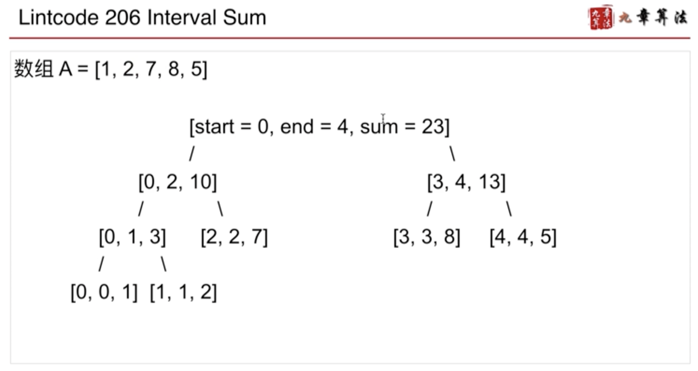

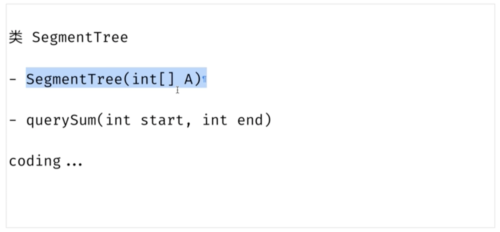

```c++
struct STNode {
  STNode(int start, int end)
    : start(start), end(end), sum(0), left_child(nullptr), right_child(nullptr) {}

  int start, end;
  long long sum;
  STNode* left_child;
  STNode* right_child;
};

class SegmentTree {
 public:
  SegmentTree(std::vector<int>& A)
    : size_(A.size()), root_(BuildTree(0, size_ - 1, A)) {}

  long long QuerySum(int start, int end) {
    return QuerySum(root_, start, end);
  }

 private:
  STNode* BuildTree(int start, int end, std::vector<int>& A) {
    STNode* node = new STNode(start, end);
    if (start == end) {
      node->sum = A[start];
      return node;
    }
    int mid = start + (end - start) / 2;
    node->left_child = BuildTree(start, mid, A);
    node->right_child = BuildTree(mid + 1, end, A);
    node->sum = node->left_child->sum + node->right_child->sum;
    return node;
  }

  // [start, end] 包含于 [node->start, node->end]
  // 在 node 节点下，查询原数组 [start, end] 区间和
  long long QuerySum(STNode* node, int start, int end) {
    if (node->start == start && node->end == end) {
      return node->sum;
    }

    int mid = node->start + (node->end - node->start) / 2;
    long long left_sum = 0;
    long long right_sum = 0;

    if (start <= mid) {
      left_sum = QuerySum(node->left_child, start, std::min(end, mid));
    }
    if (end >= mid + 1) {
      right_sum = QuerySum(node->right_child, std::max(mid + 1, start), end);
    }
    return left_sum + right_sum;
  }

  int size_; // array size
  STNode* root_;
};

/**
 * Definition of Interval:
 * class Interval {
 *  public:
 *   int start, end;
 *   Interval(int start, int end) {
 *     this->start = start;
 *     this->end = end;
 *   }
 * }
 */

class Solution {
 public:
  /**
   * @param a: An integer list
   * @param queries: An query list
   * @return: The result list
   */
  std::vector<long long> intervalSum(std::vector<int>& A, std::vector<Interval>& queries) {
    std::vector<long long> result;
    SegmentTree* tree = new SegmentTree(A);
    for (Interval& i : queries) {
      result.push_back(tree->QuerySum(i.start, i.end));
    }
    return result;
  }
};
```

### Lintcode 207 Interval Sum II
- [Lintcode 207 Interval Sum II](https://www.lintcode.com/problem/207)

`n`为数组长度，`m`为操作次数
- 暴力枚举求和`O(nm)`
- 树状数组/线段树查询区间和`O(mlogn)`

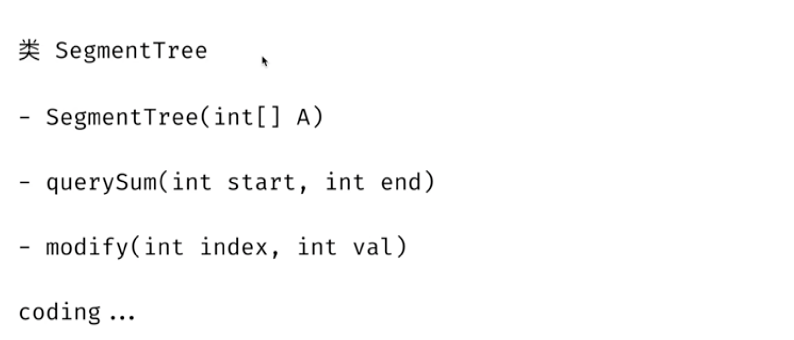

```c++
struct STNode {
  STNode(int start, int end)
    : start(start), end(end), sum(0), left_child(nullptr), right_child(nullptr) {}

  int start, end;
  long long sum;
  STNode* left_child;
  STNode* right_child;
};

class SegmentTree {
 public:
  SegmentTree(std::vector<int>& A)
    : size_(A.size()), root_(BuildTree(0, size_, A)) {}

  long long QueryTree(int start, int end) {
    return QueryTree(root_, start, end);
  }

  void ModifyTree(int index, int value) {
    return ModifyTree(root_, index, value);
  }

 private:
  STNode* BuildTree(int start, int end, std::vector<int>& A) {
    STNode* node = new STNode(start, end);
    if (start == end) {
      node->sum = A[start];
      return node;
    }

    int mid = start + (end - start) / 2;
    node->left_child = BuildTree(start, mid, A);
    node->right_child = BuildTree(mid + 1, end, A);
    node->sum = node->left_child->sum + node->right_child->sum;
    return node;
  }

  // [start, end] 包含于 [node->start, node->end]
  long long QueryTree(STNode* node, int start, int end) {
    // WRONG!!! if (node->start == node->end) {
    if (start == node->start && end == node->end) {
      return node->sum;
    }

    long long left_sum = 0;
    long long right_sum = 0;
    int mid = node->start + (node->end - node->start) / 2;
    if (start <= mid) {
      left_sum = QueryTree(node->left_child, start, std::min(mid, end));
    }
    if (end > mid) {
      right_sum = QueryTree(node->right_child, std::max(start, mid + 1), end);
    }
    return left_sum + right_sum;
  }

  void ModifyTree(STNode* node, int index, int value) {
    // if (node->start == node->end) {
    if (node->start == node->end && node->end == index) {
      node->sum = value;
      return;
    }

    if (node->left_child->end >= index) {
      ModifyTree(node->left_child, index, value);
    } else {
      ModifyTree(node->right_child, index, value);
    }
    node->sum = node->left_child->sum + node->right_child->sum;
  }

  int size_;
  STNode* root_;
};

class Solution {
 public:
  Solution(std::vector<int>& A) {
    if (A.size() == 0) {
      return;
    }
    tree = new SegmentTree(A);
  }

  long long query(int start, int end) {
    if (tree == nullptr) {
        return 0;
    }
    return tree->QueryTree(start, end);
  }

  void modify(int index, int value) {
    if (tree == nullptr) {
        return;
    }
    tree->ModifyTree(index, value);
  }

  SegmentTree* tree;
};
```

### Lintcode 248 Count of Smaller Number
- [Lintcode 248 Count of Smaller Number](https://www.lintcode.com/problem/248)


`n`为数组长度，`m`为查询次数，`k`为数组最大值
- 暴力求解`O(nm)`
- 树状数组/线段树`O(mlogk)`
- 二分法`O(nlogn + mlogn)`
- 前缀和数组`O(k + n + m)`

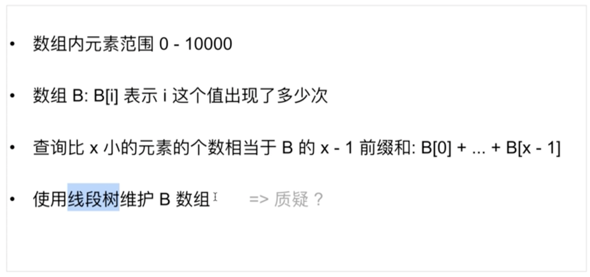

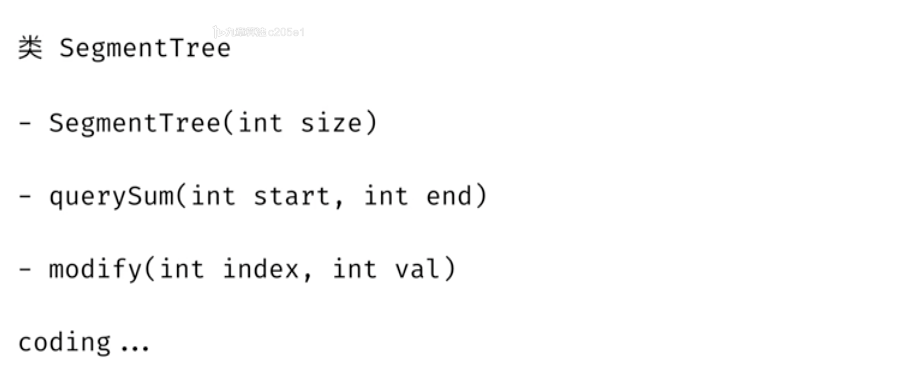

```c++
struct STNode {
  STNode(int start, int end)
    : start(start), end(end), sum(0), right(nullptr), left(nullptr) {}

  int start, end, sum;
  STNode* left;
  STNode* right;
};

class STree {
 public:
  STree(int size)
    : size_(size), root_(BuildTree(0, size_ - 1)) {}

  int QueryTree(int start, int end) {
    return QueryTree(root_, start, end);
  }
  
  void ModifyTree(int index, int value) {
    return ModifyTree(root_, index, value);
  }

 private:
  STNode* BuildTree(int start, int end) {
    STNode* node = new STNode(start, end);
    if (start == end) {
      return node;
    }

    int mid = start + (end - start) / 2;
    node->left = BuildTree(start, mid);
    node->right = BuildTree(mid + 1, end);
    return node;
  }

  int QueryTree(STNode* node, int start, int end) {
    if (node->start == start && node->end == end) {
      return node->sum;
    }

    int mid = node->start + (node->end - node->start) / 2;
    int left_sum = 0;
    int right_sum = 0;

    if (start <= mid) {
      left_sum = QueryTree(node->left, start, std::min(mid, end));
    }
    if (end > mid) {
      right_sum = QueryTree(node->right, std::max(start, mid + 1), end);
    }

    return left_sum + right_sum;
  }
  
  void ModifyTree(STNode* node, int index, int value) {
    if (node->start == node->end && node->start == index) {
      node->sum = value;
      return;
    }

    int mid = node->start + (node->end - node->start) / 2;
    if (index <= mid) {
      ModifyTree(node->left, index, value);
    } else {
      ModifyTree(node->right, index, value);
    }

    node->sum = node->left->sum + node->right->sum;
  }

  int size_;
  STNode* root_;
};

class Solution {
 public:
  std::vector<int> countOfSmallerNumber(std::vector<int>& A, std::vector<int>& queries) {
    std::vector<int> B(10001);
    for (int& a : A) {
      ++B[a];
    }

    STree* tree = new STree(10001);
    for (int i = 0; i <= 10000; ++i) {
      tree->ModifyTree(i, B[i]);
    }

    std::vector<int> result;
    for (int& q : queries) {
      if (q == 0) {
        result.push_back(0);
      } else {
        result.push_back(tree->QueryTree(0, q - 1));
      }
    }

    return result;
  }
};
```


### Lintcode 249 Count of Smaller Number before itself
- [Lintcode 249 Count of Smaller Number before itself](https://www.lintcode.com/problem/249)


`n`为数组长度，`k`为数组最大值
- 暴力求解`O(n^2)`
- 树状数组/线段树`O(nlogk)`

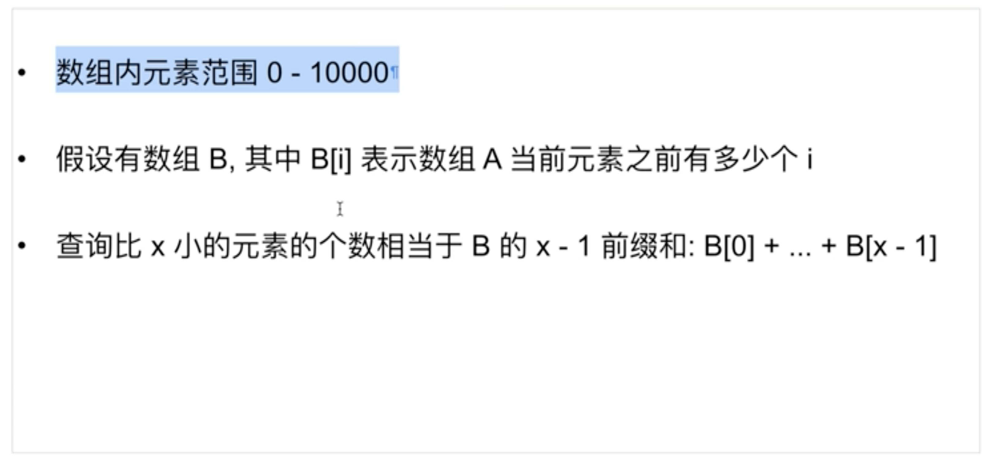

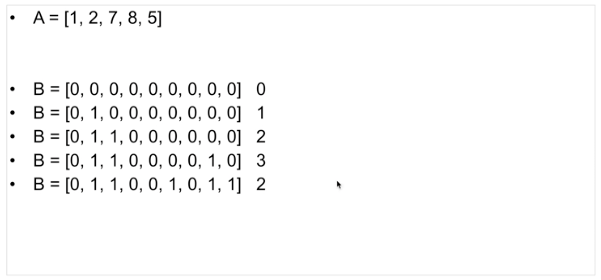

***在单点修改的情况下，维护前缀和：使用线段树维护B数组***

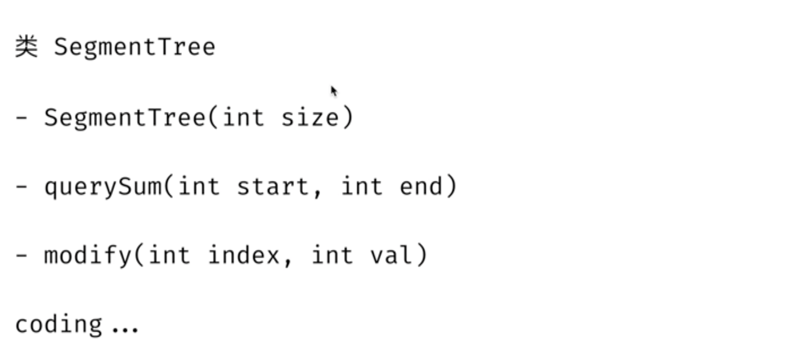

```c++
struct STNode {
  STNode(int start, int end)
    : start(start), end(end), sum(0), left(nullptr), right(nullptr) {}

  int start, end;
  int sum;
  STNode* left;
  STNode* right;
};

class STree {
 public:
  STree(int size) : size_(size), root_(BuildTree(0, size_ - 1)) {}

  int QueryTree(int start, int end) {
    return QueryTree(root_, start, end);
  }

  void ModifyTree(int index, int value) {
    return ModifyTree(root_, index, value);
  }

 private:
  STNode* BuildTree(int start, int end) {
    STNode* node = new STNode(start, end);
    if (start == end) {
      return node;
    }

    int mid = start + (end - start) / 2;
    node->left = BuildTree(start, mid);
    node->right = BuildTree(mid + 1, end);
    return node;
  }

  int QueryTree(STNode* node, int start, int end) {
    if (node->start == start && node->end == end) {
      return node->sum;
    }
    int left_sum = 0;
    int right_sum = 0;
    int mid = node->start + (node->end - node->start) / 2;
    if (start <= mid) {
      left_sum = QueryTree(node->left, start, std::min(mid, end));
    }

    if (end > mid) {
      right_sum = QueryTree(node->right, std::max(start, mid + 1), end);
    }
    return left_sum + right_sum;
  }

  void ModifyTree(STNode* node, int index, int value) {
    if (node->start == node->end && node->start == index) {
      node->sum = value;
      return;
    }

    if (node->left->end >= index) {
      ModifyTree(node->left, index, value);
    } else {
      ModifyTree(node->right, index, value);
    }
    node->sum = node->left->sum + node->right->sum;
  }

  int size_;
  STNode* root_;
};

class Solution {
 public:
  std::vector<int> countOfSmallerNumberII(std::vector<int>& A) {
    STree* tree = new STree(10001);
    std::vector<int> B(10001);
    std::vector<int> result;

    for (int& i : A) {
      if (i == 0) {
        result.push_back(0);
      } else {
        result.push_back(tree->QueryTree(0, i - 1));
      }
      ++B[i];
      tree->ModifyTree(i, B[i]);
    }

    return result;
  }
};
```

### Exercise: Lintcode 201 Build Segment Tree

- [Lintcode 201 Build Segment Tree](https://www.lintcode.com/problem/201/)

```c++
/**
 * Definition of SegmentTreeNode:
 * class SegmentTreeNode {
 *  public:
 *   int start, end;
 *   SegmentTreeNode *left, *right;
 *   SegmentTreeNode(int start, int end) {
 *     this->start = start, this->end = end;
 *     this->left = this->right = NULL;
 *   }
 * }
 */

class Solution {
 public:
  SegmentTreeNode* build(int start, int end) {

  }
};
```

### Exercise: Lintcode 439 Build Segment Tree II

- [Lintcode 439 Build Segment Tree II](https://www.lintcode.com/problem/439/)


### Exercise: Lintcode 202 Query Segment Tree

- [Lintcode 202 Query Segment Tree](https://www.lintcode.com/problem/202/)


### Exercise: Lintcode 247 Query Segment Tree II

- [Lintcode 247 Query Segment Tree II](https://www.lintcode.com/problem/247/)


### Exercise: Lintcode 203 Modify Segment Tree

- [Lintcode 203 Modify Segment Tree](https://www.lintcode.com/problem/203/)


## Chapter 3 树状数组 Binary Index Tree
> 用于维护前缀信息的结构，对前缀信息的处理也是非常高效的  

- 给定一个整数数组`nums`，然后你需要实现两个函数: 
  - `Update(i, val)`将数组下标为`i`的元素修改为`val` 
  - `SumRange(l, r)`返回数组下标在`[l, r]`区间的元素的和

> 暴力求解: `Update`时间复杂度O(1)、`SumRange`时间复杂度O(n)  
> 树状数组求解: `Update`时间复杂度O(logn)、`SumRange`时间复杂度O(logn)、对于长度为`n`的数组，构建树状数组时间复杂度O(nlogn)  

- Binary Index Tree 是通过**前缀和**思想，用来完成 *单点更新* 和 *区间查询* 的数据结构。
- Binary Index Tree advantages compared to Segment Tree: 所用空间更小（空间复杂度都是O(n), 但是Binary Index Tree只开了一个大小为n的数组，Segment Tree有左右指针, 区间端点等等），速度更快。

* 注意:
  - 树状数组的下标从 1 开始计数。
* 定义:
  - 数组 C 是一个对原始数组 A 的预处理数组。

> `C[i]`的元素个数（来自于`A`）：取决于`i`的二进制末尾有几个连续的`0`.  
> e.g. `i`有`k`个`0`，那么`C[i]`共有`2^k`个`A`中的元素.  

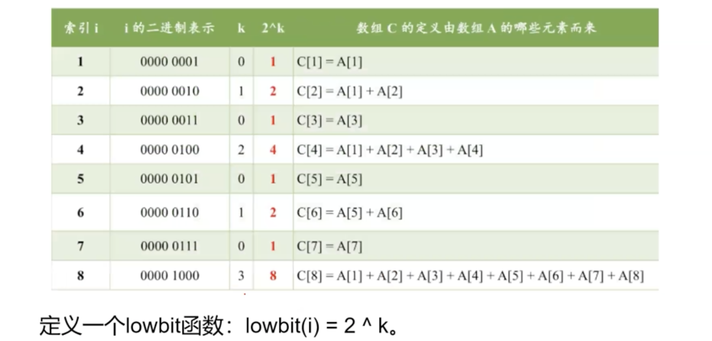

> 根据`lowbit`函数，可以知道`C[i]`代表几个`A`中的元素相加，以及`i`的父亲在哪儿(`i + lowbit(i)`, e.g. `6 + lowbit(6) = 8`)

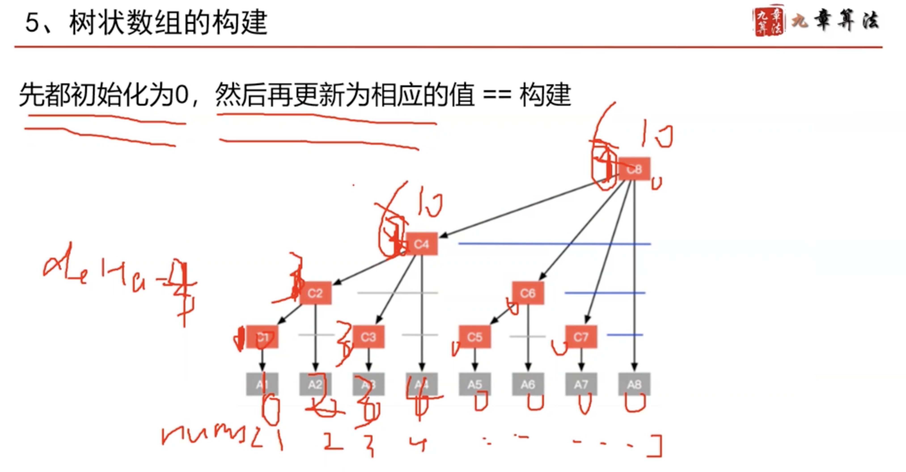

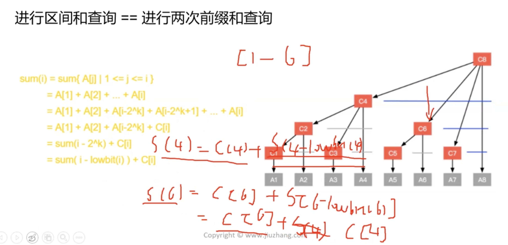

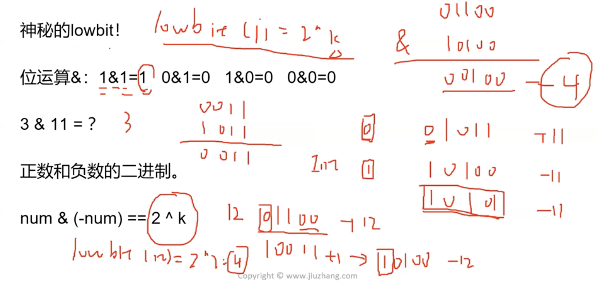

### Lowbit 的两个含义
e.g. Lowbit(4) = 4:
1. 从`A[4]`出发向左共四个数的`SUM`
2. 从`C[4]`搭出去梯子的长度（长度为4: `A[5], A[6], A[7], A[8]`），`C[4]`的值会影响到`C[8]`

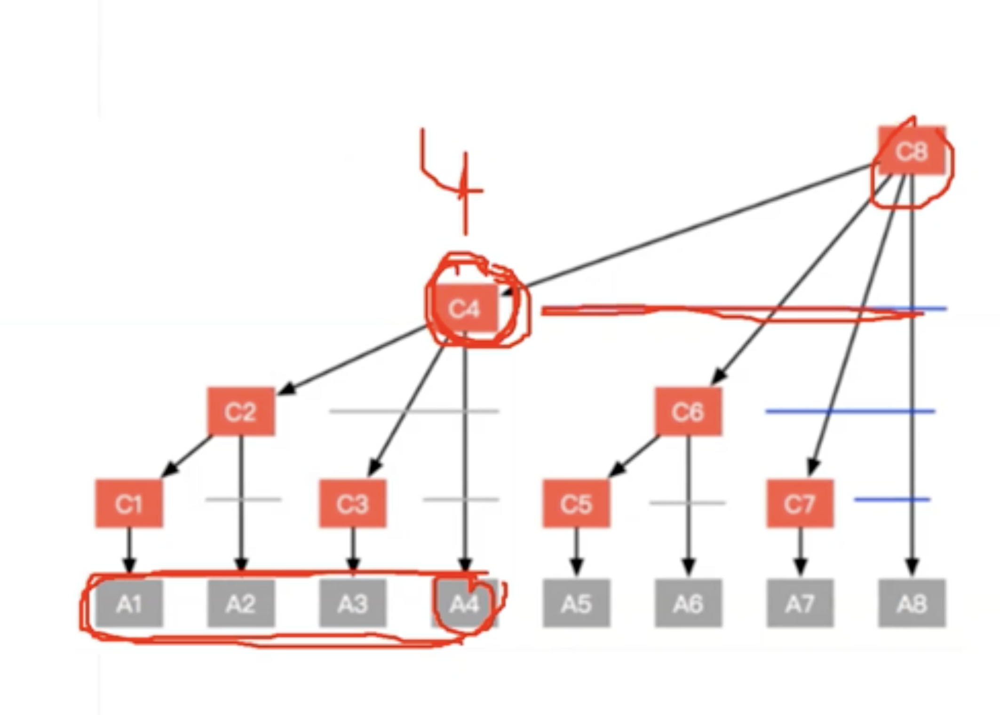

### 树状数组的程序实现: Lintcode 840: Range Sum

- [Lintcode 840 Range Sum](https://www.lintcode.com/problem/840/)

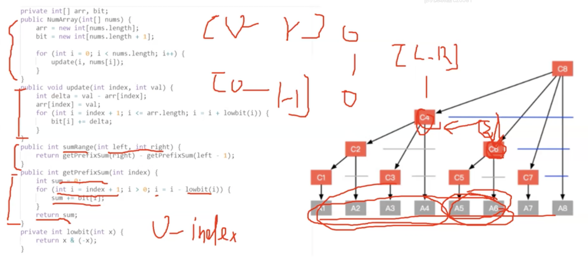

```c++
/**
 * Your NumArray object will be instantiated and called as such:
 * NumArray obj = new NumArray(nums);
 * obj.update(i,val);
 * int param_2 = obj.sumRange(i,j);
 */

class NumArray {
 public:
  NumArray(std::vector<int>& nums) {
    // both of them have to be assigned to 0
    arr_.assign(nums.size(), 0);
    bit_.assign(nums.size() + 1, 0);

    for (int i = 0; i < nums.size(); ++i) {
      update(i, nums[i]);
    }
  }

  void update(int index, int value) {
    int delta = value - arr_[index];
    arr_[index] = value;
    // Lowbit(i) 此时是Lowbit的第二个含义，即搭出去的梯子
    for (int i = index + 1; i <= arr_.size(); i = i + Lowbit(i)) {
      // bit_[i] 即C数组，包含了Lowbit的第二个含义（bit_[i]记录了Lowbit(i)个值的Sum）
      bit_[i] += delta;
    }
  }

  int sumRange(int left, int right) {
    return GetPrefixSum(right) - GetPrefixSum(left - 1);
  }

 private:
  int GetPrefixSum(int index) {
    int sum = 0;
    // Lowbit(i) 此时是Lowbit的第二个含义，即搭出去的梯子
    for (int i = index + 1; i > 0; i = i - Lowbit(i)) {
      sum += bit_[i];
    }
    return sum;
  }

  inline int Lowbit(int x) {
    return x & (-x);
  }

  std::vector<int> arr_, bit_;
};
```

### In summary
- 若求区间(i, j)的区间和rangeSum(i, j)
- 使用前缀和时，rangeSum(i, j) = sum(j) - sum(i)，时间复杂度为O(1)。
- 使用线段树时，需要从根向下搜索，找到所有包含且仅包含(i, j)中元素的区间和，所有的深度最大为树的高度，时间复杂度为O(log n)。
- 使用树状数组，根据公式sum(i) = sum(i - lowbit(i)) + C[i]，使用树状数组求前缀和的时间复杂度为O(log n)。区间和rangeSum(i, j) = sum(j) - sum(i)，求区间和的操作可以转换为求两次前缀和，因此时间复杂度也是O(log n)。


## Chapter 4

### Lintcode 206 Interval Sum
- [Lintcode 206 Interval Sum](https://www.lintcode.com/problem/206)

`n`为数组长度，`m`为查询次数
- 暴力枚举求和`O(nm)`
- 树状数组/线段树查询区间和`O(mlogn)`
- 前缀和数组`O(n + m)`

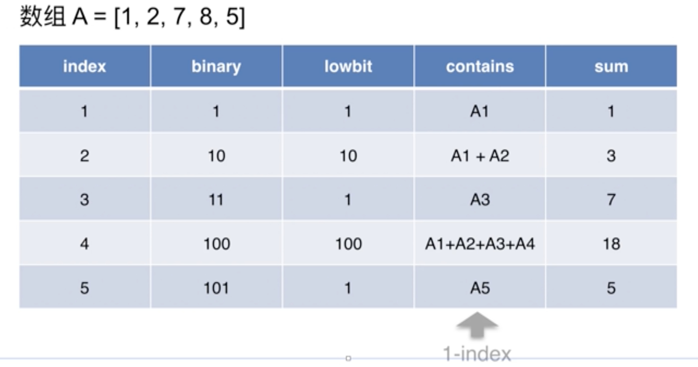
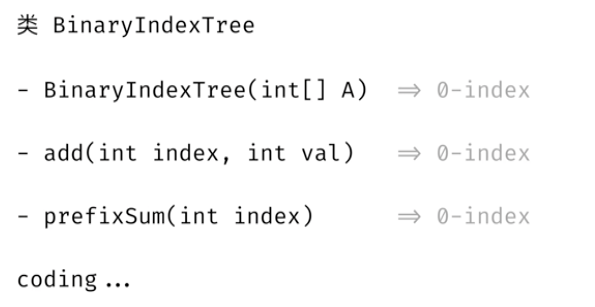

```c++
class BinaryIndexTree {
 public:
  BinaryIndexTree(std::vector<int>& A) {
    size_ = A.size();
    a_ = std::vector<long long>(size_ + 1); // a_.assign(size_ + 1, 0);
    for (int i = 0; i < size_; ++i) {
      Add(i, A[i]);
    }
  }

  // A[index] += val
  void Add(int index, int val) {
    ++index;
    while (index <= size_) {
      a_[index] += val;
      index += Lowbit(index);
    }
  }

  // A[0] + ... + A[index]
  long long PrefixSum(int index) {
    ++index;
    long long ans = 0;
    while (index > 0) {
      ans += a_[index];
      index -= Lowbit(index);
    }
    return ans;
  }

 private:
  inline int Lowbit(int x) {
    return x & (-x);
  }

  std::vector<long long> a_;
  int size_;
};

class Solution {
 public:
  std::vector<long long> intervalSum(std::vector<int>& A, std::vector<Interval>& queries) {
    std::vector<long long> ans;
    // BinaryIndexTree tree(A);
    BinaryIndexTree* tree = new BinaryIndexTree(A);

    // for (Interval& i : queries) {
    //   if (i.start == 0) {
    //     ans.push_back(tree.PrefixSum(i.end));
    //   } else {
    //     ans.push_back(tree.PrefixSum(i.end) -
    //                   tree.PrefixSum(i.start - 1));
    //   }
    // }

    for (Interval& i : queries) {
      if (i.start == 0) {
        ans.push_back(tree->PrefixSum(i.end));
      } else {
        ans.push_back(tree->PrefixSum(i.end) -
                      tree->PrefixSum(i.start - 1));
      }
    }

    return ans;
  }
};
```

### Lintcode 207 Interval Sum II
- [Lintcode 207 Interval Sum II](https://www.lintcode.com/problem/207)

`n`为数组长度，`m`为操作次数
- 暴力枚举求和`O(nm)`
- 树状数组/线段树查询区间和`O(mlogn)`

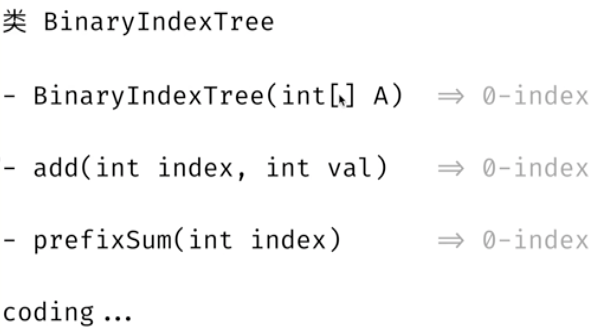

```c++
class BinaryIndexTree {
 public:
  BinaryIndexTree(std::vector<int>& A) {
    size_ = A.size();
    a_ = std::vector<long long>(size_ + 1); // a_.assign(size_ + 1, 0);
    for (int i = 0; i < size_; ++i) {
      Add(i, A[i]);
    }
  }

  // A[index] += val
  void Add(int index, int val) {
    ++index;
    while (index <= size_) {
      a_[index] += val;
      index += Lowbit(index);
    }
  }

  // A[0] + ... + A[index]
  long long PrefixSum(int index) {
    ++index;
    long long ans = 0;
    while (index > 0) {
      ans += a_[index];
      index -= Lowbit(index);
    }
    return ans;
  }

 private:
  inline int Lowbit(int x) {
    return x & (-x);
  }

  std::vector<long long> a_;
  int size_;
};

class Solution {
 public:
  Solution(std::vector<int>& A) {
    A_ = A;
    tree_ = new BinaryIndexTree(A);
  }

  long long query(int start, int end) {
    if (start == 0) {
      return tree_->PrefixSum(end);
    } else {
      return tree_->PrefixSum(end) - tree_->PrefixSum(start - 1);
    }
  }

  void modify(int index, int value) {
    tree_->Add(index, value - A_[index]);
    A_[index] = value;
  }

 private:
  std::vector<int> A_; // 为了计算difference
  BinaryIndexTree* tree_;
};
```

### Lintcode 248 Count of Smaller Number
- [Lintcode 248 Count of Smaller Number](https://www.lintcode.com/problem/248)


`n`为数组长度，`m`为查询次数，`k`为数组最大值
- 暴力求解`O(nm)`
- 树状数组/线段树`O(mlogk)`
- 二分法`O(nlogn + mlogn)`
- 前缀和数组`O(k + n + m)`

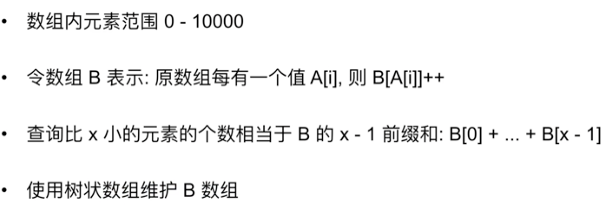
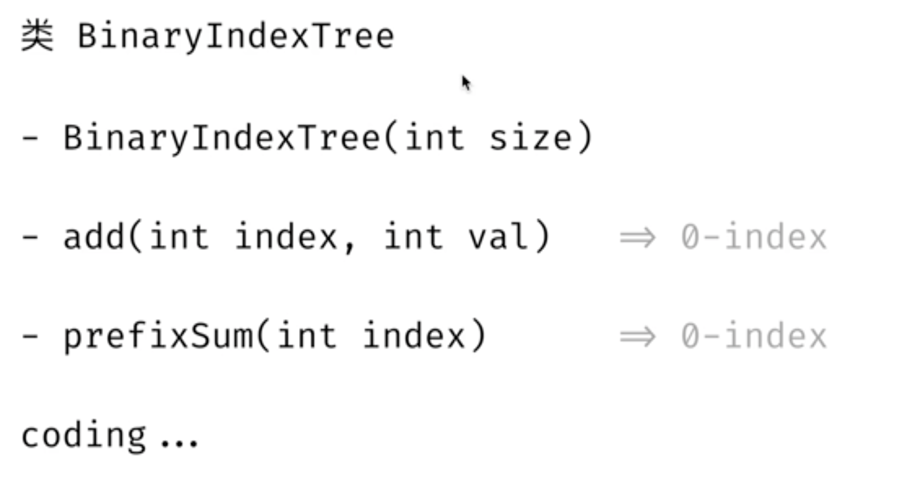


```c++
class BinaryIndexTree {
 public:
  BinaryIndexTree(int size) {
    size_ = size;
    a_.assign(size_ + 1, 0);
  }

  // B[index] += val
  void Add(int index, int val) {
    ++index;
    while (index <= size_) {
      a_[index] += val;
      index += Lowbit(index);
    }
  }

  // B[0] + ... + B[index]
  int PrefixSum(int index) {
    ++index;
    int ret = 0;
    while (index > 0) {
      ret += a_[index];
      index -= Lowbit(index);
    }
    return ret;
  }

 private:
  int Lowbit(int x) {
    return x & (-x);
  }

  int size_;
  std::vector<int> a_;
};

class Solution {
 public:
  std::vector<int> countOfSmallerNumber(std::vector<int>& A, std::vector<int>& queries) {
    int max_a = -1;
    for (int& i : A) {
      max_a = std::max(max_a, i);
    }
    BinaryIndexTree* tree = new BinaryIndexTree(max_a + 1);
    // B[A[i]]++
    for (int& i : A) {
      tree->Add(i, 1);
    }

    std::vector<int> ans;
    for (int& i : queries) {
      if (i > max_a) {
        ans.push_back(A.size());
      } else if (i < 0) {
        ans.push_back(0);
      } else {
        ans.push_back(tree->PrefixSum(i - 1));
      }
    }

    return ans;
  }
};
```


### Lintcode 249 Count of Smaller Number before itself
- [Lintcode 249 Count of Smaller Number before itself](https://www.lintcode.com/problem/249)

`n`为数组长度，`k`为数组最大值
- 暴力求解`O(n^2)`
- 树状数组/线段树`O(nlogk)`

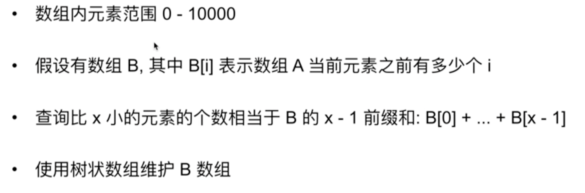


```c++
class BinaryIndexTree {
 public:
  BinaryIndexTree(int size) {
    size_ = size;
    a_.assign(size_ + 1, 0);
  }

  // B[index] += val
  void Add(int index, int val) {
    ++index;
    while (index <= size_) {
      a_[index] += val;
      index += Lowbit(index);
    }
  }

  // B[0] + ... + B[index]
  int PrefixSum(int index) {
    ++index;
    int ret = 0;
    while (index > 0) {
      ret += a_[index];
      index -= Lowbit(index);
    }
    return ret;
  }

 private:
  int Lowbit(int x) {
    return x & (-x);
  }

  int size_;
  std::vector<int> a_;
};

class Solution {
 public:
  std::vector<int> countOfSmallerNumberII(std::vector<int>& A) {
    std::vector<int> ans;
    int max_a = -1;
    for (int& i : A) {
      max_a = std::max(max_a, i);
    }

    BinaryIndexTree* tree = new BinaryIndexTree(max_a + 1);
    for (int& i : A) {
      if (i == 0) {
        ans.push_back(0);
      } else {
        ans.push_back(tree->PrefixSum(i - 1));
      }
      tree->Add(i, 1); // B[i] += 1
    }

    return ans;
  }
};
```


### Exercise: Lintcode 840 可变范围求和
- [Lintcode 840 可变范围求和](https://www.lintcode.com/problem/840/)

### Exercise: Lintcode 817 范围矩阵元素和-可变的
- [Lintcode 817 范围矩阵元素和-可变的](https://www.lintcode.com/problem/817/)

### Exercise: Lintcode 665 平面范围求和 -不可变矩阵
- [Lintcode 665 平面范围求和 -不可变矩阵](https://www.lintcode.com/problem/665/)

### Exercise: Lintcode 207 区间求和 II
- [Lintcode 207 区间求和 II](https://www.lintcode.com/problem/207/)

### Exercise: Lintcode 206 区间求和 I
- [Lintcode 206 区间求和 I](https://www.lintcode.com/problem/206/)


