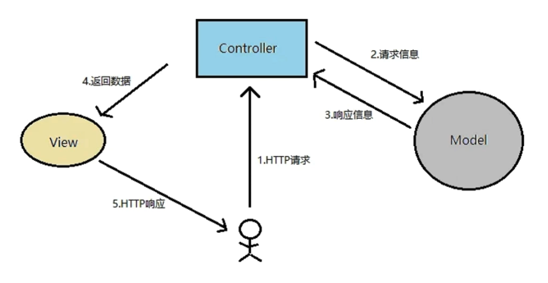
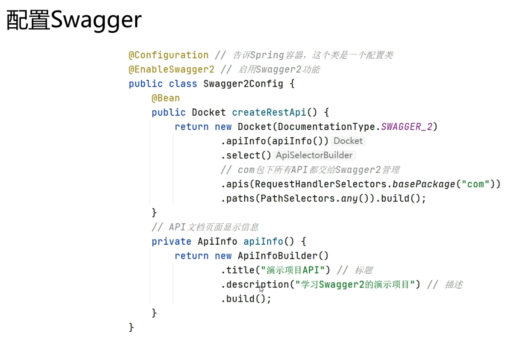
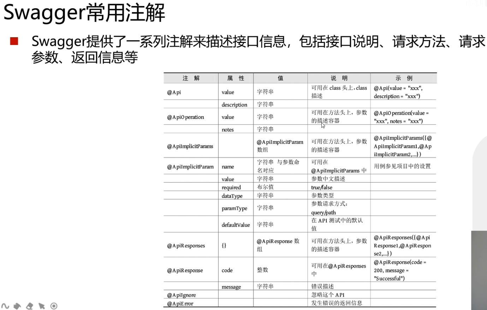
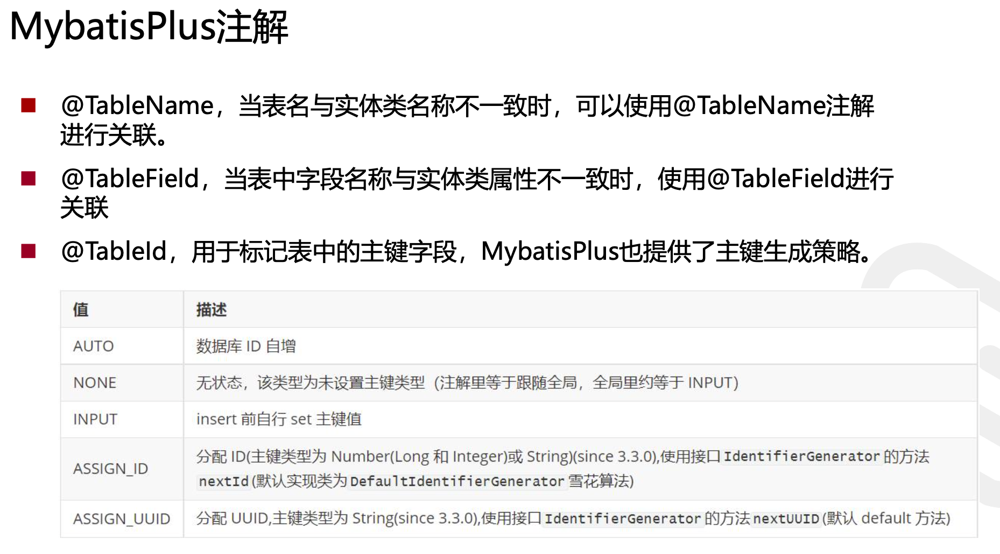

+++
title = 'Spring Boot'
date = 2023-12-27T09:02:18-05:00
+++

## Spring bean
- an instance of a class managed by the Spring container

### show all default beans
```java
  // within main method
  ApplicationContext apc = SpringApplication.run(ClassName.class)
  for (String s : apc.getBeanDefinitionNames()) {
    System.out.println(s);
  }
```

## Spring container
- **part of the core of the Spring framework**
- **managing all beans**: it decides when to create this instance, when to kill this instance, and how to initialize the instance, etc.
- **performs dependency injection**

## IoC(Inversion of Control)
- instead of the programmer really deciding the flow of the application, deciding what objects are created, etc. 
- this all handed over to the Spring framework(or more precisely to the Spring container)

## Dependency Injection
IoC entails Dependency Injection

- instead of in our code we have to instantiate some new object, Spring container is actually instantiating this object

> Spring container is **injecting** object for us

## SpringBoot Controller


### Rounter
- `@RequestMapping`, on class or methods
  - `value`
  - `method`
  - `consumes`, 请求的 Content-Type, i.e. application/json
  - `produces`
  - `params, headers`
- `*, **, ?`

### Method
- `@RequestMapping(value = "/getData", method = RequestMethod.GET)`
  - `@GetMapping("/getData")` is same as above.

### Parameters
- `@RequestParam`, (from HTTP request body or url QueryString) when the names are matching, we can **ignore** this annotation
  - `public String getTest3(@RequestParam(value = "nickname", required = false) String name) {}`
- `@PathVariable`, handle dynamic URL
- `@RequestBody`, most use case is to handle data which is not `Content-Type: application/x-www-form-urlencoded`, i.e. `application/json`, `application/xml`, etc.

  ```java
  // i.e. @RequestBody
  @RequestMapping(value = "/postTest4", method = RequestMethod.POST)
  public String postTest4(@RequestBody User user) { // @RequestBody 
    System.out.println(user);
    return "Post request"
  }
  ```

## SpringBoot File Upload + HandlerInterceptor

### Static Resources
- define filter rule and static resource path
```
// application.properties
spring.mvc.static-path-pattern=/static/**
spring.web.resources.static-locations=classpath:/static/
```
> filter rule is `/static/**`, static resource path is `classpath:/static/`

### File Upload
- `enctype` define how to encode form data before sending to server
- `enctype = "application/x-www-form-urlencoded"` is default, then form data likes `key=value&key=value`
- `enctype = "multipart/form-data"`


- To update 1MB file limitation by SpringBoot built-in Tomcat
```
// application.properties
spring.servlet.multipart.max-file-size=10MB
spring.servlet.multipart.max-request-size=10MB
```

### HandlerInterceptor


## RESTful service + Swagger

### Restful


### Swagger
- `http://127.0.0.1:8080/swagger-ui.html`




## Mybatis-Plus
ORM(Object Relational Mapping)

### Mybatis-Plus


### Mybatis-Plus CRUD operation



### Example
```java
// mapper
  // UserMapper.java
@Mapper
public interface UserMapper extends BaseMapper<User> { // User has to be same as table name within database
}
```

```java
// controller
  // UserController
@RestController
public class UserController {
  @Autowired
  private UserMapper userMapper;

  @GetMapping("/user")
  public List query() {
    List<User> list = userMapper.selectList(null);
    return list; // automatically convert to json
  }

  @PostMapping("/user")
  public String save(User user) {
    int i = userMapper.insert(user); // i is the number of rows inserted
    if (i > 0) {
      return "successfully inserted";
    } else {
      return "insertation failed";
    }
  }
}
```

### Searching Multiple Tables