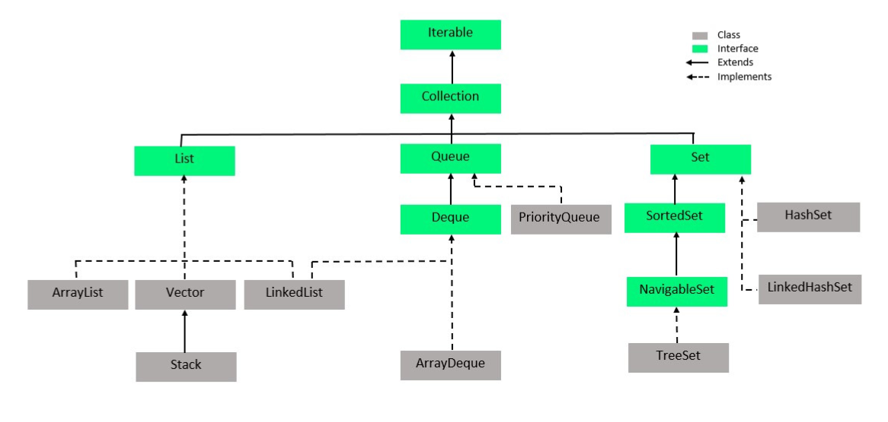

+++
title = 'Cheat Sheet'
date = 2024-04-30T18:58:08-04:00
+++

## QuickNotes

```
singleton vs immutable class

functional interface with static
```

## Core Java interview questions

## Java is passed by Value or Reference?

- In Java, there are two kinds of data type, **Primitive** data types and **Non-primitive** data types.
- For primitive types, they are built-in data types in Java including int/short/long/float/double/char/byte/boolean.
  They are all passed by value.
- For non-primitive types, they are also passed by value, the value here is actually the memory address of the object.
  e.g. annotation, class, interface, enum, array.
- In conclusion all data types in Java are passed by value.

## static keyword(within 5 sentences)

- we have four places to put static keyword on.(class, method, variable, block)
- For having static keyword on method, variable scope is to ensure that they can share just by class template.
- what **SCOPES** we can access static elements.
   - we cannot override static method
   - static class cannot called by non-static method

## static block

- **static block** is a set of instructions that is run only once when a class is loaded into memory.
   - We use a static block to initialize static variables. Although we can initialize static variables directly during
     declaration, there are situations when we need to do multiline processing. In such cases, static blocks come in
     handy.
   - If static variables require additional, multi-statement logic during initialization, we can use a static block.
   - Below are a few reasons for for using static blocks:
      - if the initialization of static variables needs some additional logic apart from the assignment
      - if the initialization of static variables is error-prone and needs exception handling

## static class

- In general, the nested class architecture is divided into two types:
   - nested classes that we declare static are called static nested classes
   - nested classes that are non-static are called inner classes
- The main difference between these two is that the inner classes have access to all members of the enclosing class (
  including private ones), whereas the static nested classes only have access to static members of the outer class.
- In fact, static nested classes behave exactly like any other top-level class, but are enclosed in the only class that
  will access it, to provide better packaging convenience.

- Basically, a static nested class doesn’t have access to any instance members of the enclosing outer class. It can only
  access them through an object’s reference.
- static nested classes can access all static members of the enclosing class, including private ones.
- Java programming specification doesn’t allow us to declare the top-level class as static. Only classes within the
  classes (nested classes) can be made as static.

## Hashmap workflow

- Internally, Hashmap is an array of linkedList.

- Each of the key-value pairs is passed into the hashCode method first, the key is going to pass as the input and
  generate values.
- With hashing result key-value pair is put in one of the place in the array, which is called bucket head.

- When there is any of hash code collision happened, then that's the reason why we need to override both equals and
  hashCode methods.
- And when hash collision happened, then we are going to check if the two keys are exactly the same then we upate the
  value.

- If they are don't, that means there is a hash collision, where we are going to attach the same key at the same bucket
  head, which that's the reason why we need the LinkedList to handle hash collision.

- Because the search in LinkedList is going to be linearly grows regarding to the time complexity. That's why we need
  LinkedList to auto turning into Red-Black tree for later search time efficiency.

## How many access modifiers?

- public: visible in all classes in all packages
- protected: visible to all classes in the same package or classes in other packages that are a subclass
- default: visible to all classes in the same package
- private: visible only in the same class

> The purpose of having access modifies is to ensure that we can do encapsulation implementation for our OOP program in
> Java.

## Pros and Cons of static

## Diff map and set. Can we have duplicate keys in map

- set is part of Collection interface, where as map is not part of Collection interface
- map is storing two dimension data, set is storing one dimension data.
- The HashSet is actually implemented by the HashMap in Java

## Given a series data, how to detect duplicate data and skip it?

## Comparable vs Comparator

- First, they are both functional interface, annotated with `@FunctionalInterface`
   - Comparable has one method `compareTo`
   - Comparator has one method `compare`
- Comparable is used to define the natural ordering of objects within the class itself.
- Comparator is used for external comparison logic.

## How GC works / GC generation

- When Java programs run on the JVM, objects are created on the heap, which is a portion of memory dedicated to the
  program. Eventually, some objects will no longer be needed. The garbage collector finds these unused objects and
  deletes them to free up memory.

- A generational garbage collector collects the short-lived objects more frequently than the longer lived ones.
  Short-lived objects are stored in the first generation, generation 0. The longer-lived objects are pushed into the
  higher generations, 1 or 2. The garbage collector works more frequently in the lower generations than in the higher
  ones.

- When an object is first created, it is put into generation 0. When the generation 0 is filled up, the garbage
  collector is invoked. The objects that survive the garbage collection in the first generation are promoted onto the
  next higher generation, generation 1. The objects that survive garbage collection in generation 1 are promoted onto
  the next and the highest generation, generation 2. This algorithm works efficiently for garbage collection of objects,
  as it is fast.


## Generics in Java, what is it, why we need it?

## Type erasing in Java, about generics

## what/why generic

## How to handle exceptions

## Checked vs Unchecked exception

## Threadpool 的 coding

## Multi-threading concepts and coding

## abstract, final, static

```
abstract: class, method
final: class, method, variable
static: inner class, method, variable, static block
```

### singleton vs immutable class

## keywords


## Sort methods


## JDK and JRE

- JDK = JRE + DEV tools (Javac Compiler etc.)
- JRE = JVM + Java SE standard library
  

## JVM

- Method Area(since java 8, meta space(replaced perm generation)): class template, static elements
   - Method Area is a standard, it keeps storing class templates
   - Meta space can resize JVM, once the memory space is all used up.
- VM stack: references and method
   - within stack, each thread be assign a private area within stack, everything within this area are only visible for
     that thread, unless we use `volatile` keyword.
- Heap: objects
   - all the threads are able to access.
- Program Counter Register:
   - persist return tracker, allows each method stack know when to return where
- Native Method stack:
   - a place contains all legacy c/c++ APIs
   - anything decorated with `native` keyword is a method, that implements with either c or c++ storing in Native Method
     stack within JVM.

### JVM memory model


## What's the result from the code1

- Green Black
   - line 70 first
     

## the diff between RunOutOfMemory and OverStackFlow Exceptions in JVM

## ClassLoader

- Three types of classLoader
   - Bootstrap ClassLoader: to load the first pure java ClassLoader
   - Extension ClassLoader: to load extensions of core java from jdk extension library
   - System/Application ClassLoader: to load application type classes
     

## Class class

- It is used to describe the meta info inside a class.
- When a class is loaded from ClassLoader, one object of Class class will be created.
- With that object, we can call `getClass()` method or `.class` field to get the instance of the Class class.

## Reflection API

- Give us the ability that during the runtime, we can inspect and modify classes, methods, and fields dynamically.
- It's not necessary to know everything about an object or class at compile time, instead we can discover them during
  the runtime.
- Reflection API is powerful, but there are some performance considerations. Generally speaking, it's slower than direct
  method calls, because it has overhead involves runtime type checking and method invocations. So in some
  performance-critical scenarios, we should not use Reflection API.

## Data Structures

- **Map** is not in **Collection** framework. That's why we cannot directly iterate key-value pairs within any Map
  implementation.

### Collection vs Collections

- **Collection** framework is for data structures.
- **Collections** is a class. That class contains lots of static methods including reverse/sort. That can help us
  manipulate our data structures including arrays.

### what's the result from the code2

- Person inherited from Object
- if we don't override hashCode method, it's basically comparing based on References.
  
  

### HashSet

- if we check HashSet implementation, HashSet is actually implemented by HashMap. But only this HashMap doesn't have any
  value, but only with the key. That's the default one.

### Comparison between any pair of data structures




## Java Flight Recorder

- It's a place that we can monitor our Java application. To check if there is any bottleneck for our web application
  regarding to the hardware and resources.

- Java Flight Recorder(since java 11 is free)
- jconsole
- IntelliJ profiler
- Spring Actuator

## Generic Data type

- Why: it gives us the ability that to make classes and methods more flexible and reusable by allowing them to operate
  on various types. It also provides compile-time type safety.
- How:
   - type bounds: there are two types of bounds: upper bound(`extends`, <), lower bound(`super`, >=)
   - wildcard generics: it has greater flexibility, and it can also be bounded with those extends and super keyword.
- i.e. `ArrayList<? super String> list = new ArrayList();`

## Enum

- it's a structure that contains some default values.
- i.e. some of constant values. like Days, Months, Weeks, etc.
- enum can implement interfaces

```
enum Day {
  SUNDAY, MONDAY,
  FRIDAY
}
```


### without Enum


## Annotations

- There are two types so annotation in Java: Normal annotation and Meta annotation.
   - Meta annotations like parents or ancestors for decorating all the other annotations you can have in Java program.
   - There are only four meta annotations since Java 8.
      - Retention: (means how long) it describes when this annotation is playing in Java program
         - SOURCE: after convert the annotation into the .class file, the annotation is going to be invalid.
         - CLASS (default): still valid with the .class file, after we loaded with ClassLoader, in the runtime, that
           annotation is not working anymore
         - RUNTIME: this annotation, starting from the .java file, compile to the .class, loading with the ClassLoader
           into JVM, until program is end. It keeps playing a role in our Java program
      - Target: (means where) where can we put the annotation on
         - Type
         - FILED
         - METHOD
         - PARAMETER
         - CONSTRUCTOR
         - LOCAL_VARIABLE
         - ANNOTATION_TYPE
         - PACKAGE
         - TYPE_PARAMETER
         - TYPE_USE
      - Documented: define if it is documented
      - Inherited: define if this annotation can inherit from parent to the child
        


## Exception Handling

- if it's checked exception, we have to extend from Exception class
- if it's unchecked exception, we need to extend from RuntimeException class

- Confluence Page:  a private library each company can have, they are going to share some of those common knowledge for
  web application on that page
   - service(first 2 numbers) to codeNumber
      - instagram 10
         - -> 01 login exceptions
         - -> 02 picture uploading exceptions
      - facebook 20
      - heel 30
      - ...
   - i.e. 10-001 is the error code

> when we trying to customize our Exceptions, we need to ensure **what the type of exceptions it is(extends Exception or
extends RuntimeException)**, then **what kind of infomation that we need to pass(those public methods)**, last *
*messages and error code** are traditional ones that almost every customize exceptions can have.


### Inheritance in Exceptions

- the child class can only have same or narrower scope.
   - i.e. parent throws `Exception`, child should throws `Exception(same) or IOException(narrower)`


## IOStream

- There are two dimensions:
   1. whether the stream is IN or OUT, that's we have in and out as direction
   2. based on the minimum unit to transfer the characters or file, we have either the Byte(8 bits, ByteStream) as the
      minimum unit or Character(two Bytes, 16 bits, CharacterStream)
- `FileInputStream`, reading file in 8 bits each time
- `FileoutputStream`, writing from JVM RAM to hard disk in 8 bits each time
- `FileReader`, reading file from hard disk to JVM in 16 bits each time
- `FileWriter`, writing file from JVM to hard disk in 16 bits each time
- `CharArrayReader`, writing file from JVM to hard disk in 16 bits each time


> pay attention to `Bufffered` ones. They are just wrapping up the normal I/O Stream. It's trying to do increase the
> communication speed.

- `DEFAULT_BUFFER_SIZE = 8192` bytes, everytime with buffered we have 8 mb into JVM, instead of 1 byte or 2 bytes.


### In real practice example

- Due to `AutoCloseable` is inheritened by buffered streams.
   - means once we turn off the wrapper buffer stream, it will also turn off the inside
   - so we just need to close the buffered one, the inside will close automatically.


- Another good thing about `AutoCloseable` interface, is that once we implement that we can use `try-with-resource`


### virtual thread is the future


### Java 8 new features

- Lambda expressions
   - it's just method without a name
   - it's passing a function as annoymous object into Java program.
   - it's just a annoynous method wrapped up with an annoynoms object. That's the object is the actually the thing we
     passed to our Java program.


- Functional Interface
   - it's a kind of interface that has only 1 abstract method.
   - it can have multiple default methods and multiple static methods.
      - when use default methods:
         - when this functional interface has been implemented by different classes and later we need to use it as a
           common function for each every those classes.

      - when use static methods:
         - when we don't want instantiate anything, any object. Or if we don't want this default method to be override,
           then we can use static method rather than default method to define this common behavior.

   - i.e. Runnable, Callable, Comparator, Comparable, etc.

> There are four major functional interface introduced in Java 8

- Consumer<T>
- Supplier<T>
- Function<T>
- Predicate<T>


- Stream API
   - It's let java can program in a way just like other functional programming language.
     
   - Two types of stream:
      - finite stream
         - normal `stream()`
         - `parallelStream()`
      - infinite stream
         - `iterate(0, t -> t + 2).limit(10).forEach(System.out::println)`
         - `generate(Math::random).limit(10).forEach(System.out::println)`
   - Two types of operations
      - intermediate operations
      - terminal operations

> it will keep original data intact.


- Method Reference
   - is a further utilization of Lambda Expression. which is also a functional interface.
   - it is trying to have a simplicity of the object and methods relationship that we can have. and return that into
     functional interface. with that functional interface will help us to write stream API through functional style
     programming.
   - The only thing we cannot reference is **abstract method**, as long as the method has a method body, that means we
     can refer to it.


- Optional Class
   - it can help to handle NullPointerExceptions
   - it's just warp the original object, to handle the situation like null reference

- CompletableFuture

## Multithreading


- when we are talking about traditional thread, we should always use thread pool.
- virtual thread is good and is the future, but it's not available for old java versions.

- the first two ways to create new thread cannot throw any Exceptions, and no return for run method.
- the third one can have return data types and also can throw Exceptions.
  

> we can set priority for each thread from 1(least significant) - 10(most significant)

### Thread Life Cycle

- NEW
- RUNNABLE
- BLOCKED
- WAITING
- TIMED_WAITING
- TERMINATED

### ThreadPool(or ExecutorService)


### Summary

- Thread: Simple and straightforward for quick-and-dirty threading needs.
- Runnable: Preferred when you don't need to return a result from the task.
- Callable: Use when you need to return a result or handle exceptions from the task.
- CompletableFuture: Ideal for asynchronous programming and chaining tasks.
- ThreadPoolExecutor: Provides extensive control over thread pool behavior for complex threading requirements.
- VirtualThread: Use for scalable and lightweight concurrency (note: still in preview as of Java 19).

## Lock(or Monitor)

- critical section: we have some threads, those threads are going to manipulate some common resources.


### data type built-in lock


### lock with synchronized keyword

- can be applied to method scope and synchronized block

### Lock interface implementations

- Lock is an interface, its implementation including `ReentrantLock`, `Condition`, `ReadWriteLock` comparing
  to `synchronized` keyword.
- when we use it
   - if we want to ensure the execution of the thread order is exactly the way that I want. I need to
     use `ReentrantLock` and `Condition`.


### Avoid!!!

> be careful when use `synchronized` and `static`

- class template lock: means any of those static methods are locked with the same lock.
   - because static element is saved in method area in JVM, it's a class template lock.
     

- the following is not thread safe
   - the first `synchronized` keyword without static is on the object lock.
   - the second `synchronized` keyword with static is on the class template lock.

### Dead Locks

- caused by adding lock in wrong orders
- how to avoid: no matter the order we add the lock, we should have the exact the same order to release the lock.

## Callable vs CompletableFuture!!!

- For Callable, every time we call the `get` api from the FutureTask, it's going to block the main thread.
- For CompletableFuture, we gonna have a callback.
   - And CompletableFuture can be chained. it means the callback will trigger another task, so on so forth. when
     everything is done, the main thread will come back and get the result. then continue to running.
- Cons for CompletableFuture, it's hard to handle Exceptions all over the place.


## volatile keyword: visibility only

- anything decorated with volatile, means it's visible in between those threads.
- volatile element will put in main memory.
- it's not thread safe. it just ensure **visibility** every time each thread will get the latest from the main memory.
- it also ensures **the instructions are not reordered(in assembly code)**.
- Usage: when we have a singleton design pattern, and we wanna singleton design pattern visible for all threads. And at
  the moment we need to add the volatile keyword on that singleton object reference.

## CAS: Compare and Swap

- it's another mechanism to ensure the thread-safety.
- it's special that it doesn't contain any lock.
   - it uses self-spinning mechanism to ensure that object value or any of those common resource value is going to be
     upgraded with the correct version.
     

- i.e. AtomicInteger


- i.e. AtomicReference
  

### CAS vs Lock

1. comparing the performance regarding to the while loop and lock.
2. the nature of the computation(something like keep back and forth) then it suit for CAS. However, if it takes very
   long time to back to the original state, we should use lock.

### AtomicReference is going to create ABA problems

- **AtomicStampedReference** is going to solve that.
   - how: it's instead of just checking the value, it also creates a tag for each of the value(so, instead of checking
     the values, we also checking the versions).
- it allows us to tracking if there is a ABA problem or not.

### practices

- 5,5,5,10,10,10,15,15,15
- 5,10,15,5,10,15,5,10,15

## Design Patterns

- what/why/where to use/how to use

### Singleton

- [reference](https://refactoring.guru/design-patterns/singleton)
- there is only one object we can create from the class.
- pros:
   - singleton can work like a global variable
- cons:
   - it's hard to do a unit test.
   - it needs special treatment in multi-threading programming

### Simple Factory

- [reference](https://refactoring.guru/design-patterns/factory-comparison)
- there is a creation method with some parameters. with those parameters we can choose which class to use for
  instantiating the object.
- pros:
   - it makes the code loosely coupled.
- cons:
   - over time, the methods might become too big. in this case, we need to convert the simple factory design pattern
     into **Factory Method**, to introduce some subclasses to handle this situation.

### Builder

- is used to simplify the process of building a complex object.
- pros:
   - we can construct object step by step, and reuse the construction codes.
- cons:
   - it would have many extra codes like having many extra classes and methods

#### Builder vs Factory

- Factory design pattern hides the process of object creation. Users just ask for what they need.
- Builder design pattern allow users to know what is set for the object.

### Proxy

- In practice, the proxy has the same interface as a service, which makes it interchangeable with a real object when
  passed to a client.
- There are two types of proxy: the static proxy and the dynamic proxy.
- The static proxy requires developer to know the target class in advance, whereas the dynamic proxy doesn't, because
  the proxy class can be dynamically created by JVM during the runtime.

### Adaptors

### Observers

## OSI model vs TCP/IP model(won't be asked during the interview)

### OSI model

- 7 layers architecture: Physical / Data Link / Network / Transport / Session / Presentation / Application
- a typical modern network architecture
- As a developer, we will only focus on the top layer called **Application Layer**
   - including HTTP, FTP, SSH, DNS, etc.

### TCP/IP model

- a simplified version network architecture
- 4 layers architecture: Network Access Layer[1,2] / Network / Transport / Application[5,6,7]

## TCP, UDP within Transport Layer

- divides the data in to many packets
- within the packet of TCP, has `Sequence Number`
- within the packet of UDP, no `Sequence Number`

- TCP is more secure, i.e. email
- UDP is faster, i.e. zoom meeting

- TCP **4 way handshake process** is more secure than **3 way handshake process**

## HTTP

- a protocol in the Application Layer
- HTTP Request
   - Request Message Header
      - Request Line
         - http methods(get, post, ...)
         - file address
         - http version
      - Request Headers
         - some key-value pairs
   - a blank line
   - Request Message Body(normally is a json file, but can be anything)

- HTTP Response
   - Response Message Header
      - Status Line
         - http version
         - http status code
      - Response Headers
         - some key-value pairs
   - a blank line
   - Response Message Body(normally is a json file, but can be anything)

## HTTP methods

- Safe: the http method does not change the state of the server, does not changing on the server side.
- Idempotent: two or more same requests are made to backend, and it will have the same effect.
- Cacheable: the browser caches some data for some http methods by default. (we can setup with `cache-control`)

| Methods                     | Safe | Idempotent | Cacheable | Description  |
|-----------------------------|------|------------|-----------|--------------|
| Get                         | yes  | yes        | yes       | read         |
| Put                         | no   | yes        | no        | whole update |
| Post                        | no   | no         | no        | create       |
| Delete                      | no   | yes        | no        | remove       |
| Patch                       | no   | no(or yes) | no        | patch update |
| headoptions/ trace/ connect |      |            |           |              |

## HTTP status codes

- 1xx: informational codes
- 2xx: success codes
- 3xx: redirection codes
- 4xx: client error codes
- 5xx: server error codes

```
200 OK -- the request has been successfully sent to the backend.
201 Created -- a new resource was created as a result.
202 Accepted -- the request has been accepted for processing, but the processing has not been completed.
204 No Content -- the request succeeded, but that the client doesn't need to navigate away from its current page. i.e. submitted some data with put method, the frontend doesn't need to be changed.

307 Temporary Redirect -- i.e. the primary website doesn't work due to some bug or maintenance, we need to redirect to backup server.
308 Permanent Redirect -- i.e. sometimes the old URL won't use anymore, we wanna keep our customers.

400 Bad Request -- the server cannot understand the request, because some invalid syntax or invalid parameters.
401 Unauthorized -- the request has not been completed because it lacks valid authentication credentials.
403 Forbidden -- the server understands the request but refuses to authorize it.
404 Not Found -- the server cannot find the requested resource.

500 Internal Server Error -- the server has encountered a situation it does not know how to handle.
```

## Session and Cookies (won't be asked during the interview)

- Cookies is a piece of data stored on the browser of the client side.
- Every session has sessionID stored on the server side, is used to store some user info.
- Cookies is generated by the session, all the requests and responses will take Cookies.

## Java Web Architecture

- Web Components(servlet, JSP): a unit can handle specific logic.
  

### Backend Web Server/Container

> **Web server** is software. **Server** is hardware. Web server is running on the server to host the Application to
> handle the request.

- Tomcat
- JBoss
- WebLogic
- TomEE
- WebSphere

## Three Layer Architecture (Web Application Three Layer Architecture)

- MVC design pattern
- Controller : handle http request
- Service : business logic, some computation
- Dao(Repository) : data access object layer, is used to connect to DB

> the underlying technology behind Spring Data JPA is Hibernate. the underlying technology behind the Hibernate is JDBC.


## Maven/Gradle

> it's a tool that automate the building of the project into a jar or war file.

- It is trying to do the Build Automation
   - Build Automation has different stages, which is lifecycles:
      - clean: clean up all the .class files that has generated
      - validate: Checks if the project is correct and all necessary information is available.
      - compile: Compiles the project's source code.
      - test
      - package: Takes the compiled code and packages it in its distributable format, such as a JAR, WAR, or EAR file.
         - pack this maven into jar package for local test. In real, it will done by CI/CD pipeline
      - verify: Runs any checks to verify the integrity and quality of the project.
      - install: install the jar package into the local repository for the maven, making it available for other projects
        on the same machine.
      - site
      - deploy: Copies the final package to the remote repository for sharing with other developers and projects.

### Maven folder structure


### Types of Repositories in Maven

> the idea about caching for the maven. When we flush our project on our IDE or local dev environment. First thing they
> are going to check is our local maven repository. If the local repository doesn't have it, it will check the remote
> repository.

- Local Repository
   - ~/.m2
- Remote Repository
   - Central Repository
   - Customized Remote Repository

### Maven Life Cycle

- clean: clean cached data, cached dependencies.
- validate: check if necessary info is available.
- compile: compile the project.
- test: run all tests within test folder.
- package: we can package the project into jar or war.
- verify: check whether our code satisfy some criteria.
- install: install the project to local as dependency for other projects.

### .jar vs .war

- jar file contains the embedded server like tomcat, whereas war file doesn't.

## Spring IoC: Inversion of Control

- We transfer the control of the object to the container of framework, which is `ApplicationContext`.
- `ApplicationContext` helps us manage all beans life cycle.


- It is a principle which **transfer the control of the objects** to a container or framework.

## Dependency Injection

- We can inject the object into another object.


## Bean Scope

1. Singleton(default).

- The IoC container creates only one instance of the bean, and reuses it whenever that bean is requested. This is the
  default cope in Spring.
- Use Case: When you want to share a single instance of a bean across the entire application.
- Example: Configuration beans, controller beans, service beans, DAO beans, Logger beans, Utility beans.

2. Prototype.

- Use Case: When you want to create a new instance of a bean every time it is requested.
- Example: Request-scoped beans in web applications, Prototype beans for stateful objects, Objects with complex
  initialization logic.

> Only valid in the context of a Spring Web ApplicationContext.

3. Request.

- Use Case: When you want to create a new instance of a bean for **each HTTP request** in a web application.
- Example: Controllers, Form objects, View helpers, Request-specific data objects.

4. Session.

- Use Case: When you want to create a single instance of a bean for **each user session** in a web application.
- Example: User session beans, Shopping cart beans, User preferences beans, User authentication beans.

5. Application.

- A single instance of the bean is created for the entire web application context. This means all requests and sessions
  share the same instance of the bean.
- Use Case: When you want to create a single instance of a bean for the entire web application context.
- Example: Application-wide configuration beans, Global caching beans, Shared resources across multiple sessions.

6. WebSocket.

- Similar to session scope, but designed for WebSocket-based interactions.
- Use Case: When you want to create a single instance of a bean for each WebSocket connection.
- Example: WebSocket handlers, Session-specific WebSocket state beans.

7. Custom Scopes.

- Use Case: When none of the built-in scopes meet your requirements, you can create custom scopes.
- Example: Tenant-specific beans, Conversation-scoped beans, Batch job-scoped beans.

### Choose Appropriate Scope

- Singleton is suitable for stateless beans or beans that are expensive to create.
- Prototype is useful for stateful beans or beans that need to maintain their state separately.
- Request, Session, and Application scopes are suitable for beans that hold web-related state information and need to be
  scoped accordingly.

## Types of Dependency Injections

1. Constructor Injection: for **mandatory dependencies** so that our bean is ready to use when it is first time called.

- pros:
   - All required dependencies are available at initialization time.
   - it's the only way for us to create immutable dependencies. It can avoid NullPointerException.
   - it also simplifies unit test.
   - Preventing errors in Tests
- cons:

2. Setter Injection: only for **optional dependencies** to avoid **circular dependencies**.

- pros:
- cons:

3. Filed Injection:

- pros:
- cons: it makes headache to test, so how do you test that without bring up spring context or using some type of
  reflection utilities to inject that. It can be done but it gives us a big headache when we do a private field in
  Autowired

## Bean Life Cycle

- `@PostConstruct`
- `@PreDestroy`
  

## AOP

- it enables us to monitor the methods, monitor the class, monitor everything without touching the service or some other
  classes.

### Usage of AOP

- log something
- Audit the CRUD operations from http request(get, put, post, delete)
- monitor some special method, like once the method was invoked, use AOP to send email to the admin.
- Caching
- Transaction
- Security

### Terms(basic components of AOP)

- Aspect
   - An aspect is a modular unit of cross-cutting concerns in AOP.
   - It encapsulates behaviors (advice) that are applied to multiple join points in the application.
   - Examples of aspects include logging, security, transaction management, and error handling.

- Advice: Advice is the action taken by an aspect at a particular **Join Point** during the execution of a program.
   - before advice: Executed before a method invocation.
   - after advice
      - `@AfterReturning`: Executed after a method returns successfully.
      - `@AfterThrowing`: Executed after a method throws an exception.
      - `@After(Finally)`: Executed regardless of the method outcome.
   - around advice: Wraps a method invocation and controls its execution.

- Join Point: A join point is a specific point in the execution of a program where an aspect can be applied.
   - Examples of join points include method invocations, method executions, field access, object instantiation, and
     exception handling.

- Point Cut: a expression to find where to inject our AOP logic
   - `@PointCut("execution(* com.example.aop.springaop.*.*.*(..))")` first star means any return.
   - `@PointCut("within(com.example.aop.springaop..*)")`
   - `@PointCut("this(com.example.aop.springaop.service.ClassName)")` to find class
   - `@PointCut("@annotation(com.example.aop.springaop.annotation.CutomAnnotation)")` to find method

- Target:
   - The **target object** is the object being advised by one or more **aspects**.
   - It is the object whose methods are intercepted by **advice** during method invocation.

### Some Default Annotations

- `@Cacheable`: is used to annotate methods to indicate that the results of method invocations can be cached.
- `@Transactional`: is used to annotate methods or classes to indicate that they are transactional.
   - It is commonly used to ensure data consistency and integrity by managing database transactions declaratively.
- `@Secured`: is used to specify method-level security constraints.
   - When applied to a method, Spring Security ensures that only users with the specified roles/authorities are allowed
     to execute the method.

### AOP workflow in Spring

- underlying logic of AOP is Reflection
- Dynamic Proxy -> Reflection
  

### SpringBoot Advantages

- auto configuration:
   - to overwrite default configurations with `application.properties` file
- starter
   - `starter` dependencies integrated many useful dependencies for us.
   - In `pom.xml` file, it handles dependency version management and add dependency
- embedded Tomcat
- Spring Actuator
- `@SpringBootApplication`
   - includes `@SpringBootConfiguration` + `@EnableAutoConfiguration` + `@ComponentScan` ....

### Annotations in SpringBoot

```
@Controller
@RestController
  - @RestController contains @Controller and @ResponseBody.
  - if we only use @Controller to Controller class, we also have to add @RespondBody manually.

@Service

// the following two are same
@RequestMapping(value = "/user/{id}", method = RequestMethod.PUT)
@PutMapping("/user/id")

@Repository
@RequestMapping
@GetMapping
@PutMapping
@DeleteMapping
@PostMapping

@Component
@Bean

@ResponseBody: java object -> json
@RequestBody: json -> java object

// used to retrieve the data from URL
@PathVariable
  - is used to retrieve the parameter before the question mark
  - i.e. http://.../api/users/12
@RequestParam
  - is used to retrieve the parameters after the question mark
  - we can specify if some parameters are required or not, we can also give them defaultValue
  - i.e. http://.../api/users/?pageNo=2&rows=10

@GenerateValue(strategy = GenerationType.AUTO)

@Aspect

@PointCut("...")
public void loggingPointCut() {}

@Before("loggingPointCut()")
public void before(JointPoint joinPoint) {
  log.info("..." + joinPoint.getSignature());
}

@AfterReturning(value = "execution(* com.....)", returning = "employee")
public void after(JointPoint joinPoint, Employee employee) {
  log.info("..." + employee);
}
@AfterThrowing(value = "execution(* com.....)", throwing = "e")
public void after(JointPoint joinPoint, Exception e) {
  log.info("..." + e.getMessage());
}

@Around("loggingPointCut()")
public Object around(ProceedingJoinPoint joinPoint) throws Throwable {
  log.info("..." + joinPoint.getArgs()[0]);
  Object object = joinPoint.proceed();

  if (object instanceof Employee) {
    log.info("..." + joinPoint.getArgs()[0]);
  } else if (object instanceof Department) {
    log.info("..." + joinPoint.getArgs()[0]);
  }
  return object;
}
```

## Spring MVC

- Spring MVC is based on MVC design pattern, provides much convenience comparing to Spring
- Doesn't provide any embedded server, whereas SpringBoot does(Tomcat).

### Flow of Spring MVC

1. **DispatcherServlet** is used to intercept all requests.
2. send requests to **HandlerMapping** to choose Handler, find Controller
3. **Controller** will go through Business Logic (Service(business logic) -> Repository(Data Access) -> Database), then
   return the result(**ModelAndView Object**) to **DispatcherServlet**
4. The **DispatcherServlet** consults its list of **ViewResolver** beans to determine which view should be rendered.
5. **ViewResolver** implementations map logical view names to actual view templates (JSP, Thymeleaf, FreeMarker, etc.).
6. Once the view template is identified, the **DispatcherServlet** delegates the rendering of the view to the
   appropriate **ViewResolver**.
7. The **ViewResolver** renders the view template, populating it with data from the model (if any), and generates the
   final HTML or other content.
8. Finally, the **DispatcherServlet** sends the generated response (HTML, JSON, XML, etc.) back to the client that
   initiated the request.


## 3 Layers

- Controller, Service, Dao

## Pojo

- Plain Old Java Object
- it's a type of java object that is not tied to any specific framework.
- it's simple and lightweight.
- it just includes some fields, constructor, setter and getter methods.

## h2 database

- it's a in-memory relational database
- once we close the application, the data will lost.
- it's useful for development and testing.

## Handle Exception in SpringBoot


- `@ExceptionHandler` within class, is **local** `@ExceptionHandler`.
- `@ControllerAdvice` class with `@ExceptionHandler`, is **global** `@ExceptionHandler`.
- Is Exception annotated by `@ResponseStatus`? `ResponseStatusExceptionResolver`
  class : `DefaultHandlerExceptionResolver` class;

## How Spring does Validation

- put `@Validated` within parameters of controller
- put the following annotation on pojo

```
@Validated

@NotNull
@NotEmpty
@Min
@Max
@Pattern
@Email
...
```

## Documentation

### Swagger

- it's a documentation framework
   - it will collect info from project
   - then generate a website
   - show all the API created by the backend

## Questions in Mock interview

### The difference between HashMap and HashTable

- Regarding to Thread Safety
   - HashTable is synchronized, so it's thread-safe.
   - HashMap is not synchronized by default, so it's not thread-safe. But we can use `synchronizedMap()` method to
     create a synchronized wrapper around it.
- Regarding to Performance
   - HashMap has better performance than HashTable, because HashTable is synchronized, it has some overhead.
- Regarding to Null keys and values:
   - HashTable doesn't support any null key or null value.
   - HashMap support both null key and null value. And the null key will put at index 0.
- Regarding to Iteration
   - We cannot iterate both of them during modification in another thread.
   - Even with HashTable is thread-safe, we cannot do that.
   - So we should find a way to make sure, during the iteration, there will not modification happen anywhere.

### Exceptions that we are familiar with

- Checked Exceptions:
   - it means they will be checked at compile-time.
   - we must handle it in our code. either with `try-catch` block or throw its responsibility to up the call stack some
     universe place.
   - i.e. IOException, SQLException, FileNotFoundException

- UnChecked Exceptions
   - it's runtime exception. The handling is optional, if we don't handle it, it will propagate up the call stack until
     get caught or causing the program terminate.
   - i.e. IndexOutOfBoundException, NullPointerException, ArithmeticException

### Java 8 new features

- above

### In SpringBoot, the difference between Controller and RestController annotation

- @RestController contains @Controller and @RespondBody.
- if we only use @Controller to Controller class, we also have to add @RespondBody manually.

### Bean Scopes

- above

## Connection between frontend and backend

### 1. Restful endpoint

- stateless API protocol for transferring the payloads
- it's the connection between the frontend and backend to sending the payload(data + something else(header...))

### 2. SOAP(earlier days)

- stateful protocol for communication between FE and BE(or BE to other BE)

## Sharding & Replica

### Replica

- trade off between hardware resources and performance
- lose some C(Consistency)

### Sharding

- partition database into different servers
   - horizontal partition
   - vertical partition: for flat and fat table

## QPS vs Throughput

- QPS(query per second): dealing with a lot of users concurrently click the button
- Throughput: dealing with the size of the payload

## Database

- we need to store backend data somewhere to ensure we have a better **searching performance**, comparing to File
  System, which would scan all the files in the file system.
- we need a certain structure that structure need to be efficient for searching
- it also need to be efficient for maintenance.
- it also need to ensure that it's not over complicated(means that going through table of content must faster than going
  through file system)

### SQL

- SQL database, supporting ACID principle(Atomicity, Consistency, Isolation, and Durability)
   - structural, tabular database, good for vertical scaling
- **ACID and transaction are interchangeable**.
   - transaction: a group of operation, i.e. CRUD operations. Once they are grouped up together, either all of them is
     going to be executed successfully, or none of them is going to be executed at all.
      - it ensures the **consistency** in between database, business logics, user.
      - it just adds locks to the database level.
         - the idea is similar to Java, when we add locks(or monitor, interchangeable) to ensure the group of operations
           are Atomic(or Thread Safe, interchangeable)
      - transaction's thread safety is supported by the ACID principle.
         - A(Atomicity): either all of them is going to be executed successfully, or none of them is going to be
           executed at all.
         - C(Consistency): guarantee the CRUD operations' consistency. i.d. Deleted records won't come back later.
         - I(Isolation): there will be certain critical problems, which is thread safety problems. With database default
           settings cannot solve it(Dirty Writing and Dirty Reading). Dirty Writing is guaranteed to solved by database
           like Mysql for sure. Dirty Reading has several levels, different levels require different level of locks to
           solve the problem. Trade off between Less Thread Safety and Less Concurrency with #locks.
         - D(Durability): once the record is inserted, the record will stay at there. i.e. Out of electricity won't
           affect the record.
- Primary Key: basically consider as ID, for any of the record within the table it will be unique and cannot be null.
- Foreign Key: it's a key that trying to simplify the content. can have duplicate values. The purpose is to save space
  which is also increasing searching efficiency.
- Normalization: the whole idea is to reduce redundancies and maintain integrity. There are 6 level of normalization
  forms we can have.
   - First Normal Form: one value in each cell
      - Sometimes we break up the normalization rules, that we keep the redundancies is to **simplify the join logics in
        between the tables or simplify the logics of our application**. From performance perspective, avoiding join
        operation can improve the performance a lot.
   - Second Normal Form: Any columns in between the same row are not going to have dependencies. (this rule is to create
     foreign key relationship)
      - Binding several columns as a Primary key is actually break this rule.
   - Third Normal Form: No Transitive Dependencies. i.e. age column and DOB column. (this rule is to create
     one-to-many/many-to-one relationships)
- Indexes: Like the index of the book is to improve reading speed.
   - if we define a table with Primary key but without Indexes. The primary key in default will be setup as the indexes.
     That's index is going to be count as a **cluster index**(equal to Primary key, interchangeable).
   - in some scenarios, we want to search in different style. Where we have **non-clustered index**. Any table can have
     as many as **non-clustered index** as we want.
   - it's good for reading operation, but bad for insert or delete operations. That's also the reason we cannot have as
     many indexes as we want.
   - non-clustered index is table of content. clustered index is the data.
- Views: A virtual table(just **reference**, that pointing to specific columns that supposed to be seen within the view)
  created from a query that includes one or more tables' data
   - based on references we still can have update/delete those records in the table
   - restrict data access from other user
   - used to improve query speed
   - simplify commonly used complex queries into one place
- Store Procedure: A function directly written inside the database.
- nowadays Postgres and Mysql supporting to store documents

### noSQL

- noSQL, supporting transactional
   - non tabular data, i.e. documents/files

1. Documented DB
   - Key-Document Pair
2. Column wised DB
   - It's something like a table, but all the thing are going to store in the **node**, each column is consider as a *
     *node**. When we searching, we search base on the **node**. So any non-related column won't be searched.
   - The whole purpose is to reduce I/O between RAM and HD.
3. Key-Value DB. (i.e. Redis)
   - Value can be anything, including int, string, arrList, set, sortedSet, ...
   - Redis:
      - natively running in the RAM database. The idea is it to cache some data to improve the performance.
      - The purpose with Redis is to reduce the number of I/O.
4. Graph noSQL
   - we want to find out the relationship between each records, in this scenario we can use Graph noSQL.
5. Elastic Search
   - not a exactly like traditional noSQL database, more like a full-text searching database
6. TimeSeries noSQL
7. Vector DB.
   - For ML scenarios.

- CAP (For all distributed system, not only for noSQL)
   - C(Consistency): Every read reflects the **most recent** write or an error.
   - A(Availability): All reads contain data, but it may **not** be the most recent.
   - P(Partition Tolerance): The system continues to operate even when there are network failures.
   - Most time we would trade off between C and A.

#### MongoDB (CP, it sacrifices some availabilities)

- Work Flow:
   - MongoS(comparing to DBMS): like a router, when request reach the **MongoS** first, then it will consult the *
     *ConfigSever**, then MongoS get the Sharding position it will get to the right Server to get the result of the
     Request.
   - ConfigServer: contains `meta data` about the MongoDB sharding and replica info.
   - Arbiter: it doesn't contain any data. It only contain **one vote**, everytime there is an election has a draw,
     Arbiter is going to check for either one of those secondary nodes(or candidates within election).

- Before MongoDB(4.2)
   - any of those transactions has to stay in the **same collections**(very similar idea like table).
- After MongoDB(4.2)
   - it supports multiple collections within one transaction.

- We can Setup in MongoDB
   - Tade off between C and P
      - Write Concern
         - determine if the data is available to the user based on #synced nodes.
         - we can also define sync up, `J = 1 or J = 0` define in RAM or HD.
         - trade off between persistency and performance
      - Read Concern
         - Are we okay to read data in RAM, or we have to read data in HD.
         - There are several levels:
            - Local: it doesn't have to be in HD
            - Majority: I only read from main node and secondary node that has already synced up. Might not be the
              lastest one, but we are not reading from the node hasn't sync up.
            - Snapshot
            - Linearizable: everything is reading from HD

- nowadays MongoDB(after 4.2) supporting multi document transaction
   - Collections in MongoDB is similar to a table in SQL database.

#### Redis

- we can setup Redis running in RAM, it's not default
- it features that it can handle more than 10+K QPS
- it use a lot as **Cache**, and **Distributed Lock**
- the purpose is to reduce the #I/O between backend server and database server.
- the expire time of the key in Cache depends on the business model.
- it's a key-value pair database
   - value type
      - string
      - list
      - set
      - sortedSet(same as Zset)
      - hash(same as hashTable)
- Cache
   - Hit(cache hit)
      - when there is a request send to backend, then it first check the cache layer to see if there's any the same
        request that has sent before and the data has been stored within the cache. Then we directly return from the
        cache layer instead of sending request to the database.
   - Miss(cache miss)
      - no record we can find in the cache. Then we count it as **cache miss**
- Cold Start-Up
   - solve it with Pre-Heat, just with some buffer
- Avoid syncing up cache and database with strong consistency, because it will lose concurrency that sacrifice too much
  performance.
   - we are trading off between consistency and performance.
   - strong consistency is the trading off between thread safety and performance.
- There are different strategies to choose based on different **traffic** patterns in our web app.
   - We can apply distributed lock to ensure thread safety.
   - To ensure the data consistent between Redis and DB. Before we use `Redis + Lua script`, right now `Redison`(a
     framework based on Redis).
      - `Lua script` add locks in the source code for atomicity to ensure the data consistency.
- Eventual Consistency vs Strong Consistency
   - with Eventual Consistency, our business model is able to endure the loss, but our technical architecture is benefit
     a lot regarding to the performance.

### interview questions

- SQL and noSQL
   - what is transaction
   - how to enable transaction
   - in distributed system case
      - how to ensure the transaction
      - how to rollback with strategy

## Server vs Web Server vs Application Server

- the difference between web server and application server
   - Web Server is used to handle http request
   - Application Server just with some additional features like JBoss, it supports transaction on application layer
     instead of database layer or anything in our code.
- Both Web Server and Application Server in general speaking are in same Web Server Layer, they help us to handle
  duplicate logics for the **servlet**

### Server

- hardware

### Web Server

- Web Server is used to handle http request
   - Tomcat
   - Nginx

### Application server

- some require commercial license, which also would provide additional features.
   - JBoss: i.e. additional features like on application server layer, they provide transactions.
   - GlassFish

### Other related topics???

- SpringBoot
   - Servlet
      - how virtual thread would benefit the traditional ones
   - Stream/React/WebFlux/MonoFlux
      - how to debug?

## BE <--> DB

### socket

- open the pipeline, we choose the port number, send the stream of the data.

### HTTP/S

- the idea of JDBC

## JDBC

- JDBC is used to connect our WEB APP and DB.
- just a driver, that require duplicate logics

- return: ResultSet

## ORM: Object Relational Mapping

- just an **idea** to get rid of boilerplate for duplicate logics within our web app logics
- each row of a table will map to a java object
- Implementation of ORM is JPA(Java persistent API)
   - JPA contains CRUD operations and Batch operations(batch delete/update/read)

- Frameworks implement ORM ideas with JPA
   - Hibernate
   - Sequelize
   - Doctrine
   - MyBatis
   - SQLAlchemy

- JDBC -> JPA -> Hibernate -> Spring Data JPA / Spring Data Mongodb / Spring Data Elastic Search

> the more encapsulation we are going to have, the more automation in between table and Java Class we are going to have.

### Hibernate

- `Session Factory` grabs the configFile: username + password, then creates `sessions`
- Hibernate use reflection API to auto generate SQL statements
- Hibernate allows us to write:
   1. HQL(Hibernate Query Language), just in case the APIs are not flexible enough to catering some situations.
   2. Native SQL. cons: with dialect language(mysql, postgres, oracle)
- Cache strategies in Hibernate:
   - First Level(default): in **session level**. The session(a user create a session) is private, it means it cannot
     access any content belong to other sessions.
   - Second Level: in **session factory level**. Add extra configurations to the ConfigFile.
      - For example, there are many users sending the same queries and they are supposed to return the same result. with
        second level caching strategy, the cache will be pubic to all sessions.

## Frontend

### HTTP, FTP, SMTP

- All are in application layer(7th layer of OSI)
- They are methods or protocols that allow users use browser/or some application to communicate with the backend server.

- HTTP/S: HyperText Transfer Protocol Secure
- FTP: File Transfer Protocol
- SMTP: Simple Mail Transfer Protocol

### DNS: domain name system

- it's a system that we can use to translate URL to the public IP address of server.

### Browser storage types

- Local Storage: no expiration date and 5 MB limit. Data here will never transfer to the server side
- Session Storage: is used to store session related data. Session storage will be closed and cleared after we close the
  browser.
- Cookie: 4 KB limit.

### Angular

- Angular project develop, build, test, release flow
   - Typescript
   - npm
   - nvm
- Single Page Application
- Component
   - Basic building blocks that compose the webpage.
   - @Component class
      - act like controller
      - written in typescript
   - Template
      - act like view template
      - written in html and angular syntax(binding, directives)
      - binding
         - event binding
         - one-way
         - two-way data binding
         - Directives
      - Attribute Directive
      - Directive(*ngIf, *ngFor, *ngClass, *ngStyle, *ngForm,)
      - pipes
   - Forms - template driven/ reactive forms
   - StyleSheet
      - css, sass, less
- Service
- Dependency Injection
   - Service -> Component
- Angular CLI
- Module
- Routing
- HttpClient
   - RxJs
   - Observable
- Module
- CORS configuration
- UI Library
- bootstrap
   - material UI
- Promise / Observable

#### concepts

- Components, modules and services are the three fundamental building blocks in Angular.
- Components should be small and self-contained, modules should group together related components, and services should
  provide shared functionality across the entire app.

##### components

- Components are the smallest, self-contained units in an Angular application. They are typically used to represent a
  view or UI element, such as a button or a form input field.

##### directives

Allow the user to write new HTML syntax specific to their applications. They execute whenever the Angular compiler finds
them in the DOM. Angular supports three types of directives.

- Component Directives
- Structural Directives
- Attribute Directives

##### pipes

- pipes are simple functions designed to accept input value, process, and return output(transformed value).

##### module

- Modules are larger units that group together one or more related components.
- contains (components, directive, pipe)

##### service

- Services are singleton objects that provide specific functionality throughout an Angular application, such as data
  access or logging.

##### annotations

- @NgModule: Annotates a class to specify that it is an Angular module and provides metadata about its dependencies,
  components, directives, pipes, and services.
- @Component: Annotates a class to define an Angular component, providing metadata such as its selector, template, and
  style.
- @Directive: Annotates a class to define an Angular directive, which allows you to add behavior to elements in the DOM.
- @Pipe: Annotates a class to define an Angular pipe, which transforms input data to a desired output format for
  display.
- @Injectable: Annotates a class to define an injectable service that can be injected into other components or services.
- @Input: Annotates a class property to allow data to be passed into a component from its parent component.
- @Output:(with EventEmitter) Annotates a class property to allow a component to emit custom events to its parent
  component.
- @ViewChild and @ViewChildren: Annotates a class property to query and access child components or elements in the
  component's template.
- @HostListener: Annotates a class method to listen for events on the host element of a directive or component.
- @HostBinding: Annotates a class property to bind to a host element property or attribute in a directive or component.

##### two-way binding

- Use two-way binding to listen for events and update values simultaneously between parent and child components.
- Syntax is a combination of square brackets and parentheses, `[()]`

##### Promises and Observable

While both the concepts deal with Asynchronous events in Angular, Promises handle one such event at a time while
observables handle a sequence of events over some time.

- Promises: They emit a single value at a time. They execute immediately after creation and are not cancellable. They
  are Push errors to the child promises.
- Observables: They are only executed when subscribed to them using the subscribe() method. They emit multiple values
  over a period of time. They help perform operations like forEach, filter, and retry, among others. They deliver errors
  to the subscribers. When the unsubscribe() method is called, the listener stops receiving further values.

##### Constructor vs ngOnInit

- `constructor` is called first. Then, once all component inputs are initialized, Angular is going to call `ngOnInit`

##### Lifecycle hooks

In Angular, every component has a lifecycle. Angular creates and renders these components and also destroys them before
removing them from the DOM. This is achieved with the help of lifecycle hooks. Here's the list of them -

- ngOnChanges() - Responds when Angular sets/resets data-bound input properties.
- ngOnInit() - Initialize the directive/component after Angular first displays the data-bound properties and sets the
  directive/component's input properties/
- ngDoCheck() - Detect and act upon changes that Angular can't or won't detect on its own.
- ngAfterContentInit() - Responds after Angular projects external content into the component's view.
- ngAfterContentChecked() - Respond after Angular checks the content projected into the component.
- ngAfterViewInit() - Respond after Angular initializes the component's views and child views.
- ngAfterViewChecked() - Respond after Angular checks the component's views and child views.
- ngOnDestroy - Cleanup just before Angular destroys the directive/component.

##### Angular Material

- Angular Material is a UI component library for Angular applications. It provides a set of pre-built and customizable
  UI components.

## Architecture

- Monolithic architecture
- SOA: ESB(Enterprise Service Bus) could become a single point of failure. Sharing data storage.
- MicroService: Each microservice has its own data storage.
- MicroFrontend: Each component we can use different frontend framework to build with.
- Frontend Backend Separation
  

### Microservice

#### WHY: we need microservice

- if one service fails, we need to like restart the whole thing work.

#### HOW: various ways to implement Microservice

- business separation: (vertical): i.e. login/browse/order/payment/...
- business separation: (horizontal): i.e. service oriented. (Python handles ML, Java handles web application, ...)

#### Five Components

- API Gateway: Spring Gateway or Zuul(can also be used as LB)
- Service Registry/Discovery: Eureka
- Business Modules
- Monitoring and Log Tracing: log4j, backlog, splunk
- Configuration Management: nacos or Eureka(can also be an configuration server)

#### Spring Cloud

- Spring Cloud provides a comprehensive set of tools to build resilient, scalable, and manageable microservices
  architectures. By leveraging the various components of Spring Cloud, developers can focus on business logic while the
  framework handles the complexities of distributed systems. Whether dealing with service discovery, configuration
  management, circuit breakers, or API gateways, Spring Cloud offers a unified and streamlined approach to developing
  cloud-native applications.

##### Core components

1. Spring Cloud Config:
   - Spring Cloud Config Server: Centralized external configuration management across all environments.
   - Spring Cloud Config Client: Provides an abstraction for the client to access configuration properties.
2. Spring Cloud Netflix (now largely superseded by Spring Cloud LoadBalancer and Spring Cloud CircuitBreaker):
   - Eureka: Service discovery server.
   - Ribbon: Client-side load balancing.
   - Hystrix: Circuit breaker.
   - Zuul: Edge server for routing.
3. Spring Cloud Gateway:
   - A replacement for Zuul, it provides a way to route requests to various services using filters and predicates for
     request processing.
4. Spring Cloud OpenFeign:
   - Declarative REST client, which allows defining a client interface annotated with Feign annotations to create
     dynamic REST clients.
5. Spring Cloud Circuit Breaker:
   - Provides an abstraction layer over various circuit breaker implementations like Resilience4j, Hystrix, Sentinel,
     etc.
6. Spring Cloud Sleuth:
   - Distributed tracing via logs. It integrates with Zipkin or Brave for trace and span IDs to help in troubleshooting.
7. Spring Cloud Stream:
   - Framework for building message-driven microservices using Apache Kafka or RabbitMQ.
8. Spring Cloud Bus:
   - Links nodes of a distributed system with a lightweight message broker. Useful for broadcasting state changes (e.g.,
     configuration changes) or other management instructions.

- Eureka(Service discovery server): for service discover and registry. for service health management with service heart
  beat.
   - key-value: URL - IP
- config server: Centralized external configuration management across all environments.
- zipkin & sleuth(for debug in microservice): Distributed tracing via logs. With trace IDs and span IDs to help in
  troubleshooting.
   - trace ID & Span ID:
      - Trace ID
         - A **Trace ID** is a unique identifier for a single request as it travels through various microservices or
           components of a distributed system.
         - It remains consistent across all services involved in the handling of the request, enabling a holistic view
           of the request's lifecycle.
      - Span ID
         - A **Span ID** is a unique identifier for a single unit of work or operation within the trace.
         - Each span represents a segment of the work done by a microservice, including details like the start and end
           time, and any additional metadata.
         - Spans are related to each other in a parent-child relationship, forming a tree-like structure that maps out
           the full journey of a request.
- ribbon: for Client-side load balancing.
- Log Aggregation
   - Splunk
   - ELK: Elastic Search(Storage)/ LogStash(Data processing)/ Kibana(Visualize)
      - cons of E: doesn't support join and transactions.

## Security

- Security Basic
   - Authentication vs Authorization
      - Authentication: valid user? passcode, username, fingerprint
      - Authorization: what permission does the user have.
         - role base
         - permission base
   - Encryption, Hashing, Encoding
      - Encryption
         - symmetric: i.e.AES
         - asymmetric: public/private key i.e. RSA
      - Hashing: for data integration
         - i.e. MD5, SHA
   - Asymmetric Key usage(SSL/TLS/HTTPs, Signature, SSH)
   - data security
      - solving with Encryption/Hashing
         - in transit
         - at rest
   - api security
      - Authentication: 401
      - Authorization: 403
   - server side security(SQL Injection), client side security(XSS, CSRF)
- HTTPS
   - Flow
   - port 443
   - protect data in transit
   - prevent man in the middle attack
- Networking Configuration
   - Segmentation
      - public/private subnet
   - Firewall
   - VPN
- User authentication/authorization
   - username/password
   - token
   - api key
   - certificate
- OAuth2, Single Sign On
   - OAuth2
      - is a third party validation
   - SSO
      - once we login in a service like gmail, our other service like google drive and google map will automatically
        login.
- JWT
   - header(algorithm..) + payload(data) + verify signature(hashed values)

## Messaging Queue

- Two major Purpose:
   - with buffering we can have OFF PEAK, we are going to protect our servers from burning out.
   - with topic related, we can have decoupling style.
- pub-sub messaging queue example: RabbitMQ, Redis, Kafka

### Kafka, one of message queue implementations

- it's a pub-sub messaging queue type.
- itself can run as a cluster(we would have multiple kafka brokers).
   - The these two number we can configure when we setup each Kafka topic
      - #partitions(can not be dynamic configured) depends on #consumers
      - #replication depends on #servers(same as #brokers)
- versioning: since kafka 7, it replace ZooKeeper with Kraft
- topics: a virtual or conceptual idea that we store messages
- partitions: a real way to store messages(a topic is **sharding** into three? partitions), within partitions there is
  offset(like consuming index to indicate consuming process)
   - when the broker(Zookeeper) is shutting down, kafka will persist partitions(messages data) and offset.
- Producer: will configure which topics it is going to send message to(depending on logic).
- Consumer: will configure the #partitions, #replications, whether consumers are in the same consumer group or not.
   - consumer groups: a bunch of consumers can run in parallel, to consume the message in the same topic. Within
     consumer group, each consumer can only consume different partition than others(to avoid thread safe issues).
- Re-balancing: will sacrifice some performance. It will infected by the interval we set up.
- Duplicated messages
   - Producer side: to determine if the message has been produced(sent) or not: Consistency of replications vs
     Performance: setting up #replications(need to be sync up) as a condition while producer sending message to broker,
     if condition fulfill.
   - Consumer side: to determine if the message has been consumed(deleted) or not: just comparing offset like above,
     checking if the offset sync up.

#### Code

- [Github](https://github.com/AntraJava/KafkaPOC)
- [Setup Kafka cluster](https://www.youtube.com/watch?v=tSsagN7-V3E)

## SDLC (software development lifecycle)

### Waterfall

- pros: reduce the communication time between tech and non-tech people, so it might increase some efficiency and budget.
- we gonna have a meeting with manager or non-tech people, and we plan the new feature will be alive within a year or
  half year.
- we have almost fixed time line for the project. like within a year, every 3 month we would sync up with the company
  status.
- so the whole project will separate into 4 stages.

### Agile

- when we want the company to cater to the market to survive, and the market can be very dynamic, which means our
  business model has to be changed rapidly.
- in this case, the waterfall is not a practical solution for this kind of scenario.
- we have relative way much shorter amount of period to sync up and report the status of the project.
- each sprint is just about one or two weeks.

- Sprint planning: a meeting to kick of the sprint.
- Sprint backlog: a list of tasks and activities that a project team plans to complete during a sprint.
- Sprint increment: backlog items that a team completes during a sprint.
- Sprint review: a meeting to do some demonstration to the product owner or anyone related.
- Sprint retrospective: a meeting after a sprint to reflect on our work and identify areas for improvement.
- Daily standup

## Testing

### unit test

- testing coverage: 80% 90% 100%.
   - tools: Jacoco, SonarQube(in CI/CD pipeline, give us **tech debt** called code smell)
- types of testing: function testing/ pressure testing/ ...
- stage: Dev/QA/UAT/Prod

### integration test

- Selenium framework

### BDD

- Cucumber framework

### pressure test

- Jmeter framework

## CI/CD

> just define several stages within yaml file

- Jenkins
- Concourse

## SonarQube

- we start SonarQube in docker, and then attach it to the Jenkins pipeline. Which is going to be the last step of the
  CI/CD pipeline.
- If any of those stages, the test coverage, or any of the code smell, or any of the technical debt, is more than we
  want to setup for bottleneck, we can reject the whole CI/CD process. Then code is not release to the environment then.

## Manage project

- Jira: project management tool
- Confluence: proj

## Mockito
### Basic
```Java
package net.thebabydragon;

import org.junit.jupiter.api.AfterEach;
import org.junit.jupiter.api.Assertions;
import org.junit.jupiter.api.BeforeEach;
import org.junit.jupiter.api.Test;
import org.mockito.Mock;
import org.mockito.Mockito;
import org.mockito.MockitoAnnotations;
import org.mockito.Spy;

import java.util.Random;

class MainTest {

  // following two lines equals to 'Random random = Mockito.mock(Random.class);'
  // @Mock and @Spy 需要搭配 MockitoAnnotations.openMocks(testClass) 方法一起使用
  @Mock
  private Random random;

  // 真实的
  @Spy
  private Main main;

  @BeforeEach
  void setUp() {
    System.out.println("----before----");
    MockitoAnnotations.openMocks(this);
  }

  @Test
  void addTest() {
//    Random random = Mockito.mock(Random.class);
    System.out.println(random.nextInt());

    // basic
    Mockito.verify(random).nextInt();
    Mockito.verify(random, Mockito.times(1)).nextInt();

    // 打桩
    Mockito.when(random.nextInt()).thenReturn(100);
    Assertions.assertEquals(100, random.nextInt());

  }

  @AfterEach
  void after() {
    System.out.println("----after----");
  }

  @Test
  void testMain() {
    // 这里可以打桩，如果不打桩，就是真实的，打桩就执行打桩
    Mockito.when(main.add(2, 3)).thenReturn(100);
    Assertions.assertEquals(100, main.add(2, 3));
  }
}
```

### Mockito.when().thenThrow();
```java
package net.thebabydragon;

import org.junit.jupiter.api.AfterEach;
import org.junit.jupiter.api.Assertions;
import org.junit.jupiter.api.BeforeEach;
import org.junit.jupiter.api.Test;
import org.mockito.Mock;
import org.mockito.Mockito;
import org.mockito.MockitoAnnotations;
import org.mockito.Spy;

import java.util.Random;

class MainTest {
  @Spy
  private Main main;

  @BeforeEach
  void setUp() {
    MockitoAnnotations.initMocks(this);
  }

  @Test
  void testMain() {
    // Mockito.when().thenThrow();
    Mockito.when(main.add(1, 3)).thenThrow(new RuntimeException());
    main.add(1, 3);
  }
}
```
### Mockito.when().thenCallRealMethod();
```java
package net.thebabydragon;

import org.junit.jupiter.api.AfterEach;
import org.junit.jupiter.api.Assertions;
import org.junit.jupiter.api.BeforeEach;
import org.junit.jupiter.api.Test;
import org.mockito.Mock;
import org.mockito.Mockito;
import org.mockito.MockitoAnnotations;
import org.mockito.Spy;

import java.util.Random;

class MainTest {
  @Spy
  private Main main;

  @BeforeEach
  void setUp() {
    MockitoAnnotations.initMocks(this);
  }

  @Test
  void testMain() {
    // first time run this
    Mockito.when(main.add(1, 3)).thenReturn(12);
    Assertions.assertEquals(12, main.add(1, 3));

    // second time run this
    Mockito.when(main.add(1, 3)).thenCallRealMethod();
    Assertions.assertEquals(4, main.add(1, 3));
  }
}
```

### Static method
```java
package net.thebabydragon.Util;

import org.junit.jupiter.api.Test;
import org.mockito.MockedStatic;
import org.mockito.Mockito;

import java.util.Arrays;

import static org.junit.jupiter.api.Assertions.*;

class StaticUtilsTest {

  @Test
  void range() {
    try (MockedStatic<StaticUtils> mocked = Mockito.mockStatic(StaticUtils.class)) {
      mocked.when(() -> StaticUtils.range(2, 6)).thenReturn(Arrays.asList(10, 11, 12));
      assertEquals(Arrays.asList(10, 11, 12), StaticUtils.range(2, 6));
    }
  }

  @Test
  void name() {
    try (MockedStatic<StaticUtils> mocked = Mockito.mockStatic(StaticUtils.class)) {
      mocked.when(StaticUtils::name).thenCallRealMethod();
      assertEquals("Echo", StaticUtils.name());
    }
  }
}```