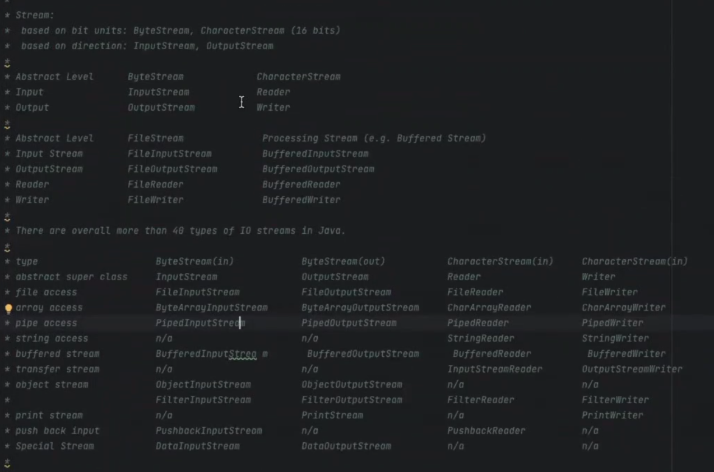
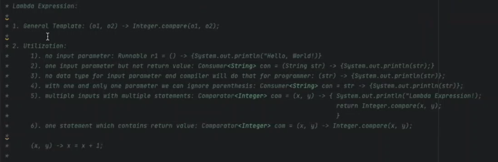
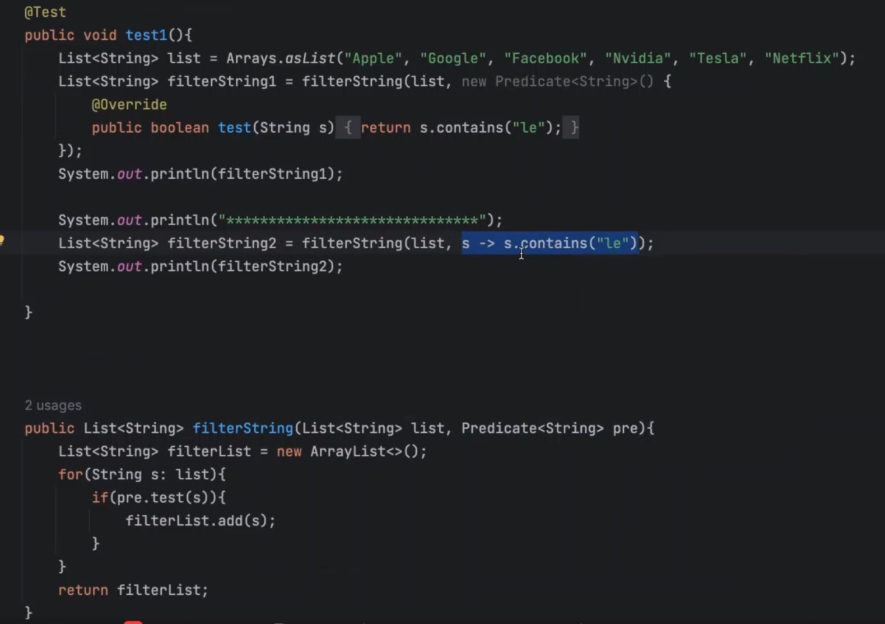
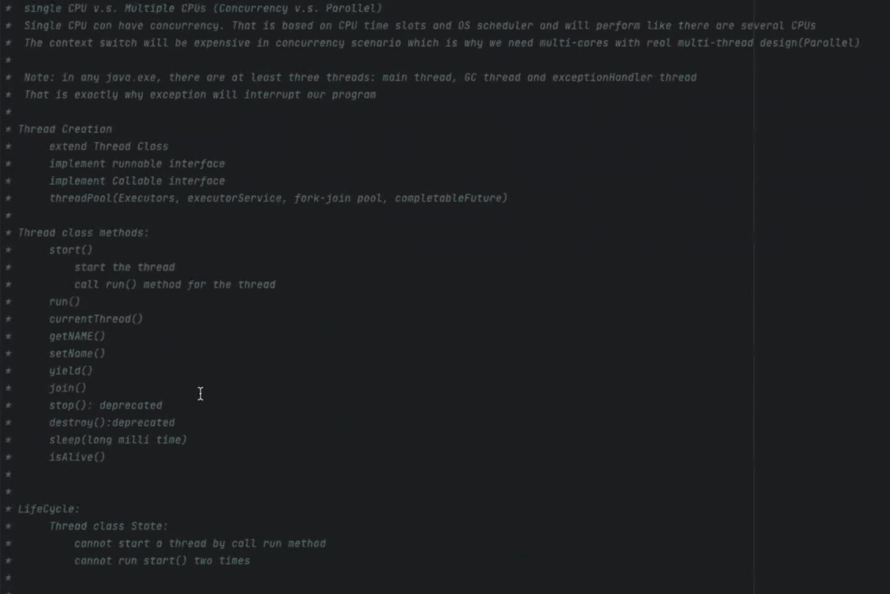
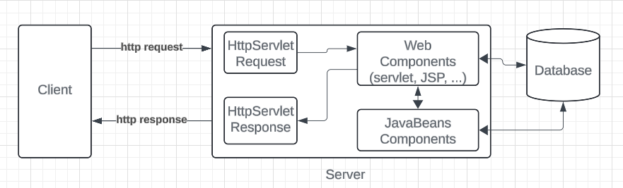
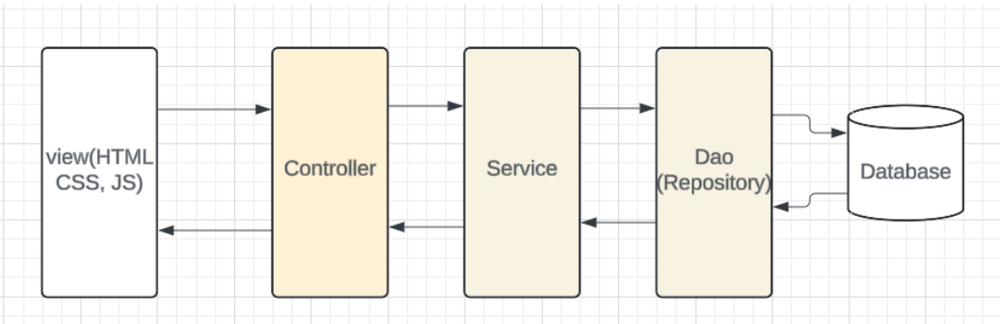
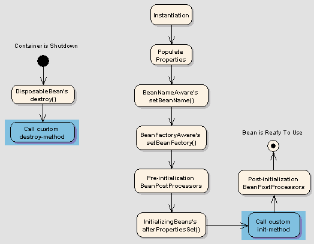
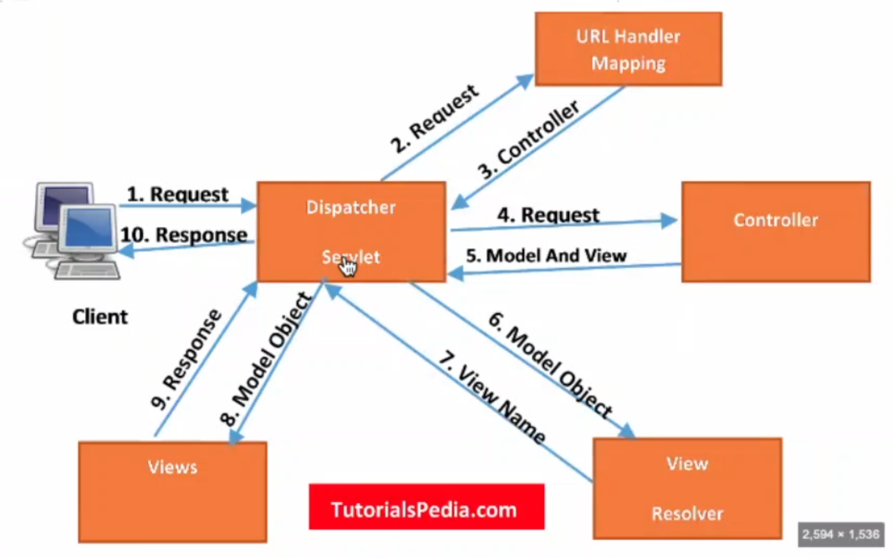

+++
title = 'Antra Training Concepts Cheat Sheet'
date = 2024-04-30T18:58:08-04:00
+++

```
static block?

singleton vs immutable class

abstract: class, method
final: class, method, variable
static: inner class, method, variable

jvm:
method area(after java 8, meta space): static, class template
heap: objects
vm stack: references and method
native(c/c++) method stack: old api within jam


jconsole
IntelliJ profiler
java flight recorder(since java 11 is free)
spring actuator

ArrayList<? extends Staff> list = new ArrayList();

confluence page->
	service 00 
				-> 000

bytestream(8 bits), characterstream(16 bits)
fileinputstream
fileread

lambda function type name

functional interface with static

virtual thread !!!!!         loom project

persons.stream(); vs persons.parallelStream();

method reference

traditional thread: use thread pool

thread pool vs virtual thread

threadFactory

synchronized method
synchronized static method

callable futureTask.get block the thread vs completableFuture

volatile : 2:38 visibility only not thread safety

CAS 

is that necessary to set accessible back to false for those private members


//////////////////
osi model, 7 layers vs tcp/ip model
200 1 2 4
307 8
400 1 3 4
500 

session/ cookies
	sticky session, weighted/ round robin

/// day 2
- Bean scope
  - singleton(default)
  - prototype
  - request
  - session
  - application
  - websocket

- types of DI(pros and cons)
  - constructor based DI
  - settrer based DI
  - filed based DI

- Bean Life Cycle
  - 

/// day 3
- AOP
  - Aspect
  - Advice
  - Joinpoint
  - Pointcut
  - Target
- AOP usages: 
  - crud operation(get, put, delete, post)
  - method special
    @ABC
    method_special();
  - ...

- Spring MVC
  - explain the work flow
- Springboot
  - pros: autoconfigration, 
```

## Core Java interview questions

## Java is passed by Value or Reference?
- In Java, there are two kinds of data type, **Primitive** data types and **Non-primitive** data types.
- For primitive types, they are built-in data types in Java including int/short/long/float/double/char/byte/boolean. They are all passed by value.
- For non-primitive types, they are also passed by value, the value here is actually the memory address of the object. e.g. annotation, class, interface, enum, array.
- In conclusion all data types in Java are passed by value.

## static keyword(within 5 sentences)
- we have four places to put static keyword on.(class, method, variable, block)
- For having static keyword on method, variable scope is to ensure that they can share just by class template. 
- what **SCOPES** we can access static elements.
  - we cannot override static method
  - static class cannot called by non-static method 

## Hashmap workflow
- Internally, Hashmap is an array of linkedList. 
- Each of the key-value pairs is passed into the hashCode method first, the key is going to pass as the input and generate values. With hashing result key-value pair is put in one of the place in the array, which is called bucket head. When there is any of hash code collision happened, then that's the reason why we need to override equals and hashCode methods. And when hash collision happened, then we are going to check if the two keys are exactly the same then we upate the value. If they are don't, that means there is a hash collision, where we are going to attach the same key at the same bucket head, which that's the reason why we need the LinkedList to handle hash collision. Because the search in LinkedList is going to be linearly grows regarding to the time complexity. That's why we need LinkedList to auto turning into Red-Black tree for later search time efficiency.

## How many access modifiers?
- public: visible in all classes in all packages 
- protected: visible to all classes in the same package or classes in other packages that are a subclass 
- default: visible to all classes in the same package 
- private: visible only in the same class

> The purpose of having access modifies is to ensure that we can do encapsulation implementation for our OOP program in Java.

## Pros and Cons of static

## Diff map and set. Can we have duplicate keys in map
- set is part of Collection interface, where as map is not part of Collection interface
- map is storing two dimension data, set is storing one dimension data.
- The HashSet is actually implemented by the HashMap in Java

## Given a series data, how to detect duplicate data and skip it?

## Comparable vs Comparator
- First, they are both functional interface, annotated with `@FunctionalInterface`
  - Comparable has one method `compareTo`
  - Comparator has one method `compare`
- Comparable is used to define the natural ordering of objects within the class itself.
- Comparator is used for external comparison logic.

## How GC works / GC generation
- When Java programs run on the JVM, objects are created on the heap, which is a portion of memory dedicated to the program. Eventually, some objects will no longer be needed. The garbage collector finds these unused objects and deletes them to free up memory.

- A generational garbage collector collects the short-lived objects more frequently than the longer lived ones. Short-lived objects are stored in the first generation, generation 0. The longer-lived objects are pushed into the higher generations, 1 or 2. The garbage collector works more frequently in the lower generations than in the higher ones.

- When an object is first created, it is put into generation 0. When the generation 0 is filled up, the garbage collector is invoked. The objects that survive the garbage collection in the first generation are promoted onto the next higher generation, generation 1. The objects that survive garbage collection in generation 1 are promoted onto the next and the highest generation, generation 2. This algorithm works efficiently for garbage collection of objects, as it is fast.


## Generics in Java, what is it, why we need it?

## Type erasing in Java, about generics

## what/why generic

## How to handle exceptions

## Checked vs Unchecked exception

## Threadpool 的 coding

## Multi-threading concepts and coding

## abstract, final, static
```
abstract: class, method
final: class, method, variable
static: inner class, method, variable, static block
```

### singleton vs immutable class

## keywords


## Sort methods


## JDK and JRE
- JDK = JRE + DEV tools (Javac Compiler etc.)
- JRE = JVM + Java SE standard library


## JVM
- Method Area(since java 8, meta space(replaced perm generation)): class template, static elements
  - Method Area is a standard, it keeps storing class templates
  - Meta space can resize JVM, once the memory space is all used up.
- VM stack: references and method
  - within stack, each thread be assign a private area within stack, everything within this area are only visible for that thread, unless we use `volatile` keyword.
- Heap: objects
  - all the threads are able to access.
- Program Counter Register: 
  - persist return tracker, allows each method stack know when to return where 
- Native Method stack: 
  - a place contains all legacy c/c++ APIs
  - anything decorated with `native` keyword is a method, that implements with either c or c++ storing in Native Method stack within JVM.

### JVM memory model


## What's the result from the code1
- Green Black
  - line 70 first


## the diff between RunOutOfMemory and OverStackFlow Exceptions in JVM

## ClassLoader
- Three types of classLoader
  - Bootstrap ClassLoader: to load the first pure java ClassLoader
  - Extension ClassLoader: to load extensions of core java from jdk extension library
  - System/Application ClassLoader: to load application type classes


## Class class
- It is used to describe the meta info inside a class.
- When a class is loaded from ClassLoader, one object of Class class will be created.
- With that object, we can call `getClass()` method or `.class` field to get the instance of the Class class.

## Reflection API
- Give us the ability that during the runtime, we can inspect and modify classes, methods, and fields dynamically. 
- It's not necessary to know everything about an object or class at compile time, instead we can discover them during the runtime.
- Reflection API is powerful, but there are some performance considerations. Generally speaking, it's slower than direct method calls, because it has overhead involves runtime type checking and method invocations. So in some performance-critical scenarios, we should not use Reflection API.

## Data Structures
- **Map** is not in **Collection** framework. That's why we cannot directly iterate key-value pairs within any Map implementation.

### Collection vs Collections
- **Collection** framework is for data structures.
- **Collections** is a class. That class contains lots of static methods including reverse/sort. That can help us manipulate our data structures including arrays.

### what's the result from the code2
- Person inherited from Object
- if we don't override hashCode method, it's basically comparing based on References.


### HashSet
- if we check HashSet implementation, HashSet is actually implemented by HashMap. But only this HashMap doesn't have any value, but only with the key. That's the default one.

### Comparison between any pair of data structures


## Java Flight Recorder
- It's a place that we can monitor our Java application. To check if there is any bottleneck for our web application regarding to the hardware and resources.

- Java Flight Recorder(since java 11 is free)
- jconsole
- IntelliJ profiler
- Spring Actuator

## Generic Data type
- Why: it gives us the ability that to make classes and methods more flexible and reusable by allowing them to operate on various types. It also provides compile-time type safety.
- How: 
  - type bounds: there are two types of bounds: upper bound(`extends`, <), lower bound(`super`, >=)
  - wildcard generics: it has greater flexibility, and it can also be bounded with those extends and super keyword.
- i.e. `ArrayList<? super String> list = new ArrayList();` 

## Enum
- it's a structure that contains some default values.
- i.e. some of constant values. like Days, Months, Weeks, etc.
- enum can implement interfaces
```
enum Day {
  SUNDAY, MONDAY,
  FRIDAY
}
```


### without Enum


## Annotations
- There are two types so annotation in Java: Normal annotation and Meta annotation.
  - Meta annotatios like parents or ancestors for decorating all the other annotations you can have in Java program. 
  - There are only four meta annotations since Java 8.
    - Retention: (means how long) it describes when this annotation is playing in Java program
      - SOURCE: after convert the annotation into the .class file, the annotation is going to be invalid.
      - CLASS (default): still valid with the .class file, after we loaded with ClassLoader, in the runtime, that annotation is not working anymore
      - RUNTIME: this annotation, starting from the .java file, compile to the .class, loading with the ClassLoader into JVM, until program is end. It keeps playing a role in our Java program
    - Target: (means where) where can we put the annotation on
      - Type
      - FILED
      - METHOD
      - PARAMETER
      - CONSTRUCTOR
      - LOCAL_VARIABLE
      - ANNOTATION_TYPE
      - PACKAGE
      - TYPE_PARAMETER
      - TYPE_USE
    - Documented: define if it is documented
    - Inherited: define if this annotation can inherit from parent to the child


## Exception Handling
- if it's checked exception, we have to extend from Exception class
- if it's unchecked exception, we need to extend from RuntimeException class

- Confluence Page:  a private library each company can have, they are going to share some of those common knowledge for web application on that page
  - service(first 2 numbers) to codeNumber
    - instagram 10
      - -> 01 login exceptions
      - -> 02 picture uploading exceptions
    - facebook  20
    - heel      30
    - ...
  - i.e. 10-001 is the error code

> when we trying to customize our Exceptions, we need to ensure **what the type of exceptions it is(extends Exception or extends RuntimeException)**, then **what kind of infomation that we need to pass(those public methods)**, last **messages and error code** are traditional ones that almost every customize exceptions can have.


### Inheritance in Exceptions
- the child class can only have same or narrower scope.
  - i.e. parent throws `Exception`, child should throws `Exception(same) or IOException(narrower)`


## IOStream
- There are two dimensions: 
  1. whether the stream is IN or OUT, that's we have in and out as direction
  2. based on the minimum unit to transfer the characters or file, we have either the Byte(8 bits, ByteStream) as the minimum unit or Character(two Bytes, 16 bits, CharacterStream)
- `FileInputStream`, reading file in 8 bits each time
- `FileoutputStream`, writing from JVM RAM to hard disk in 8 bits each time
- `FileReader`, reading file from hard disk to JVM in 16 bits each time 
- `FileWriter`, writing file from JVM to hard disk in 16 bits each time 
- `CharArrayReader`, writing file from JVM to hard disk in 16 bits each time 



> pay attention to `Bufffered` ones. They are just wrapping up the normal I/O Stream. It's trying to do increase the communication speed.
- `DEFAULT_BUFFER_SIZE = 8192` bytes, everytime with buffered we have 8 mb into JVM, instead of 1 byte or 2 bytes.


### In real practice example
- Due to `AutoCloseable` is inheritened by buffered streams.
  - means once we turn off the wrapper buffer stream, it will also turn off the inside
  - so we just need to close the buffered one, the inside will close automatically.


- Another good thing about `AutoCloseable` interface, is that once we implement that we can use `try-with-resource`


### virtual thread is the future


### Java 8 new features
- Lambda expressions
  - it's just method without a name
  - it's passing a function as annoymous object into Java program.
  - it's just a annoynous method wrapped up with an annoynoms object. That's the object is the actually the thing we passed to our Java program.



- Functional Interface
  - it's a kind of interface that has only 1 abstract method.
  - it can have multiple default methods and multiple static methods.
    - when use default methods:
      - when this functional interface has been implemented by different classes and later we need to use it as a common function for each every those classes.

    - when use static methods:
      - when we don't want instantiate anything, any object. Or if we don't want this default method to be override, then we can use static method rather than default method to define this common behavior.

  - i.e. Runnable, Callable, Comparator, Comparable, etc.

> There are four major functional interface introduced in Java 8
- Consumer<T>
- Supplier<T>
- Function<T>
- Predicate<T>




- Stream API
  - It's let java can program in a way just like other functional programming language.

  - Two types of stream:
    - finite stream 
      - normal `stream()`
      - `parallelStream()`
    - infinite stream
      - `iterate(0, t -> t + 2).limit(10).forEach(System.out::println)`
      - `generate(Math::random).limit(10).forEach(System.out::println)`
  - Two types of operations
    - intermediate operations
    - terminal operations
> it will keep original data intact.
  


- Method Reference
  - is a further utilization of Lambda Expression. which is also a functional interface.
  - it is trying to have a simplicity of the object and methods relationship that we can have. and return that into functional interface. with that functional interface will help us to  write stream API through functional style programming.
  - The only thing we cannot reference is **abstract method**, as long as the method has a method body, that means we can refer to it.


- Optional Class
  - it can help to handle NullPointerExceptions
  - it's just warp the original object, to handle the situation like null reference

- CompletableFuture

## Multithreading

- when we are talking about traditional thread, we should always use thread pool.
- virtual thread is good and is the future, but it's not available for old java versions.

- the first two ways to create new thread cannot throw any Exceptions, and no return for run method.
- the third one can have return data types and also can throw Exceptions.


> we can set priority for each thread from 1(least significant) - 10(most significant)

### Thread Life Cycle
- NEW
- RUNNABLE
- BLOCKED
- WAITING
- TIMED_WAITING
- TERMINATED

### ThreadPool(or ExecutorService)


## Design Patterns
### Singleton
- [reference](https://refactoring.guru/design-patterns/singleton)
- there is only one object we can create from the class.
- pros: 
  - singleton can work like a global variable
- cons: 
  - it's hard to do a unit test.
  - it needs special treatment in multi-threading programming 

### Simple Factory
- [reference](https://refactoring.guru/design-patterns/factory-comparison)
- there is a creation method with some parameters. with those parameters we can choose which class to use for instantiating the object.
- pros: 
  - it makes the code loosely coupled.
- cons: 
  - over time, the methods might become too big. in this case, we need to convert the simple factory design pattern into **Factory Method**, to introduce some subclasses to handle this situation.

### Builder
- is used to simplify the process of building a complex object.
- pros:
  - we can construct object step by step, and reuse the construction codes.
- cons:
  - it would have many extra codes like having many extra classes and methods

#### Builder vs Factory
- Factory design pattern hides the process of object creation. Users just ask for what they need.
- Builder design pattern allow users to know what is set for the object.

### Proxy
- In practice, the proxy has the same interface as a service, which makes it interchangeable with a real object when passed to a client.
- There are two types of proxy: the static proxy and the dynamic proxy.
- The static proxy requires developer to know the target class in advance, whereas the dynamic proxy doesn't, because the proxy class can be dynamically created by JVM during the runtime.


## OSI model vs TCP/IP model(won't be asked during the interview)
### OSI model
- 7 layers architecture: Physical / Data Link / Network / Transport / Session / Presentation / Application
- a typical modern network architecture
- As a developer, we will only focus on the top layer called **Application Layer**
  - including HTTP, FTP, SSH, DNS, etc. 
### TCP/IP model
- a simplified version network architecture
- 4 layers architecture: Network Access Layer[1,2] / Network / Transport / Application[5,6,7]

## TCP, UDP within Transport Layer
- divides the data in to many packets
- within the packet of TCP, has `Sequence Number`
- within the packet of UDP, no `Sequence Number`

- TCP is more secure, i.e. email
- UDP is faster, i.e. zoom meeting 

- TCP **4 way handshake process** is more secure than **3 way handshake process**

## HTTP
- a protocol in the Application Layer
- HTTP Request 
  - Request Message Header
    - Request Line
      - http methods(get, post, ...)
      - file address 
      - http version
    - Request Headers
      - some key-value pairs
  - a blank line
  - Request Message Body(normally is a json file, but can be anything)

- HTTP Response 
  - Response Message Header
    - Status Line
      - http version
      - http status code
    - Response Headers
      - some key-value pairs
  - a blank line
  - Response Message Body(normally is a json file, but can be anything)

## HTTP methods
- Safe: the http method does not change the state of the server, does not changing on the server side.
- Indempotent: two or more same requests are made to backend, and it will have the same effect.
- Cacheable: the browser caches some data for some http methods by default. (we can setup with `cache-control`)

| Methods                     | Safe | Indempotent | Cacheable | Description  |
|-----------------------------|------|-------------|-----------|--------------|
| Get                         | yes  | yes         | yes       | read         |
| Put                         | no   | yes         | no        | whole update |
| Post                        | no   | no          | no        | create       |
| Delete                      | no   | yes         | no        | remove       |
| Patch                       | no   | no(or yes)  | no        | patch update |
| headoptions/ trace/ connect |      |             |           |              |

## HTTP status codes
- 1xx: informational codes
- 2xx: success codes
- 3xx: redirection codes
- 4xx: client error codes
- 5xx: server error codes

```
200 OK -- the request has been successfully sent to the backend.
201 Created -- a new resource was created as a result.
202 Accepted -- the request has been accepted for processing, but the processing has not been completed.
204 No Content -- the request succeeded, but that the client doesn't need to navigate away from its current page. i.e. submitted some data with put method, the frontend doesn't need to be changed.

307 Temporary Redirect -- i.e. the primary website doesn't work due to some bug or maintenance, we need to redirect to backup server.
308 Permanent Redirect -- i.e. sometimes the old URL won't use anymore, we wanna keep our customers.

400 Bad Request -- the server cannot understand the request, because some invalid syntax or invalid parameters.
401 Unauthorized -- the request has not been completed because it lacks valid authentication credentials.
403 Forbidden -- the server understands the request but refuses to authorize it.
404 Not Found -- the server cannot find the requested resource.

500 Internal Server Error -- the server has encountered a situation it does not know how to handle.
```

## Session and Cookies (won't be asked during the interview)
- Cookies is a piece of data stored on the browser on the client side.
- Every session has sessionID stored on the server side, is used to store some user info.
- Cookies is generated by the session, all the requests and responses will take Cookies.


## Java Web Architecture
- Web Components(servlet, JSP): a unit can handle specific logic.



### Backend Web Server/Container
> **Web server** is software. **Server** is hardware. Web server is running on the server to host the Application to handle the request.
- Tomcat
- JBoss
- WebLogic
- TomEE
- WebSphere

## Three Layer Architecture (Web Application Three Layer Architecture)
- MVC design pattern
- Controller : handle http request
- Service : business logic, some computation
- Dao(Repository) : data access object layer, is used to connect to DB

> the underlying technology behind Spring Data JPA is Hibernate. the underlying technology behind the Hibernate is JDBC.




## Maven/Gradle
- project management tool

### Maven folder structure


### Types of Repositories in Maven
- Local Repository
  - ~/.m2
- Remote Repository
  - Central Repository
  - Customized Remote Repository

### Maven Life Cycle
- clean: clean cached data, cached dependencies.
- validate: check if necessary info is available.
- compile: compile the project.
- test: run all tests within test folder.
- package: we can package the project into jar or war.
- verify: check whether our code satisfy some criteria.
- install: install the project to local as dependency for other projects.

### .jar vs .war
- jar file contains the embedded server like tomcat, whereas war file doesn't.

## Spring IoC: Inversion of Control
- We transfer the control of the object to the container of framework, which is `ApplicationContext`.
- `ApplicationContext` helps us manage all beans life cycle.


- It is a principle which **transfer the control of the objects** to a container or framework.

## Dependency Injection
- We can inject the object into another object.


## Bean Scope
1. Singleton(default). 
  - The IoC container creates only one instance of the bean, and reuses it whenever that bean is requested. This is the default cope in Spring.
  - Use Case: When you want to share a single instance of a bean across the entire application.
  - Example: Configuration beans, controller beans, service beans, DAO beans, Logger beans, Utility beans.

2. Prototype. 
  - Use Case: When you want to create a new instance of a bean every time it is requested.
  - Example: Request-scoped beans in web applications, Prototype beans for stateful objects, Objects with complex initialization logic.

> Only valid in the context of a Spring Web ApplicationContext.

3. Request. 
  - Use Case: When you want to create a new instance of a bean for **each HTTP request** in a web application.
  - Example: Controllers, Form objects, View helpers, Request-specific data objects.

4. Session.
  - Use Case: When you want to create a single instance of a bean for **each user session** in a web application.
  - Example: User session beans, Shopping cart beans, User preferences beans, User authentication beans.

5. Application. 
  - A single instance of the bean is created for the entire web application context. This means all requests and sessions share the same instance of the bean.
  - Use Case: When you want to create a single instance of a bean for the entire web application context.
  - Example: Application-wide configuration beans, Global caching beans, Shared resources across multiple sessions.

6. WebSocket. 
  - Similar to session scope, but designed for WebSocket-based interactions.
  - Use Case: When you want to create a single instance of a bean for each WebSocket connection.
  - Example: WebSocket handlers, Session-specific WebSocket state beans.

7. Custom Scopes.
  - Use Case: When none of the built-in scopes meet your requirements, you can create custom scopes.
  - Example: Tenant-specific beans, Conversation-scoped beans, Batch job-scoped beans.


### Choose Appropriate Scope
- Singleton is suitable for stateless beans or beans that are expensive to create.
- Prototype is useful for stateful beans or beans that need to maintain their state separately.
- Request, Session, and Application scopes are suitable for beans that hold web-related state information and need to be scoped accordingly.

## Types of Dependency Injections
1. Constructor Injection: for **mandatory dependencies** so that our bean is ready to use when it is first time called.
  - pros:
    - All required dependencies are available at initialization time.
    - it's the only way for us to create immutable dependencies. It can avoid NullPointerException.
    - it also simplifies unit test.
    - Preventing errors in Tests
  - cons:
2. Setter Injection: only for **optional dependencies** to avoid **circular dependencies**.
  - pros:
  - cons:
3. Filed Injection: 
  - pros:
  - cons: it makes headache to test, so how do you test that without bring up spring context or using some type of reflection utilities to inject that. It can be done but it gives us a big headache when we do a private field in Autowired

## Bean Life Cycle
- `@PostConstruct`
- `@PreDestroy`



## AOP
- it enables us to monitor the methods, monitor the class, monitor everything without touching the service or some other classes.

### Usage of AOP
- log something
- Audit the crud operations from http request(get, put, post, delete)
- monitor some special method, like once the method was invoked, use AOP to send email to the admin.
- Caching
- Transaction
- Security

### Terms(basic components of AOP)
- Aspect
  - An aspect is a modular unit of cross-cutting concerns in AOP.
  - It encapsulates behaviors (advice) that are applied to multiple join points in the application.
  - Examples of aspects include logging, security, transaction management, and error handling.

- Advice: Advice is the action taken by an aspect at a particular **Join Point** during the execution of a program.
  - before advice: Executed before a method invocation.
  - after advice
    - `@AfterReturning`: Executed after a method returns successfully. 
    - `@AfterThrowing`: Executed after a method throws an exception. 
    - `@After(Finally)`: Executed regardless of the method outcome. 
  - around advice: Wraps a method invocation and controls its execution.

- Join Point: A join point is a specific point in the execution of a program where an aspect can be applied.
  - Examples of join points include method invocations, method executions, field access, object instantiation, and exception handling.

- Point Cut: a expression to find where to inject our AOP logic
  - `@PointCut("execution(* com.example.aop.springaop.*.*.*(..))")` first star means any return.
  - `@PointCut("within(com.example.aop.springaop..*)")`
  - `@PointCut("this(com.example.aop.springaop.service.ClassName)")` to find class
  - `@PointCut("@annotation(com.example.aop.springaop.annotation.CutomAnnotation)")` to find method

- Target: 
  - The **target object** is the object being advised by one or more **aspects**.
  - It is the object whose methods are intercepted by **advice** during method invocation.

### Some Default Annotations
- `@Cacheable`: is used to annotate methods to indicate that the results of method invocations can be cached.
- `@Transactional`: is used to annotate methods or classes to indicate that they are transactional.
  - It is commonly used to ensure data consistency and integrity by managing database transactions declaratively.
- `@Secured`: is used to specify method-level security constraints.
  - When applied to a method, Spring Security ensures that only users with the specified roles/authorities are allowed to execute the method.

### AOP workflow in Spring
- underlying logic of AOP is Reflection
- Dynamic Proxy -> Reflection


### SpringBoot Advantages
- auto configuration: 
  - to overwrite default configurations with `application.properties` file
- starter
  - `starter` dependencies integrated many useful dependencies for us.
  - In `pom.xml` file, it handles dependency version management and add dependency
- embedded Tomcat 
- Spring Actuator
- `@SpringBootApplication`
  - includes `@SpringBootConfiguration` + `@EnableAutoConfiguration` + `@ComponentScan` ....


### Annotations in SpringBoot
```
@Controller
@RestController
  - @RestController contains @Controller and @RespondBody.
  - if we only use @Controller to Controller class, we also have to add @RespondBody manually.

@Service

// the following two are same
@RequestMapping(value = "/user/{id}", method = RequestMethod.PUT)
@PutMapping("/user/id")

@Repository
@RequestMapping
@GetMapping
@PutMapping
@DeleteMapping
@PostMapping

@Component
@Bean

@ResponseBody: java object -> json
@RequestBody: json -> java object

// used to retrieve the data from URL
@PathVariable
  - is used to retrieve the parameter before the question mark
  - i.e. http://.../api/users/12
@RequestParam
  - is used to retrieve the parameters after the question mark
  - we can specify if some parameters are required or not, we can also give them defaultValue
  - i.e. http://.../api/users/?pageNo=2&rows=10

@GenerateValue(strategy = GenerationType.AUTO)

@Aspect

@PointCut("...")
public void loggingPointCut() {}

@Before("loggingPointCut()")
public void before(JointPoint joinPoint) {
  log.info("..." + joinPoint.getSignature());
}

@AfterReturning(value = "execution(* com.....)", returning = "employee")
public void after(JointPoint joinPoint, Employee employee) {
  lof.info("..." + employee);
}
@AfterThrowing(value = "execution(* com.....)", throwing = "e")
public void after(JointPoint joinPoint, Exception e) {
  lof.info("..." + e.getMessage());
}

@Around("loggingPointCut()")
public Object around(ProceedingJoinPoint joinPoint) throws Throwable {
  log.info("..." + joinPoint.getArgs()[0]);
  Object object = joinPoint.proceed();

  if (object instanceof Employee) {
    log.info("..." + joinPoint.getArgs()[0]);
  } else if (object instanceof Department) {
    log.info("..." + joinPoint.getArgs()[0]);
  }
  return object;
}
```

## Spring MVC
- Spring MVC is based on MVC design pattern, provides much convenience comparing to Spring
- Doesn't provide any embedded server, whereas SpringBoot does(Tomcat).

### Flow of Spring MVC
1. **DispatcherServlet** is used to intercept all requests.
2. send requests to **HandlerMapping** to choose Handler, find Controller
3. **Controller** will go through Business Logic (Service(business logic) -> Repository(Data Access) -> Database), then return the result(**ModelAndView Object**) to **DispatcherServlet**
4. The **DispatcherServlet** consults its list of **ViewResolver** beans to determine which view should be rendered.
5. **ViewResolver** implementations map logical view names to actual view templates (JSP, Thymeleaf, FreeMarker, etc.).
6. Once the view template is identified, the **DispatcherServlet** delegates the rendering of the view to the appropriate **ViewResolver**.
7. The **ViewResolver** renders the view template, populating it with data from the model (if any), and generates the final HTML or other content.
8. Finally, the **DispatcherServlet** sends the generated response (HTML, JSON, XML, etc.) back to the client that initiated the request.




## 3 Layers
- Controller, Service, Dao

## Pojo
- Plain Old Java Object
- it's a type of java object that is not tied to any specific framwork.
- it's simple and lightweight.
- it just includes some fields, constructor, setter and getter methods.

## h2 database
- it's a in-memory relational database
- it's useful for development and testing.
- once we close the application, the data will lost.

## Handle Exception in SpringBoot


- `@ExceptionHandler` within class, is **local** `@ExceptionHandler`.
- `@ControllerAdvice` class with `@ExceptionHandler`, is **global** `@ExceptionHandler`.
- Is Exception annotated by `@ResponseStatus`? `ResponseStatusExceptionResolver` class : `DefaultHandlerExceptionResolver` class;

## How Spring does Validation
- put `@Validated` within parameters of controller
- put the following annotation on pojo
```
@Validated

@NotNull
@NotEmpty
@Min
@Max
@Pattern
@Email
...
```

## Documentation
### Swagger
- it's a documentation framework
  - it will collection info from project 
  - then generate a website
  - show all the API created by the backend

## Questions in Mock interview
### The difference between HashMap and HashTable
- Regarding to Thread Safety
  - HashTable is synchronized, so it's thread-safe.
  - HashMap is not synchronized by default, so it's not thread-safe. But we can use `synchronizedMap()` method to create a synchronized wrapper around it.
- Regarding to Performance
  - HashMap has better performance than HashTable, because HashTable is synchronized, it has some overhead.
- Regarding to Null keys and values:
  - HashTable doesn't support any null key or null value.
  - HashMap support both null key and null value. And the null key will put at index 0.
- Regarding to Iteration
  - We cannot iterate both of them during modification in another thread.
  - Even with HashTable is thread-safe, we cannot do that.
  - So we should find a way to make sure, during the iteration, there will not modification happen anywhere.

### Exceptions that we are familiar with
- Checked Exceptions: 
  - it means they will be checked at compile-time. 
  - we must handle it in our code. either with `try-catch` block or throw its responsibility to up the call stack some universe place.
  - i.e. IOException, SQLException, FileNotFoundException

- UnChecked Exceptions
  - it's runtime exception. The handling is optional, if we don't handle it, it will propagate up the call stack until get caught or causing the program terminate.
  - i.e. IndexOutOfBoundException, NullPointerException, ArithmeticException

### Java 8 new features
- above

### In SpringBoot, the difference between Controller and RestController annotation
- @RestController contains @Controller and @RespondBody.
- if we only use @Controller to Controller class, we also have to add @RespondBody manually.

### Bean Scopes
- above
