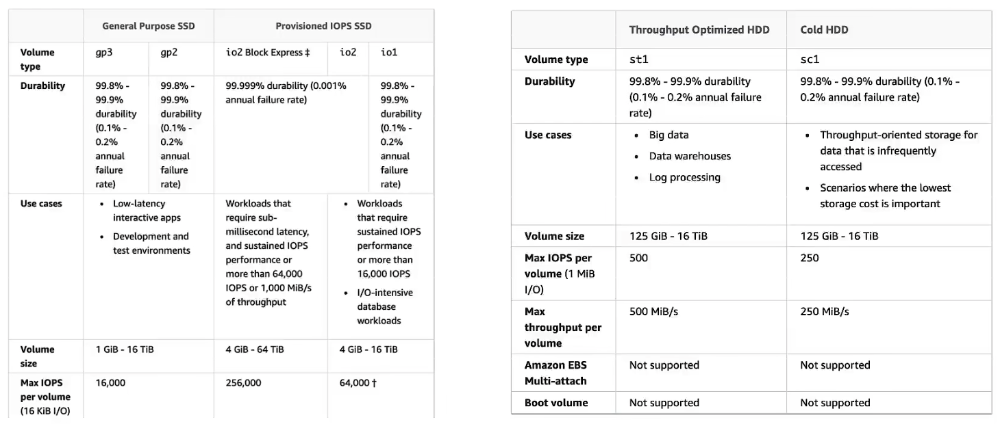

+++
title = 'AWS'
date = 2024-04-29T15:12:10-04:00
+++

- [SAA-02 Reference](https://github.com/keenanromain/AWS-SAA-C02-Study-Guide?tab=readme-ov-file#elastic-block-store-ebs)

## Global Services
- Identity and Access Management (IAM)
- Route 53 (DNS service)
- CloudFront (Content Delivery Network)
- WAF (Web Application Firewall)

## Region-scoped
- Amazon EC2 (Infrastructure as a Service)
  - Renting virtual machines (EC2)
  - Storing data on virtual drives (EBS)
  - Elastic File System (EFS)
  - Distributing load across machines (ELB)
  - Scaling the services using an auto-scaling group (ASG)
- Elastic Beanstalk (Platform as a Service)
- Lambda (Function as a Service)
- Rekognition (Software as a Service)

## IAM
```
which aws
aws --version

aws configure

aws iam list-users
```

## Section 7: EC2 Instance Storage
### EBS


#### General Purpose SSD, gp2, gp3
- gp3: IOPS and throughput are not linked.
- gp2: IOPS and throughput are linked.

#### Provisioned IOPS (PIOPS) SSD, io1/io2
- Use Case: 
  - Critical business applications with sustained IOPS performance.
  - Or applications that need more than 16000 IOPS
  - Great for database workloads(sensitive to storage perf and consistency)
- PIOPS and storage size are not linked just like gp3

#### Hard Disk Drives(HDD), st1, sc1
- cannot be boot volume

- Throughput Optimized HDD(st1)
  - Big Data, Data Warehouses, Log Processing

- Cold HDD(sc1)
  - For data that is infrequently accessed
  
#### EBS Multi-Attach - io1/io2 family
- attach the same EBS volume to multiple EC2 instances in the same AZ
- Up to 16 EC2 instances at a time.

#### EBS Encryption
- create snapshot
  1. copy snapshot && encrypt snapshot
  2. create volume from snapshot && encrypt volume

#### EFS
- EFS works with EC2 instances in multi-AZ

## Section 8: High Availability and Scalability: ELB & ASG


## Section 9: AWS Fundamentals: RDS + Aurora + ElastiCache

## Section 10: Route 53

## Section 11: Classic Solutions Architecture Discussions

## Section 12: Amazon S3 Introduction

## Section 13: Advanced Amazon S3

## Section 14: Amazon S3 Security

## Section 15: CloudFront & AWS Global Accelerator

## Section 16: AWS Storage Extras

## Section 17: Decoupling applications: SQS, SNS, Kinesis, Active MQ

## Section 18: Containers on AWS: ECS, Fargate, ECR & EKS

## Section 19: Serverless Overviews from a Solution Architect Perspective

## Section 20: Serverless Solution Architecture Discussions

## Section 21: Databases in AWS

## Section 22: Data & Analytics

## Section 23: Machine Learning

## Section 24: AWS Monitor & Audit: CloudWatch, CloudTrail & Config

## Section 25: Identiy and Access Management(IAM) - Advanced

## Section 26: AWS Security & Encryption: KMS, SSM Parameter Store, Shield, WAF

## Section 27: Networking - VPC

## Section 28: Disaster Recovery & Migrations

## Section 29: More Solution Architecures

## Section 30: Other Services

