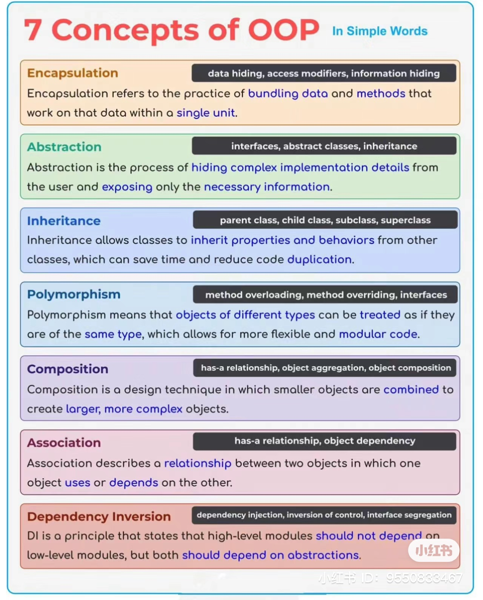

+++
title = 'BF'
date = 2024-03-29T18:09:26-04:00
+++

## Project/Work Experience

## Java Core: OOP, Exception, Concurrency, String, Java 8, etc
### OOP

### Exception
### Concurrency
### String
### Java 8

## Java Data Structure
### List
### Set
### Map
### Queue
### Stack

## Database
### SQL
### NoSQL

## Framework(optional): J2EE, Spring
## Frontend(optional): Angular, React
## Java Coding

## Interview Questions:
- [mj](https://www.1point3acres.com/bbs/thread-1045411-1-1.html)
- [mj](https://www.1point3acres.com/bbs/thread-1048363-1-1.html)

- 1. Springboot annotation 2. Primary key, foreign key 3. Hashmap,LinkedList vs ArrayList 4. Redis vs MySQL（resume里的项目） 5. Hibernate 6. Spring boot how to connect database 7. Leetcode 49 + 438

- What is concurrency and parallelism?

- What does the static keyword in Java do

- What do you know about OOP?

- Are you familiar with Request and Post in web development?

- 1. Short Answer
a. Project/Work Experience
b. JavaScript Basics: Variables, Scoping, ES6 Features, etc
c. Front-end Web Development: DOM, HTML, CSS
d. Framework/Library if applied, ex. Angular, React, Express.js, Redux Etc
2. Coding Session (subject to the interview)
a. IDE is a must. e.g. Visual Studio, WebStorm etc.
b. Clear explanation with time/space complexity
c. Programming Language: JavaScript/Typescript is strongly preferred

- Reverse the string with some restrictions.

- Java basic question, Spring components, SQL, vs NoSql Data structure quesion, arrayList vs LinkedList, hashSet implementation.
- Coding with leetcode medium. How to optimize the solution.

- 2 stirng questions and java basics

- basic leetcode, bhaviour questions and other design questions.

- coding: Leetcode 3. Longest Substring Without Repeating Characters

- Four core concepts of oop? Java collections

- They ask about core Java and my past experience.

- Do you know any design patterns? Specifically the Singleton pattern?

- Given a pattern and a string s, find if s follows the same pattern.

- Q: What is Polymorphism? What is OOP?

- What is the difference between ArrayList and LinkList

- linkedlist and some basic sql and java questions

- leetcode: top frequency element
- bq: what is the Challenge in your previous job and how you fix it

- Primary Key and Foreign Key in SQL?

- Implement a sorting algorithm

- polymorphism, over riding over loading, inheritance...

- 1. first round: phone call with recruiter, asked OOP, Basic Java, introduce yourself and the project you wored on before
- 2. Technical round: two easy/medium Level coding questions, was good because the interviewer is communicative
- 3. Manager Round: just some questions to know your background and give you some information about the company

- What is the difference between method overloading and overriding

- What is the difference between an array and an arraylist in java?

- Name some sorting algorithms and implement the merge sort.

- How does hashmap works internally?
  - HashMap use singly linked list to store elements, these are called bins or buckets. When we call put method, hashCode of key is used to determine the bucket that will be used to store the mapping. Once bucket is identified, hashCode is used to check if there is already a key with same hashCode or not.

- arraylist vs linkedlist
- final, finalize, finally

- Decode a string e.g. 2[a3[c]] to acccaccc

- Java: What data type is immutable?

- the coding problem is the string pattern

- Leetcode question: Valid Palindrome II, Transpose Matrix

- what is polymorphism?
- what is interface?
- what is final and static?

- Write a algorithm to figure the prime number.

## Training: JavaSE, J2EE, Hibernate, Spring, SpringBoot, Microservice, RabbitMQ, Kafka, Angular, React and several advanced technologies in modern day software development.