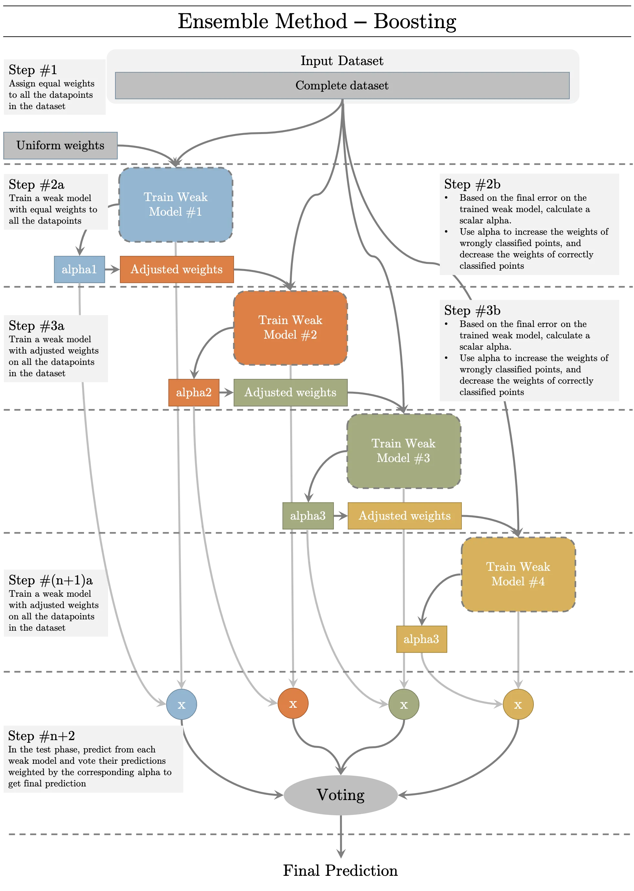
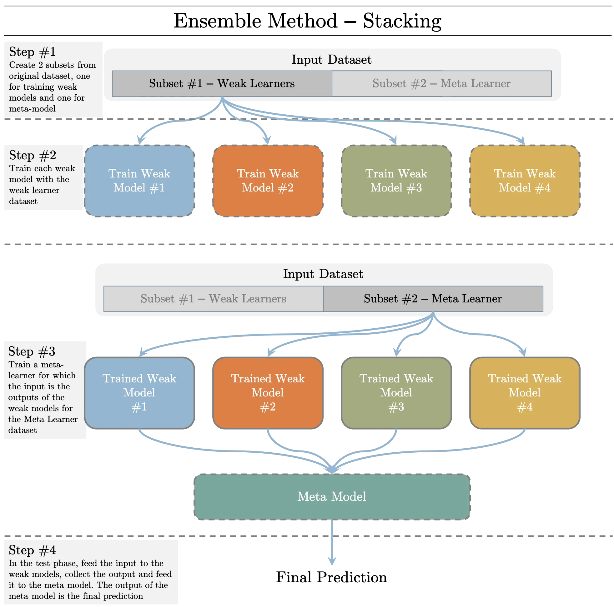

+++
title = 'Data Science Knowledge'
date = 2023-10-24T03:10:46-04:00
+++

## Bias vs Variance
- Low Bias(very sensitive to the training data), (then it performs poorly when we got new data)High Variance -- Overfitting
- Higher Bias(less sensitive to the training data), (then it performs better when we got new data)Low Variance -- Underfitting

- Error = bias^2 + variance + inreducible error
- The best model is where the error is reduced
- Compromise between bias and variance

- Solution: Use Cross Validation

## Handle imbalanced data
1. collect more data to even the imbalances in the dataset
2. resample the dataset to correct for imbalances
3. try a different algorithm altogether on your dataset

## precision & recall & F1
- **Precision** is a good measure to determine, when the costs of **False Positive** is high.
- We know that **Recall** shall be the model metric we use to select our best model when there is a high cost associated with **False Negative**.
- F1 Score might be a better measure to use if we need to seek a balance between Precision and Recall AND there is an uneven class distribution (large number of Actual Negatives).
    - F1: weighted average of the precision and recall of a model. 1 is the best, 0 is the worst. 
    - You would use it in classification tests where true negatives don't matter much.

## AUC
- 0.5 < ROC < 0.7: Poor discrimination
- 0.7 ≤ ROC < 0.8: Acceptable discrimination
- 0.8 ≤ ROC < 0.9: Excellent discrimination
- ROC ≥ 0.9: Outstanding discrimination

## Regularization
- Regularization is an approach to address over-fitting in ML.
- Overfitted model fails to generalize estimations on test data
- When the underlying model to be learned is **low bias/high variance**, or when we have **small amount of data**, the estimated model is prone to **over-fitting**.
### Types of Regularization
#### 1. Modify the loss function
- **L2 Regularization**: Prevents the weights from getting too large(defined by L2 norm). Larger the weights, more complex the model is, more chances of overfitting.
- **L1 Regularization**: Prevents the weights from getting too large(defined by L1 norm). Larger the weights, more complex the model is, more chances of overfitting. L1 Regularization introduces sparsity in the weights. It forces more weights to be zero, than reducing the average magnitude of all weights.
- **Entropy**: Used for the models that output probability. Forces the probability distribution towards **uniform distribution**.
#### 2. Modify data sampling
- **Data augmentation**: Create more data from available data by randomly cropping, dialting, rotating, adding small amount of noise, etc.
- **K-fold Cross-validation**: Divide the data in to k groups. Train on (k - 1) groups and test on 1 group. Try all k possible combinations.
#### 3. Change training approach
- **Injecting noise:** Add random noise to the weights when they are being learned. It pushes the model to be relatively insensitive to small variations in the weights, hence regularization.
- **Dropout:** Generally used for neural networks. Connections between consecutive layers are randomly dropped based on a dropout-ratio and the remaining network is trained in the current iteration. In the next iteration, another set of random connections are dropped.

## L1 vs L2 regularization
- L2 regularization tends to spread error among all the terms
- L1 is more binary/sparse, with many variables either being assigned a 1 or 0 in weighting.
- L1 corresponds to setting a Laplacean prior on the terms
- L2 corresponds to a Gaussian prior.

## Type I vs Type II error
- Type I error is a **false positive**: claiming something has happened when it hasn't
    - e.g. Telling a man he is pregnant.
- Type II eeror is a **false negative**: claiming nothing is happening when in fact something is.
    - e.g. Telling a pregnant woman she isn't carrying a baby.

## Likelihood vs Probability

## Linear Regression
## Logistic Regression
## Decision Trree
## SVM
### Soft Margin
- The name **Support Vector Classifier** comes from the fact that the observations on the edge and within the **Soft Margin** are called **Support Vectors**.

## Naive Bayes Algorithm
### Why "Naive"
- Because it makes an assumption: the conditional probabilities is calculated as the pure product of the individual probabilities of components.
- This implies the absolute independence of features -- a condition probably never met in real life.

## KNN
- sort the nearest neighbors of the given point by the distances in increasing order

### K
- small K: low bias, high variance, overfitting
- large K: high bias, low variance, underfitting
- best K: can be found with cross validation and learning curve

### Classification & Regression
- Classification - vote by top k candidates
- Regression - average of the k nearest neighbors' labels as the prediction

## K-means
## Random forest algorithm
## Dimensionality reduction algorithms
### PCA
- 
## Gradient boosting algorithm and AdaBoosting algorithm

## Ensemble Learning
Combined multiple weak models/learners into one predictive model to reduce bias, variance and/or improve accuracy.

### Types of Ensemble Learning: N number of weak learners
1. Bagging: Trains N different weak models(usually of same types - homogenous) with N non-overlapping subset of the input dataset in parallel. In the test phase, each model is evaluated. The label with the greatest number of predictions is selected as the prediction. Bagging methods reduces **variance** of the prediction. **Simple voting**

2. Boosting: Trains N different weak models(usually of same types - homogenous) with the complete dataset in a sequential order. The datapoints wrongly classified with previous weak model is provided more weights to that they an be classified by the next weak learner properly. In the test phase, each model is evaluated and based on the test error of each weak model, the prediction is weighted for voting. Boosting methods decreases the **bias** of the prediction. **Weighted voting**

3. Stacking: Trains N different weak models(usually of different types - heterogenous) with one of the two subsets of the dataset in parallel. Once the weak learners are trained, they are used to trained a meta learner to combine their predictions and carry out final prediction using the other subset. In the test phase, each model predicts its label, these set of labels are fed to the meta learner which generates the final prediction. Focus on improving **accuracy**. **Learned voting(meta-learning)**

