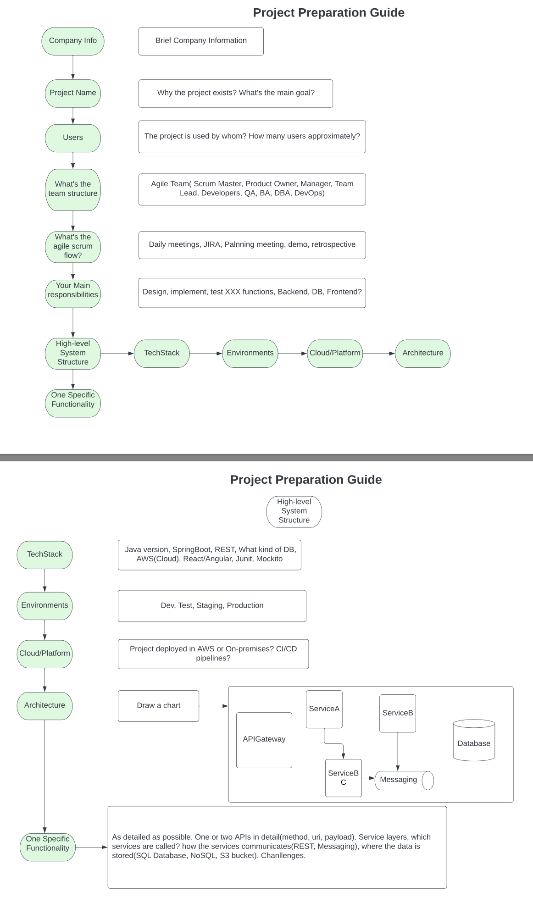

+++
title = 'Interview'
date = 2024-06-20T22:49:47-04:00
+++

## Questions to ask at the end of an interview
- At least 3 - 5 questions for the interviewer.
### 3 types of questions
1. Culture
   - What do you love most about your job?
   - What makes people stay with this organization?
   - What are the biggest challenges or opportunities that this organization or department is facing in the next six months to a year?
   - **What is your favorite part about working here in this organization?**
   - **How would you describe the work environment here?**
2. Role-specific
   - Can you tell me what a typical day or week looks like in this position?
   - What do you want the person in this position to accomplish in their first 30/60/90 days?
   - What challenges or opportunities do you foresee this position taking on in the next six month?
   - **How will my performance be measured in this position?**
   - **How long will this project last?**
   - **What are the next steps in the interview process?**
3. Hesitation
   - Do you have any hesitation about me filling this position?
   - Based on what we've talked about today, is there anything that is causing you hesitation about my fit for this position
   - How do I compare to other candidates you've interviewed for this role?
   - Have I answered all the questions that you have for me?
   - **Do you have any hesitation about my qualifications?**
   - **Is there anything I can clarify for you?**

## Project Preparation Guide

## Questions
### Important
- Introduce your self and the previous project in 2 to 3 minutes.
- Describe a specific function/feature you did in last project. As detailed as possible.
- How did you agile in your team? Typical Day?
- What is the size of team? BA, DBA, QA, TL(team lead)?
- Most challenging/proud task.
- What is the Deployment process? How do you release? How many environment do you have?
- Do you have front-end experience?
- Do you know Cloud/AWS? Where/what do you use?

### Normal
- What's your strong/weak point?
- Version control. How did you use it? SVN? GIT? Branching, CheckIn-CheckOut.
- Did you do production support.
- What will you do if you don't like the design from other team member? Conflict? Which project is your favorite?
- How did you use spring mvc/ws/hibernate/transaction/all technologies in your resume in detail with examples of your project
- How many tables you worked on, how much traffic, how many users/clients
- How did you use JIRA/jenkins?
- Do you write document? What kind of document? Swagger?
- What's the name of your manager/team lead/architect?
- Where is the project located?
- How did you do unit testing?
- How do you handle exception? How do you log? Any tools used?
- Do you know any scripting language? Where do you use scripting?
- Given a task/story, what's the steps you take to complete it? What if there are road-blockers?
- What will you do if you cannot finish a task on time?
- What's your next 5 years plan?
- What do you know about our company? Do some research before go to a client interview.
- Why are you looking for a new project?

