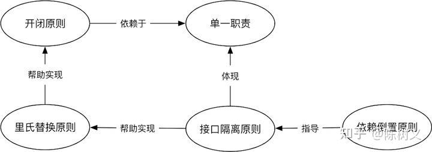

+++
title = 'SOLID'
date = 2024-04-29T20:09:27-04:00
+++

- S: Single-responsibility Principle
- O: Open-closed Principle
- L: Liskov Substitution Principle
- I: Interface Segregation Principle
- D: Dependency Inversion Principle

- [Reference](https://zhuanlan.zhihu.com/p/350291336)

## S -  Single-responsibility Principle
- **DEFINE**: The interface responsibility should be single and not take on too many responsibilities.
- Applies to interfaces, classes, and methods.
- The focus of the single responsibility principle lies in the division of responsibilities, which is often not static and needs to be determined based on the actual situation.
- **PROS**: It can reduce class complexity, clarify responsibilities between classes, improve code readability, and make it easier to maintain.
- **CONS**: The knowledge and skills required of technicians are high, and sometimes it is difficult to distinguish between responsibilities.

## O - Open-closed Principle
- **DEFINE**: when someone else wants to modify the software function, he cannot modify our original code and can only add new code to achieve the purpose of modifying the software function.
- **EXAMPLE**: we should can only create a new class to implement interface.

## L - Liskov Substitution Principle
- **DEFINE**: For users, where the parent class can be used, its subclasses can also be used, and the expected results are consistent.
- It not only refers to the syntax level consistency, but also includes the implementation consistency.

## I - Interface Segregation Principle
- **DEFINE**: Don't throw a large and comprehensive interface to users, but separate the interface that each user cares about.

## D - Dependency Inversion Principle
- It is recommended that users rely on an abstract class or interface instead of relying on a implementation.

## SOLID - GPT
The SOLID principles are a set of five design principles intended to make software designs more understandable, flexible, and maintainable. They were introduced by Robert C. Martin (also known as Uncle Bob). Each letter in the acronym SOLID stands for one of the principles:

1. **S - Single Responsibility Principle (SRP)**
2. **O - Open/Closed Principle (OCP)**
3. **L - Liskov Substitution Principle (LSP)**
4. **I - Interface Segregation Principle (ISP)**
5. **D - Dependency Inversion Principle (DIP)**

### 1. Single Responsibility Principle (SRP)

**Definition**: A class should have only one reason to change, meaning that a class should have only one job or responsibility.

**Explanation**:
- Each class should focus on a single task or responsibility.
- If a class handles multiple responsibilities, it becomes more complex and harder to maintain.
- Changes in one responsibility may affect the others, leading to fragile designs.

### 2. Open/Closed Principle (OCP)

**Definition**: Software entities (classes, modules, functions, etc.) should be open for extension but closed for modification.

**Explanation**:
- We should be able to add new functionality to a class without modifying its existing code.
- This is typically achieved through abstraction and polymorphism.
- Helps in minimizing the risk of introducing bugs in existing code when new features are added.

### 3. Liskov Substitution Principle (LSP)

**Definition**: Objects of a superclass should be replaceable with objects of a subclass without affecting the correctness of the program.

**Explanation**:
- Subtypes must be substitutable for their base types.
- Derived classes must extend the base class without changing its behavior.
- Ensures that a derived class can be used wherever the base class is expected.

### 4. Interface Segregation Principle (ISP)

**Definition**: Clients should not be forced to depend on interfaces they do not use.

**Explanation**:
- Split large interfaces into smaller, more specific ones so that clients only need to know about the methods that are of interest to them.
- Reduces the impact of changes, as clients are not affected by methods they do not use.

### 5. Dependency Inversion Principle (DIP)

**Definition**: High-level modules should not depend on low-level modules. Both should depend on abstractions. Abstractions should not depend on details. Details should depend on abstractions.

**Explanation**:
- Decouple software modules by introducing interfaces or abstract classes.
- High-level modules define the interfaces that low-level modules implement, reversing the typical dependency direction.

## Summary

- **SRP**: One class, one responsibility.
- **OCP**: Open for extension, closed for modification.
- **LSP**: Subtypes must be substitutable for their base types.
- **ISP**: Prefer smaller, specific interfaces over a large, general-purpose interface.
- **DIP**: Depend on abstractions, not on concrete implementations.

These principles help create more modular, maintainable, and flexible codebases, improving software quality and reducing the risk of bugs and technical debt.
