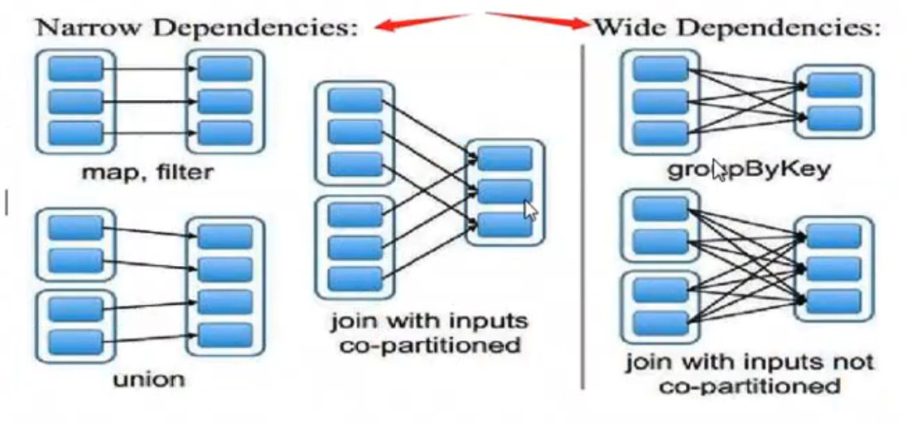

+++
title = 'Spark Core'
date = 2023-12-03T19:43:27-05:00
+++

## RDD

- Resilient distributed dataset
  1. Fault tolerance
  2. distributed
  3. immutable data structure, stored in disk or memory
- There are multiple partitions(#partitions is the same as #machines) within one RDD
- DN(Data Node to store data) and Worker(to compute) are all in one machine(best practice)
  - only shuffle need data transfering with network, others are in local machine

### reduceByKey

```
hadoop ---> (hadoop, 1)
hadoop ---> (hadoop, 1)
hadoop ---> (hadoop, 1)
hive ---> (hive, 1)
hive ---> (hive, 1)
hive ---> (hive, 1)
```

- reduceByKey

```
<hadoop, [1, 1, 1]>
<hive, [1, 1, 1]>
```

- shuffle

```
hash(hadoop) ---> hashcode % 3 = 1(machine 1)
hash(hive) ---> hashcode % 3 = 2(machine 2)
```

### operations

#### transformation: RDD-->RDD

| Operations  | Summary                                                                                          |
| :---------- | ------------------------------------------------------------------------------------------------ |
| map         | return a new RDD                                                                                 |
| filter      | return a new RDD; true: keep, false: remove                                                      |
| flatMap     | map + flat(from two dimentional to one dimentional)                                              |
| groupByKey  |                                                                                                  |
| reduceByKey | groupByKey(get <hadoop, [1, 1, 1]>) + map(get <hadoop, 3>)                                       |
| sortByKey   | not default in spark, but default in hadoop                                                      |
| join        | cogroup + remove nulls: join by key of <key, value>, all pairs will handle by cutomized function |
| cogroup     | full join                                                                                        |

#### action: RDD-->anything else

| Operations                 | Summary                                                                                                                        |
| :------------------------- | ------------------------------------------------------------------------------------------------------------------------------ |
| reduce                     | operation on all elements within RDD, first merges with second element, and then the result merges with the third element, ... |
| collect                    | get all elements within RDD to local client                                                                                    |
| count                      | get the total number of elements within RDD                                                                                    |
| take(n)                    | get first unsorted n elements within RDD, top(n) can have first sorted n elements                                              |
| takeOrdered(n, [ordering]) | get first sorted n elements within RDD using natural order or a custom comparator                                              |
| saveAsTextFile             | save to file, each element with toString method                                                                                |
| countByKey                 |                                                                                                                                |
| foreach                    | iterate each element within RDD                                                                                                |

### Depencencies(This topic is Transformation operation related)

- with shuffle(internet connections between different machines) is wide dependency
- without shuffle is narrow dependency

#### narrow dependencies - 1 : 1
每个父RDD的分区都至多被一个子RDD的分区使用。一对一
1. 输入输出一对一，结果RDD的分区结构不变，主要是map, flatMap
2. 输入输出一对一，但结果RDD的分区结构发生变化，如union, coalesce
3. 从输入中选择部分元素的算子，如filter, distinct, subtract, sample

#### wide dependencies - multiple : multiple
多个子RDD的分区依赖一个父RDD的分区。一对多
1. 对单个RDD基于key进行分组，如groupByKey, reduceByKey
2. 对两个RDD基于key进行join，如join

## Create sparkContext

```python
from pyspark.sql import SparkSession
spark = SparkSession.builder.master("spark://localhost:7077").appName("rdd_demos").getOrCreate()
sc = spark.sparkContext
```

## Create RDD

### 1. parallelize array
```python
# parallelize array in memory to crete RDD
arr1 = [1, 2, 3, 4, 5, 6, 7, 8, 9, 10] # run in client
rdd1 = spark.sparkContext.parallelize(arr1) # run in server
# This is an Action, return RDD to Driver
rdd1.collect()
# check the number of partitions of current RDD
rdd1.getNumPartitions()

# OR
# create RDD like this # range(start = 0, end, step = 1)
rdd2 = spark.sparkContext.parallelize(range(3, 11, 1))
rdd2.collect()
```
### 2. load data from outside
1. txt file
```python
file = "/opt/module/spark-3.5.0-bin-hadoop3/data/core/data/workcount.txt"
rdd3 = spark.sparkContext.textfile(file)
rdd3.collect()
```
2. json file
```python
jsonFile = "/opt/module/spark-3.5.0-bin-hadoop3/data/core/data/people.json"
jsonRDD = sc.textFile(jsonFile)
jsonRDD.collect()

# python use json module to handle json file
import json
result = jsonRDD.map(lambda line: json.loads(line))
result.collect()
# for d in result.collect():
#     print(d)
```
- [spark通过textFile读取hdfs数据分区数量规则](https://www.jianshu.com/p/e33671341f0d)
- [Spark：RDD数据分区数量总结(并行化集合parallelize与外部数据集textFile)](https://blog.csdn.net/qq_39192827/article/details/97494565)

## RDD Operations
- [Spark RDD 创建操作](https://www.cnblogs.com/abcdwxc/p/9867475.html)
### transformation: RDD-->RDD
```python
# Suppose we have an RDD, including {1, 2, 3, 3}
# first, create a RDD
data = spark.sparkContext.parallelize([1, 2, 3, 3])

# map
data_rdd1 = data.map(lambda x: x + 1)
data_rdd1.collect() # [2, 3, 4, 4]

# flatMap
data_rdd2 = data.flatMap(lambda x: range(x, 4))
data_rdd2.collect() # [1, 2, 3, 2, 3, 3, 3]

# filter
data_rdd3 = data.filter(lambda x: x != 1)
data_rdd3.collect() # [2, 3, 3]

# distinct
data_rdd4 = data.distinct()
data_rdd4.collect() # [1, 2, 3]

# sample: sample(withReplacement, fraction, seed)
# withReplacement param: 是否放回采样
# fraction param: 抽取比例
# seed param: random seed(optional)
data_rdd5 = data.sample(False, 0.5)
data_rdd5.collect()
# takeSample: Action not Transformation
# sample + take(2)
data_rdd51 = data.takeSample(False, 2)
print(data_rdd51)
```

```python
# Suppose we have two RDDs, {1, 2, 3, 3} and {3, 4, 5}
# first, create two RDDs
data1 = spark.sparkContext.parallelize([1, 2, 3, 3])
data2 = spark.sparkContext.parallelize([3, 4, 5])

# union
# similar to union all in mysql, not union in mysql
data1.union(data2).collect() # [1, 2, 3, 3, 3, 4, 5]

# intersection
data1.intersection(data2).collect() # [3]

# subtract
data1.subtract(data2).collect() # [1, 2]

# cartesian
data1.cartesian(data2).collect()
# [(1, 3),
#  (1, 4),
#  (1, 5),
#  (2, 3),
#  (2, 4),
#  (2, 5),
#  (3, 3),
#  (3, 4),
#  (3, 5),
#  (3, 3),
#  (3, 4),
#  (3, 5)]
```

```python
# groupBy
a = spark.sparkContext.parallelize(["black", "blue", "white", "green", "grey"])
b = a.groupBy(lambda x: len(x)).collect()
print(b) # [(4, <pyspark.resultiterable.ResultIterable object at 0x7f95187af580>), (5, <pyspark.resultiterable.ResultIterable object at 0x7f95087b5c10>)]
sorted([(x, sorted(y)) for (x, y) in b]) # [(4, ['blue', 'grey']), (5, ['black', 'green', 'white'])]
```

### action: RDD-->anything else
```python
# create a RDD
rdd = spark.sparkContext.parallelize([1, 2, 3, 3])

rdd.count() # 4

rdd.collect() # [1, 2, 3, 3]

rdd.first() # 1

rdd.countByValue() # defaultdict(int, {1: 1, 2: 1, 3: 2})

rdd.take(2) # [1, 2]

rdd.takeOrdered(2) # [1, 2]

rdd.takeOrdered(2, key=lambda x: -x) # [3, 3]

rdd.takeSample(False, 2)

rdd.reduce(lambda x, y: x + y) # 9
# reduce
#     x:("", 0), y:("hadoop", 1)
#     x:("hadoop", 1), y:("hadoop", 1)
#     x:("hadoophadoop", 2)
# reduceByKey: ignore key, only care value
#     x:0, y:1
#     x:1, y:1
#     x:2, y:1

rdd.fole(0, lambda x, y: x + y)
# fold
#     has an initial value for each partition and one more for merging

# aggregate(zeroValue, seqOp, combOp)
print("RDD 当前的分区数是: ", rdd.getNumPartitions()) # RDD 当前的分区数是:  8
seqOp = (lambda x, y: x * y) # 每个分区执行的函数
combOp = (lambda x, y: x + y) # 各个分区结果最后聚集时使用的函数
result = rdd.aggregate(2, seqOp, combOp)
result # 28

seqOp = (lambda x, y: (x[0] + y, x[1] + 1))
combOp = (lambda x, y: (x[0] + y[0], x[1] + y[1]))
result1 = spark.sparkContext.parallelize([1, 2, 3, 4]).aggregate((0, 0), seqOp, combOp)
print(result1) # (10, 4)

result2 = spark.sparkContext.parallelize([]).aggregate((0, 0), seqOp, combOp)
print(result2) # (0, 0)
```
- `reduce` is the special case of `fold`
- `fold` is the special case of `aggregate`

### RDD action on numeric data(description statistics)
```python
rdd1 = sc.parallelize(range(1, 21, 2))
rdd1.collect()

rdd1.sum()
rdd1.max()
rdd1.min()
# mean
rdd1.mean()
rdd1.count()
# variance
rdd1.variance()
# sample variance
rdd1.sampleVariance()
# standard deviation
rdd1.stdev()
# sample standard deviation
rdd1.sampleStdev()
# Histogram reference: https://blog.csdn.net/hit0803107/article/details/52807485 
# Approach 1
rdd1.histogram([1.0, 8.0, 20.9])
# Approach 2
rdd1.histogram(3)

# 通过调用stats()方法，返回一个StatsCounter对象
status = rdd1.stats()
print(status.sum())
print(status.max())
print(status.min())
print(status.mean())
print(status.count())
print(status.variance())
print(status.stdev())
```

## Pair RDD Operations
### create Pair RDD
```python
# There are multiple ways to create Pair RDD
# Approach 1: load from file, and then transform to Pair RDD
file = "/data/spark_demo/rdd/wc.txt"
lines = spark.sparkContext.textFile(file)

pairRDD = lines.flatMap(lambda line: line.split(" ")).map(lambda word: (word, 1))
pairRDD.collect()
```

```python
# Approach 2: parallelize array
rdd = spark.sparkContext.parallelize(["Hadoop", "Spark", "Hive", "Spark"])
pairRDD = rdd.map(lambda word: (word, 1))
pairRDD.collect() # [('Hadoop', 1), ('Spark', 1), ('Hive', 1), ('Spark', 1)]
```

```python
# Approach 3: keyBy(): customize the rule for key grouping
a = spark.sparkContext.parallelize(["black", "blue", "white", "green", "grey"])

# with cutomized function to create keys, return Pair RDD
b = a.keyBy(lambda x: len(x))
b.collect() # [(5, 'black'), (4, 'blue'), (5, 'white'), (5, 'green'), (4, 'grey')]
```

```python
# Approach 4: creating with tuple
pets = spark.sparkContext.parallelize([("cat", 1), ("dog", 1), ("cat", 2)])
pets.collect() # [('cat', 1), ('dog', 1), ('cat', 2)]
```

### transformation on Pair RDD
- `reduceByKey` is special case of `aggregateByKey`
- `aggregateByKey` is special case of `combineByKey`

```python
# Suppose we have a pair RDD [(1, 2), (3, 4), (3, 6)]
# Create Pair RDD
pairRDD = spark.sparkContext.parallelize([(1, 2), (3, 4), (3, 6)])
pairRDD.collect()
```

```python
# reduceByKey(func)
pairRDD.reduceByKey(lambda x, y: x + y).collect() # [(1, 2), (3, 10)]

# groupByKey()
pairRDD.groupByKey().collect()
# [(1, <pyspark.resultiterable.ResultIterable at 0x7f94d9638970>),
#  (3, <pyspark.resultiterable.ResultIterable at 0x7f94d021f550>)]

# keys: return all keys
pairRDD.keys().collect() # [1, 3, 3]

# values: return all values
pairRDD.values().collect() # [2, 4, 6]

# sortByKey(): default is increasing
pairRDD.sortByKey().collect() # [(1, 2), (3, 4), (3, 6)]

# pairRDD.sortByKey(ascending=False).collect()
pairRDD.sortByKey(False).collect() # [(3, 4), (3, 6), (1, 2)]

# mapValues(func): apply func to each element of Pair RDD, without chaning key
pairRDD.mapValues(lambda x: x * x).collect() # [(1, 4), (3, 16), (3, 36)]

# flatMapValues(func)
pairRDD.flatMapValues(lambda x: range(x, 6)).collect() # [(1, 2), (1, 3), (1, 4), (1, 5), (3, 4), (3, 5)]
```

```python
# combineByKey()
data = spark.sparkContext.parallelize([("company-1", 92), ("company-1", 85), ("company-1", 82),\
                                       ("company-1", 93), ("company-1", 86), ("company-1", 83),\
                                       ("company-2", 78), ("company-2", 96), ("company-2", 85),\
                                       ("company-3", 88), ("company-3", 94), ("company-3", 80)], 3)
cbk = data.combineByKey(
    lambda income: (income, 1),
    lambda t, income: (t[0] + income, t[1] + 1),
    lambda t1, t2: (t1[0] + t2[0], t1[1] + t2[1])
)

# total income of each company
cbk.collect() # [('company-1', (521, 6)), ('company-3', (262, 3)), ('company-2', (259, 3))]

# average income of each company
cbk.map(lambda t: (t[0], t[1][0], t[1][0]/float(t[1][1]))).collect()
# [('company-1', 521, 86.83333333333333),
#  ('company-3', 262, 87.33333333333333),
#  ('company-2', 259, 86.33333333333333)]
```

```python
# reduceByKey()
x = spark.sparkContext.parallelize([("a", 1), ("b", 1), ("a", 1), ("a", 1), ("b", 1), ("b", 1), ("b", 1), ("b", 1)], 2)

# apply reduceByKey
y = x.reduceByKey(lambda accum, n: accum + n)
y.collect() # [('b', 5), ('a', 3)]

# customize func separately
def sumFunc(accum, n):
    return accum + n

y = x.reduceByKey(sumFunc)
print(y.collect()) # [('b', 5), ('a', 3)]
```

```python
# groupByKey()
x = spark.sparkContext.parallelize([
    ("USA", 1), ("USA", 2), ("India", 1),\
    ("UK", 1), ("India", 4), ("India", 9),\
    ("USA", 8), ("USA", 3), ("India", 4),\
    ("UK", 6), ("UK", 9), ("UK", 5)], 4)

# utilize groupByKey, default partition
y = x.groupByKey()

# check partitions
print("number of partitions: ", y.getNumPartitions())

# utilize pre-defined partition
y = x.groupByKey(2)
print("number of partitions: ", y.getNumPartitions())

# output result
for t in y.collect():
    print(t[0], [v for v in t[1]])
```

```python
# aggregateByKey
# utilize key-value pair creating pairRDD studentRDD
student_rdd = spark.sparkContext.parallelize([
    ("Joseph", "Maths", 83), ("Joseph", "Physics", 74), ("Joseph", "Chemistry", 91),\
    ("Joseph", "Biology", 82), ("Jimmy", "Maths", 69), ("Jimmy", "Physics", 62),\
    ("Jimmy", "Chemistry", 97), ("Jimmy", "Biology", 80), ("Tina", "Maths", 78),\
    ("Tina", "Physics", 73), ("Tina", "Chemistry", 68), ("Tina", "Biology", 87),\
    ("Thomas", "Maths", 87), ("Thomas", "Physics", 93), ("Thomas", "Chemistry", 91),\
    ("Thomas", "Biology", 74), ("Cory", "Maths", 56), ("Cory", "Physics", 65),\
    ("Cory", "Chemistry", 71), ("Cory", "Biology", 68), ("Jackeline", "Maths", 86),\
    ("Jackeline", "Physics", 62), ("Jackeline", "Chemistry", 75), ("Jackeline", "Biology", 83),\
    ("Juan", "Maths", 63), ("Juan", "Physics", 69), ("Juan", "Chemistry", 64),\
    ("Juan", "Biology", 60)], 2)

# define Sequential Operation and Combiner Operation
# Sequential Operation: find maximum score from single partition
def seq_op(accumulator, element):
    if (accumulator > element[1]):
        return accumulator
    else:
        return element[1]
# Combiner Operation: find maximum score from accumulators of all partitions
def comb_op(accumulator1, accumulator2):
    if (accumulator1 > accumulator2):
        return accumulator1
    else:
        return accumulator2
# In our scenario, zero value is 0, because we are trying to find the maximum score
zero_val = 0
aggr_rdd = student_rdd.map(lambda t: (t[0], (t[1], t[2]))).aggregateByKey(zero_val, seq_op, comb_op)

# Check output
for tpl in aggr_rdd.collect():
    print(tpl)
# ('Jimmy', 97)
# ('Tina', 87)
# ('Thomas', 93)
# ('Joseph', 91)
# ('Cory', 71)
# ('Jackeline', 86)
# ('Juan', 69)

# redefine Sequential Operation and Combiner Operation
def seq_op(accumulator, element):
    return (accumulator[0] + element[1], accumulator[1] + 1)

def comb_op(accumulator1, accumulator2):
    return (accumulator1[0] + accumulator2[0], accumulator1[1] + accumulator2[1])

zero_val = (0, 0)
aggr_rdd = student_rdd.map(lambda t: (t[0], (t[1], t[2])))\
                      .aggregateByKey(zero_val, seq_op, comb_op)\
                      .map(lambda t: (t[0], t[1][0]/t[1][1]*1.0))
for tpl in aggr_rdd.collect():
    print(tpl)
# ('Jimmy', 77.0)
# ('Tina', 76.5)
# ('Thomas', 86.25)
# ('Joseph', 82.5)
# ('Cory', 65.0)
# ('Jackeline', 76.5)
# ('Juan', 64.0)
```

## RDD cache
### overview
- One of the reasons why Spark is so fast is that it can cache datasets in memory during different operations.
- When an RDD is cached, each node will save the partition computation result in memory and reuse them in other actions performed on this RDD or derived RDDs. This makes subsequenct actions much faster. 
- Cache is key to building iterative algorithms and fast iteractive queries in Spark.

### approaches
1. persist
2. cache
- only after triggering **actions**, then current RDD will be cached in memory for later use
- cache invoke persist at last, the default storage level just a part in memory

```scala
/** Persist this RDD with the default storage level (MEMORY_ONLY)
def persist(): this.type = persist(StorageLevel.MEMORY_ONLY)

/** Persist this RDD with the default storage level (MEMORY_ONLY)
def cache(): this.type = persist()
```

- There are many storage levels in Spark, storage level is defined in **object StorageLevel**
```scala
object StorageLevel {
    val NONE = new StorageLevel(false, false, false, false)
    val DISK_ONLY = new StorageLevel(true, false, false, false)
    val DISK_ONLY_2 = new StorageLevel(true, false, false, false, 2)
    val MEMORY_ONLY = new StorageLevel(false, true, false, true)
    val MEMORY_ONLY_2 = new StorageLevel(false, true, false, true, 2)
    val MEMORY_ONLY_SER = new StorageLevel(false, true, false, false)
    val MEMORY_ONLY_SER_2 = new StorageLevel(false, true, false, false, 2)
    val MEMORY_AND_DISK = new StorageLevel(true, true, false, true)
    val MEMORY_AND_DISK_2 = new StorageLevel(true, true, false, true, 2)
    val MEMORY_AND_DISK_SER = new StorageLevel(true, true, false, false)
    val MEMORY_AND_DISK_SER_2 = new StorageLevel(true, true, false, false, 2)
    val OFF_HEAP = new StorageLevel(false, false, true, false)
}
```
- Fault tolerance can recompute some failed partitions of RDD, not all partitions of all RDD

## Fault tolerance
### overview
- **fault tolerance**: use Lineage and Checkpoint

### lineage mechanism
- RDD's lineage records **Coarse-grained** specific data from Transformation operation. So when some partitions of a RDD lost data, it can reload or recompute from Lineage.
- This Coarse-grained data model limited use cases of Spark, so that Spark cannot use for high performance scenarios.

Spark Lineage mechanism is performed through RDD dependencies:
1. narrow dependency: certain data of child RDD can be directly computed from certain data of parent RDD
2. wide dependency: **recompute all parents' RDD**, then after finished and hashing, recomputing children RDD. When we deal with long lineage, we need set appropriate checkpoint.

### checkpoint mechanism
- There are two approaches:
    1. **LocalRDDCheckpointData**: temporarly saved in local disk and memory. It's fast, good for scenarios that lineage info needed to be deleted frequently(e.g. GraphX), can tolerate executor fail.
    2. **ReliableRDDCheckpointData**: saved in reliable outside storage(e.g. HDFS), can tolerate driver fail. It's not fast as local, but it has the highest fault tolerance level. 
> If the code doesn't setup checkpoint, it will use local mode checkpoint. If the path is setup, it will use reliable mode checkpoint.

- RDD's action triggering computation, then executing checkpoint.
- If task fails, it will load data from checkpoint to compute


## Data Partitions
- RDD is very large, it will be cutted into partitions saved in different nodes. This is where RDD come from.
### assign partitions when creating RDD

### assign partitions when transforming RDD

### customize partition function

## Shared Variables

### overview

### broadcast

#### utilize broadcast

#### update broadcast

#### release broadcast

### accumulator

## Shuffle
