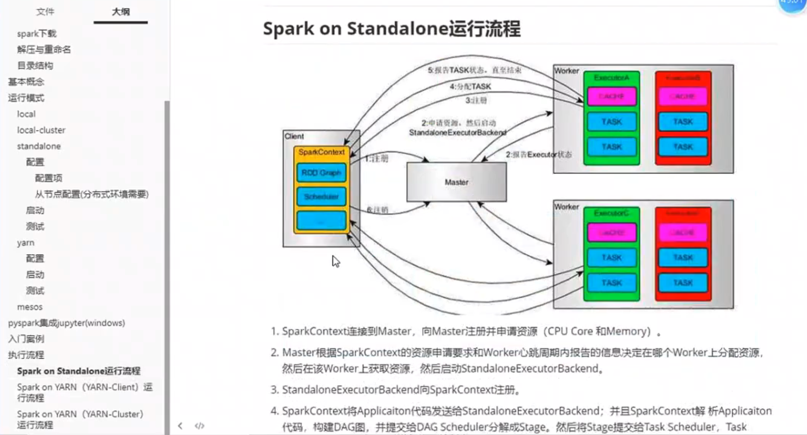
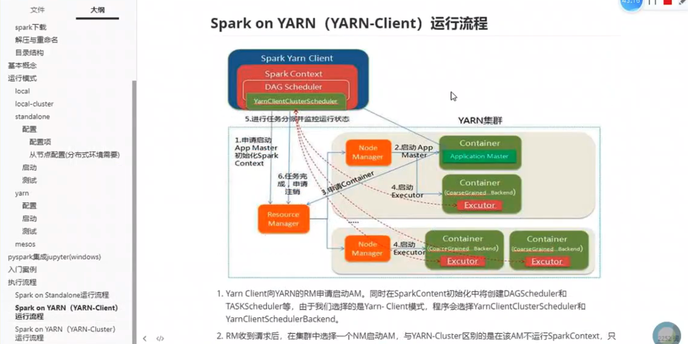
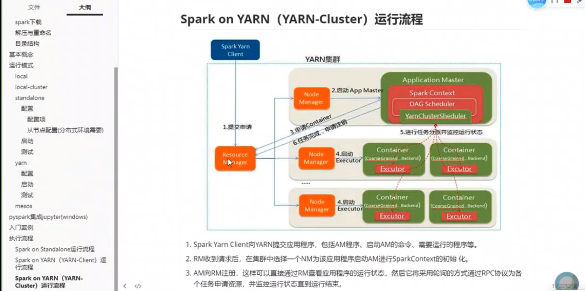

+++
title = 'Spark'
date = 2023-12-01T00:32:23-05:00
+++

## Basics
- application > job > state > task
- cluser manager: scheduling spark applications. e.g. yarn/mesos
    - masater && worker
        - master: RM(ResourceManager in YARN)
        - worker: NM(NodeManager in YARN)
    - executor: Container in YARN
- driver: 
    - running in spark, including DAGScheduler && TaskScheduler
    - combine operations and form DAG(directed acyclic graph)
    - break down job into stages
    - similar to ApplicationMaster(AM) in YARN, responsible for applying resources and scheduling
    - DAGScheduler:
        - split job into stages
    - TaskScheduler:
        - similar to AM, responsible for applying resources and scheduling
- YARN: ResourceManager(RM), NodeManager(NM), ApplicationMaster(AM), Container
- YARN: only NM can start AM and Container
- Standalone: master, worder, driver, executor
- Standalone: only worker can start driver and executor





## Operating Mode
- local/local-cluster/standalone/yarn/mesos
### local
- driver + executor, running in one process
- `pyspark` use `local[*]` by default
    - local: one executor
    - local[K]: K executors, K threads
    - local[*]: the number of cpu executors
- change mode with `pyspark --master`

- with `jps` to check procsses 
```bash
bin/pyspark --master local
# or
bin/spark-submit examples/src/main/python/pi.py 10
```

### local-cluster
- driver + master + worker, running in one process
- each worker has multiple executors, each executor start one new process
- `pyspark --master local-cluster[x, y, z]`
    - x: the number of executors
    - y, z: each executor has y cores(actually threads) and z memory size(MB)
```bash
bin/pyspark --master local-cluster[2, 2, 1024] # commont out pyspark setup in .zshrc
# or
bin/spark-submit --master local-cluster[2, 2, 1024] examples/src/main/python/pi.py 10
```

### standalone
- written by spark, similar to RM of YARN
- driver/master/worker/executor all have their own process
- Setup: 
    - `spark-env.sh.template`
    - `spark-default.conf.template`
    - Note: SparkSubmitArguments reads in order:
        - [pyspark-options] or [spark-submit-options], [conf/spark-default.conf], [conf/spark-env.sh]
- Setup workers:
    1. modify `conf/slaves` file
    2. sync the setup of work1 and work2 
    ```bash
    scp -r /opt/module/spark-3.5.0-bin-hadoop3/ worker1:/opt/module/spark-3.5.0-bin-hadoop3
    scp -r /opt/module/spark-3.5.0-bin-hadoop3/ worker2:/opt/module/spark-3.5.0-bin-hadoop3
    ```
- Start:
    1. Start spark
    ```bash
    sbin/start-all.sh
    ```
    2. Start process
    ```bash
    [start-all.sh] 
    -> load [spark-config.sh] 
    -> run [start-master.sh] and [start-slaves.sh]
    -> load [spark-config.sh] and [spark-env.sh]
    -> run [spark-daemon.sh]
    -> run [spark-class.sh] or ([spark-submit.sh] -> [spark-class.sh])
    ```
- Test:
    - On each machine, use `jps` to check process of master and slaves
    - Entry master's WEBUI: 8080
    - run `pyspark`
        ```bash
        bin/pyspark --master spark://localhost:7077
        ```
    - run `spark-submit`
        > must assign `--master` for standalone, otherwise it will be local
        ```bash
        bin/spark-submit --master spark://localhost:7077 examples/src/main/python/pi.py 10
        ```
- Kill:
    - `jps`
    - `kill 00000`

### yarn and mesos(similar to yarn)
> start `yarn` and `hdfs` in hadoop, then spark-submit
> with yarn, we don't need to start spark
- **yarn-client** and **yarn-cluster**
- Setup:
    - `spark-env.sh.template` rename to `spark-env.sh`
    ```
    HADOOP_CONF_DIR=/...../hadoop-3.3.6/etc/hadoop
    or
    YARN_CONF_DIR=/home/yixianwang/hadoop/etc/hadoop
    ```
- Start:
    - in `hadoop` folder, run the following
    ```bash
    sbin/hadoop-daemon.sh start namenode
    sbin/hadoop-daemon.sh start datenode
    sbin/yarn-daemon.sh start resourcemanager
    sbin/yarn-daemon.sh start nodemanager
    # or directly
    sbin/start-all.sh
    ```
- Test:
    > `netstat -an|grep LISTEN`
    1. On each machine, use `jps` to check process of RM and NM
    2. Entry master's WEBUI: 8088
    3. running: yarn-client
    ```bash
    bin/spark-submit --master yarn examples/src/main/python/pi.py 10
    ```
    > Note: `--deploy-mode` default is client, start **driver** from client, we can browse logs from client
    4. running: yarn-cluster
    ```bash
    bin/spark-submit --master yarn --deploy-mode cluster examples/src/main/python/pi.py 10
    ```
    > Note: if `--deploy-mode` is cluster, start **driver** from master of cluster, we have to use history server to browse logs

## SparkSession && sparkContext
- spark sql, start with SparkSession
- spark core, start with sparkContext

## For Test in Local: open Jupyter notbook with pyspark built-in spark and sc
```zsh
# .zshrc
export PYSPARK_DRIVER_PYTHON=jupyter-lab
export PYSPARK_DRIVER_PYTHON_OPTS=/opt/module/spark-3.5.0-bin-hadoop3/tutu
```

## Examples
```bash
# after setting up, pyspark has built-in spark and sc, and can open jupyter-lab
# for local test with jupyter
pyspark
```

```python
# file and counts are RDDs
file = sc.textFile("/opt/module/spark-3.5.0-bin-hadoop3/data/core/data/wordcount.txt")
counts = file.flatMap(lambda line : line.split(' '))\
             .map(lambda word : (word, 1))\
             .reduceByKey(lambda a, b : a + b)
counts.collect()

# collect before saving
file.collect()
file.saveAsTextFile("/opt/module/spark-3.5.0-bin-hadoop3/data/core/data/result")
```

### read from HDFS
- Start HDFS:
```bash
sbin/hadoop-daemon.sh start namenode
sbin/hadoop-daemon.sh start datanode
```
- Upload file
```bash
# create 1 -level folder
bin/hdfs dfs -mkdir /spark
# create 2 -level folder
bin/hdfs dfs -mkdir -p /spark/history
```

```bash
bin/hdfs dfs -rm -r /folder_need_to_remove
```

## history server setup
1. Setup
    1. setup `spark-defaults.conf`
    ```bash
    # spark-defaults.conf
    spark.eventLog.enabled   true        
    spark.eventLog.compress  true
    spark.eventLog.dir       hdfs://localhost:9000/spark/history        
    ```
    2. create history foler in hdfs
    ```bash
    bin/hdfs dfs -mkdir -p /spark/history
    ```

    3. setup `spark-env.sh`
    ```bash
    SPARK_HISTORY_OPTS="-Dspark.history.ui.port=18080 -Dspark.history.retainedApplications=3 -Dspark.history.fs.logDirectory=hdfs://localhost:9000/spark/history -Dspark.history.fs.cleaner.interval=1d -Dspark.history.fs.cleaner.maxAge=2d"
    ```
2. Run
    1. start hdfs
    2. mkdir hdfs folder
    3. start historyserver `start-history-server.sh`
> `tail -10f filename` realtime checking