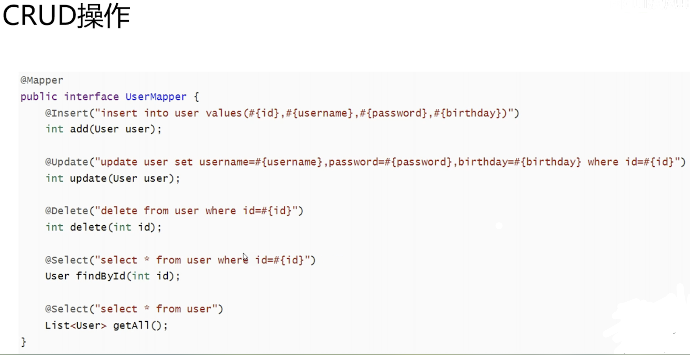

+++
title = 'Spring Boot'
date = 2023-12-27T09:02:18-05:00
+++

## Spring bean
- an instance of a class managed by the Spring container

### show all default beans
```java
  // within main method
  ApplicationContext apc = SpringApplication.run(ClassName.class)
  for (String s : apc.getBeanDefinitionNames()) {
    System.out.println(s);
  }
```

## Spring container
- **part of the core of the Spring framework**
- **managing all beans**: it decides when to create this instance, when to kill this instance, and how to initialize the instance, etc.
- **performs dependency injection**

## IoC(Inversion of Control)
- instead of the programmer really deciding the flow of the application, deciding what objects are created, etc. 
- this all handed over to the Spring framework(or more precisely to the Spring container)

## Dependency Injection
IoC entails Dependency Injection

- instead of in our code we have to instantiate some new object, Spring container is actually instantiating this object

> Spring container is **injecting** object for us

## SpringBoot Controller


### Rounter
- `@RequestMapping`, on class or methods
  - `value`
  - `method`
  - `consumes`, 请求的 Content-Type, i.e. application/json
  - `produces`
  - `params, headers`
- `*, **, ?`

### Method
- `@RequestMapping(value = "/getData", method = RequestMethod.GET)`
  - `@GetMapping("/getData")` is same as above.

### Parameters
- `@RequestParam`, (from HTTP request body or url QueryString) when the names are matching, we can **ignore** this annotation
  - `public String getTest3(@RequestParam(value = "nickname", required = false) String name) {}`
- `@PathVariable`, handle dynamic URL
- `@RequestBody`, most use case is to handle data which is not `Content-Type: application/x-www-form-urlencoded`, i.e. `application/json`, `application/xml`, etc.

  ```java
  // i.e. @RequestBody
  @RequestMapping(value = "/postTest4", method = RequestMethod.POST)
  public String postTest4(@RequestBody User user) { // @RequestBody 
    System.out.println(user);
    return "Post request"
  }
  ```

## SpringBoot File Upload + HandlerInterceptor

### Static Resources
- define filter rule and static resource path
```
// application.properties
spring.mvc.static-path-pattern=/static/**
spring.web.resources.static-locations=classpath:/static/
```
> filter rule is `/static/**`, static resource path is `classpath:/static/`

### File Upload
- `enctype` define how to encode form data before sending to server
- `enctype = "application/x-www-form-urlencoded"` is default, then form data likes `key=value&key=value`
- `enctype = "multipart/form-data"`


- To update 1MB file limitation by SpringBoot built-in Tomcat
```
// application.properties
spring.servlet.multipart.max-file-size=10MB
spring.servlet.multipart.max-request-size=10MB
```

### HandlerInterceptor


## RESTful service + Swagger

### Restful


### Swagger
- `http://127.0.0.1:8080/swagger-ui.html`


## Mybatis-Plus
ORM(Object Relational Mapping)

### Mybatis-Plus


### Mybatis-Plus CRUD operation



### Example
```java
// mapper
  // UserMapper.java
@Mapper
public interface UserMapper extends BaseMapper<User> { // User has to be same as table name within database
}
```

```java
// controller
  // UserController
@RestController
public class UserController {
  @Autowired
  private UserMapper userMapper;

  @GetMapping("/user")
  public List query() {
    List<User> list = userMapper.selectList(null);
    return list; // automatically convert to json
  }

  @PostMapping("/user")
  public String save(User user) {
    int i = userMapper.insert(user); // i is the number of rows inserted
    if (i > 0) {
      return "successfully inserted";
    } else {
      return "insertation failed";
    }
  }
}
```

### Searching Multiple Tables

## ResponseEntity
- Returning a resource: Use `ResponseEntity.ok(resource)` for successful retrieval (200 OK).
- Handling "Not Found": Use `new ResponseEntity<>(HttpStatus.NOT_FOUND)` or `ResponseEntity.notFound().build()` for resources that don't exist (404 Not Found).
- Creating a new resource: Use `ResponseEntity.status(HttpStatus.CREATED).headers(headers).body(createdResource)` or `ResponseEntity.created(locationUri).body(createdResource)` for successful creation (201 Created), often including a Location header.
- No content: Use `ResponseEntity.noContent().build()` when an operation is successful but there's no content to return (204 No Content).
- Bad requests: Use `ResponseEntity.badRequest().body(errorMessage)` for invalid client requests (400 Bad Request), often with an error message in the body.
- Internal server errors: Use `ResponseEntity.status(HttpStatus.INTERNAL_SERVER_ERROR).body(errorMessage)` for unexpected server-side issues (500 Internal Server Error).
- Conditional responses: Use headers like `ETag`, `Last-Modified` with appropriate status codes like 304 Not Modified using ResponseEntity.

## Lombok Constructors
### @NoArgsConstructor
- Creates constructor with no parameters
- Handles `final` fields by initializing to `0/false/null` (adds compiler warning)
- Use `force = true` to force `final` fields to `0/false/null` (suppresses warning)

#### Use Case:
- JPA entity classes (require no-arg constructor)
- Frameworks like Hibernate that use reflection
- Deserialization (JSON → Object)


### @AllArgsConstructor
- Order of parameters matches field declaration order
- Includes `final` and non-final fields
- Handles `@NonNull` fields (null checks)

#### Use Case
- Quick object initialization(Value Object)
- Testing (creating objects with specific state)
- Immutable configuration objects

### @RequiredArgsConstructor
- Generates a constructor for `final` fields and `@NonNull` fields.

#### Use Case
- Dependency injection
- Immutable data

### Best Practices:
- Prefer `@RequiredArgsConstructor` for DI
- Use `@NoArgsConstructor` only when required by frameworks
- Combine with `@Data` or `@Value` for full POJOs

## Lombok Annotations Best Practice
1. @Getter / @Setter
- Use Case: Replace trivial getters/setters.
- Best Practices:
  - Avoid on `final` fields: Setters aren't generated.
  - Limit Scope: Use `@Getter(AccessLevel.PROTECTED)` for encapsulation.
  - Exclude Collections: Avoid exposing mutable collections directly.

2. @ToString
- Use Case: Debugging/logging representations.
- Best Practices:
  - Exclude Sensitive Data: `@ToString(exclude = "password")`.
  - Handle Inheritance: Use `@ToString(callSuper = true)` for superclass fields.
  - Avoid Circular References: Exclude bidirectional relationships.
```java
@ToString(callSuper = true, exclude = "user") 
public class Profile { ... }
```

3. @EqualsAndHashCode
- Use Case: Value-based equality.
- Best Practices:
  - Always Use `callSuper = true` for subclass equality checks.
  - Exclude Lazy-Loaded Fields: In JPA entities, exclude `OneToMany`/collections.
  - Use Immutable Fields: Only include fields that never change.
```java
@EqualsAndHashCode(callSuper = true, onlyExplicitlyIncluded = true)
public class User {
    @EqualsAndHashCode.Include private final Long id; // Immutable ID only
}
```

4. Constructor Annotations
- `@NoArgsConstructor`
  - JPA Requirement: Use with access = AccessLevel.PROTECTED.
  - Avoid in immutable objects.
```java
@NoArgsConstructor(access = AccessLevel.PROTECTED) // JPA-safe
public class Entity { ... }
```
- `@RequiredArgsConstructor`
  - Dependency Injection: Perfect for final Spring beans.
  - Replace explicit @Autowired constructors.
```java
@Service
@RequiredArgsConstructor // Injects final dependencies
public class OrderService {
    private final OrderRepository repo;
}
```
- `@AllArgsConstructor`
  - Avoid in Entities: Risk of field-order mismatch.
  - Use for DTOs/Records: Simple data carriers.
```java
@AllArgsConstructor // For non-persistent objects
public record ProductDto(String id, String name) {}
```

5. `@Data`
- Use Case: Mutable data containers (e.g., configuration DTOs).
- Best Practices:
  - Avoid in JPA Entities: Combines risky `@ToString/@EqualsAndHashCode`.
  - Never Extend Classes: Breaks `equals()/hashCode()` without `callSuper=true`.
```java
@Data // Only for simple POJOs with no inheritance
public class Config {
    private String apiKey;
    private int timeout;
}
```

6. `@Value`
- Use Case: Immutable objects (Java 16+ records preferred).
- Best Practices:
  - Replace with Records: Prefer `record` in modern Java.
  - Use for Thread-Safe Objects: Immutability by default.
```java
@Value // Immutable class
public class Point {
    int x;
    int y;
}
```

7. `@Builder`
- Use Case: Complex object creation.
- Best Practices:
  - Customize with `@Builder(builderMethodName = "hiddenBuilder")`.
  - Set Defaults: Use `@Builder.Default` for field initializers.
  - Immutable Builders: Pair with `@Value`.
```java
@Builder
public class Widget {
    @Builder.Default private String type = "DEFAULT"; 
    private final int id;
}
```

8. `@Slf4j`
- Use Case: Logger injection.
- Best Practice: Replace manual logger declarations.
```java
@Slf4j
public class OrderService {
    void process() {
        log.info("Order processed"); // Injects 'log'
    }
}
```

9. `@SneakyThrows`
- Use Case: Edge cases like rethrowing checked exceptions.
- Best Practices:
  - Avoid Mainstream Logic: Use sparingly.
  - Document Why: Explain why exception is unchecked.
```java
@SneakyThrows(IOException.class) // Rarely justified
public void unsafeOperation() { ... }
```

10. JPA-Specific Practices
- Avoid `@Data/@EqualsAndHashCode`:
  - Use hand-written equals() with primary key checks.
- Lazy Fields: Exclude from `@ToString`:
```java
@Entity
@Getter @Setter // Safe
public class User {
    @ToString.Exclude private byte[] passwordHash;
    @EqualsAndHashCode.Exclude @OneToMany private List<Order> orders;
}
```

11. Testing Considerations
- Verify Generated Code: Ensure Lombok doesn't break complex logic.
- Customize for Frameworks:
```java
@Value
@AllArgsConstructor(access = AccessLevel.PRIVATE) // For Jackson
public class TestDto { ... }
```

12. Advanced: Configuration File
- Global Settings: Add `lombok.config`:
```java
# Fail on warnings
config.stopBubbling = true
lombok.anyConstructor.addConstructorProperties = true
```

| Annotation               | Do                                   | Don't                               |
|--------------------------|--------------------------------------|-------------------------------------|
| @Data                    | Simple DTOs/config objects           | JPA entities, inherited classes     |
| @Value                   | Immutable objects (prefer records)   | Mutable objects                     |
| @Builder                 | Complex construction, DTOs           | Entities with JPA constraints       |
| @RequiredArgsConstructor | Spring dependency injection          | Classes with non-final dependencies |
| @ToString                | Debugging, exclude sensitive fields  | Entities with relationships         |
| @EqualsAndHashCode       | Immutable values, include superclass | Entities (use primary key manually) |

### Summary for best practices
|            Annotation            |                   Use Case & Notes                  |
|:--------------------------------:|:---------------------------------------------------:|
| @RequiredArgsConstructor         | Preferred for constructor injection in Spring beans |
| @Getter, @Setter                 | Use on fields or class; avoid on JPA entities       |
| @Slf4j                           | For logging (no manual logger needed)               |
| @Data                            | For DTOs only (not JPA entities)                    |
| @Builder                         | For DTOs, not JPA entities                          |
| @Value                           | For immutable DTOs                                  |
| @NoArgsConstructor(force = true) | For JPA entities                                    |

## Java Records: Immutable Data Carriers
- Eliminate boilerplate code for data-oriented classes.

Key Features
1. Auto-Generated Components:
  - `final` fields (private)
  - Public constructor (canonical)
  - Accessor methods (`field()` instead of `getField()`)
  - `equals(), hashCode(), toString()`
2. Immutability:
  - All fields are implicitly `final`
  - No setter methods
3. Syntax
  - `public record Point(int x, int y) {}`
```java
// Equivalent Traditional Class
public final class Point {
    private final int x;
    private final int y;

    public Point(int x, int y) {
        this.x = x;
        this.y = y;
    }

    public int x() { return x; }
    public int y() { return y; }

    // Auto-generated:
    // - equals() (compares all fields)
    // - hashCode() (uses all fields)
    // - toString() (e.g., "Point[x=1, y=2]")
}
```

| Use Cases                    | Examples                  |
|------------------------------|---------------------------|
| Data Transfer Objects (DTOs) | API responses, DB results |
| Value objects                | Currency, Coordinates     |
| Tuple-like structures        | Pair<K,V>, Coordinate     |
| Temporary data containers    | Method return values      |

### Advanced Usage
1. Custom Constructors
```java
public record Point(int x, int y) {
    // Compact constructor (no parameters)
    public Point {
        if (x < 0 || y < 0) 
            throw new IllegalArgumentException("Negative values");
        // Fields auto-assigned after this block
    }
}
```

2. Add Methods
```java
public record Point(int x, int y) {
    public double distance() {
        return Math.sqrt(x*x + y*y);
    }
}
```

3. Implement Interfaces
```java
public record User(String name) implements Serializable {}
```

4. Annotations
```java
public record User(
    @NotBlank String name,
    @Min(18) int age
) {}
```

### Limitations
1. Cannot:
  - Extend other classes (implicitly `final`)
  - Declare non-`final` fields
  - Add instance initializers

2. Restrictions:
  - All fields defined in header
  - No abstract records
  - Accessors must match field names

### Records vs Traditional Classes
| Characteristic | Record                | Class               |
|----------------|-----------------------|---------------------|
| Boilerplate    | Auto-generated        | Manual coding       |
| Immutability   | Enforced              | Optional            |
| Inheritance    | No extension (final)  | Extendable          |
| Constructor    | Compact syntax        | Explicit assignment |
| Accessors      | x() instead of getX() | Traditional getters |
| Purpose        | Data carriers         | Complex behavior    |

### Records vs Lombok @Data
| Feature          | Java Record           | Lombok @Data            |
|------------------|-----------------------|-------------------------|
| Language feature | Native (JVM)          | Compiler plugin         |
| Immutability     | Enforced              | Optional (final fields) |
| Serialization    | Built-in support      | Manual configuration    |
| Pattern Matching | Works with instanceof | No special support      |
| Validation       | Compact constructor   | Manual validation       |

### Best Practices
1. Use for simple data carriers: DTOs, configuration, coordinates
2. Avoid:
  - Adding mutable state
  - Complex business logic
  - Inheritance hierarchies
3. Prefer over Lombok for new projects (native solution)
4. Validate data in compact constructors

Example: REST API DTO
```java
public record ApiResponse<T>(
    int status,
    String message,
    T data
) {
    public ApiResponse {
        Objects.requireNonNull(data);
    }
}

// Usage
ApiResponse<User> response = new ApiResponse<>(200, "OK", user);
```

## Model Mapper in Spring Boot
> ModelMapper is a Java library that helps you easily map one object to another, reducing repetitive code and improving maintainability—especially useful for converting between entities and DTOs in Spring Boot applications.

Define a ModelMapper bean for dependency injection:
```java
@Configuration
public class ModelMapperConfig {
  @Bean
  public ModelMapper modelMapper() {
    return new ModelMapper();
  }
}
```
Then inject and use it in services or controllers:
```java
@Service
public class UserService {
  private final ModelMapper modelMapper;

  @Autowired
  public UserService(ModelMapper modelMapper) {
    this.modelMapper = modelMapper;
  }

  public UserDTO convertToDto(User user) {
    return modelMapper.map(user, UserDTO.class);
  }
}
```
### Custom Mappings
For more complex cases (different field names, nested objects), we can configure mappings:
```java
modelMapper
  .typeMap(Source.class, Destination.class)
  .addMapping(Source::getFoo, Destination::setBar);
```

## Modern and recommended folder structure
```plaintext
src
└── main
    ├── java
    │   └── com
    │       └── yourcompany
    │           └── yourproject
    │               ├── YourProjectApplication.java
    │               ├── config
    │               │   └── (configuration classes: security, web, etc.)
    │               ├── controller
    │               │   └── (REST/controllers)
    │               ├── dto
    │               │   └── (Data Transfer Objects)
    │               ├── entity
    │               │   └── (JPA entities/domain models)
    │               ├── exception
    │               │   └── (custom exceptions and handlers)
    │               ├── repository
    │               │   └── (Spring Data repositories)
    │               ├── service
    │               │   └── (service layer)
    │               ├── mapper
    │               │   └── (MapStruct/ModelMapper mappers)
    │               ├── util
    │               │   └── (utility/helper classes)
    │               └── (any feature-based packages, e.g., user, order, etc.)
    ├── resources
    │   ├── application.yml
    │   ├── static
    │   │   └── (static web resources)
    │   ├── templates
    │   │   └── (Thymeleaf/Freemarker templates)
    │   └── (other resource files)
    └── test
        └── java
            └── com
                └── yourcompany
                    └── yourproject
                        └── (test classes, mirroring main structure)
```

- config: Java configuration classes (security, CORS, Swagger/OpenAPI, etc.)
- controller: REST or web controllers (@RestController, @Controller)
- dto: Data Transfer Objects for requests & responses
- entity: JPA/Hibernate entities (database models)
- exception: Custom exceptions and exception handlers (@ControllerAdvice)
- repository: Spring Data repository interfaces
- service: Business logic/services (@Service)
- mapper: Classes/interfaces for mapping between entities and DTOs (e.g., using MapStruct or ModelMapper)
- util: Utility or helper classes (validation, constants, etc.)

For larger projects, use feature-based modularization:
```plaintext
└── user
    ├── UserController.java
    ├── UserService.java
    ├── UserRepository.java
    ├── User.java
    ├── UserDto.java
    └── UserMapper.java
└── order
    └── (order-related classes)
```

## Async
```java {filename="AsyncConfig.java"}
package com.yourcompany.yourapp;

import org.springframework.context.annotation.Configuration;
import org.springframework.scheduling.annotation.EnableAsync;
import org.springframework.context.annotation.Bean;
import org.springframework.scheduling.concurrent.ThreadPoolTaskExecutor;
import java.util.concurrent.Executor;

import org.springframework.aop.interceptor.AsyncUncaughtExceptionHandler;

@Configuration
@EnableAsync
public class AsyncConfig {

  @Bean(name = "taskExecutor")
  public Executor taskExecutor() {
    ThreadPoolTaskExecutor executor = new ThreadPoolTaskExecutor();
    executor.setCorePoolSize(4);        // Number of threads to keep in pool
    executor.setMaxPoolSize(10);        // Max threads allowed
    executor.setQueueCapacity(100);     // Queue size before rejecting new tasks
    executor.setThreadNamePrefix("Async-"); // Thread name prefix for easier debugging
    executor.initialize();
    return executor;
  }

  // You can also add an AsyncUncaughtExceptionHandler bean to handle uncaught exceptions from @Async void methods
  @Bean
  public AsyncUncaughtExceptionHandler asyncUncaughtExceptionHandler() {
    return (throwable, method, obj) -> {
      System.err.println("Exception in async method: " + method.getName() + ", message: " + throwable.getMessage());
    };
  }
}
```

## Stream DAO
```java {filename="KieConfig.java"}
package com.example.validation.config;

import org.kie.api.runtime.KieContainer;
import org.kie.spring.KModuleBeanFactoryPostProcessor;
import org.springframework.context.annotation.Bean;
import org.springframework.context.annotation.Configuration;

@Configuration
public class KieConfig {
    @Bean
    public KModuleBeanFactoryPostProcessor kiePostProcessor() {
        return new KModuleBeanFactoryPostProcessor();
    }

    @Bean
    public KieContainer kieContainer(org.kie.api.KieServices ks) {
        return ks.getKieClasspathContainer();
    }
}
```

```java{filename="VirtualThreadConfig.java"}
package com.example.validation.config;

import org.springframework.context.annotation.Bean;
import org.springframework.context.annotation.Configuration;

import java.util.concurrent.ExecutorService;
import java.util.concurrent.Executors;

@Configuration
public class VirtualThreadConfig {

    @Bean(destroyMethod = "shutdown")
    public ExecutorService virtualThreadExecutor() {
        // Java 21 virtual thread-per-task executor
        return Executors.newVirtualThreadPerTaskExecutor();
    }
}
```

```java {filename="BigTableDao.java"}
@Repository
public class BigTableDao {

    private final JdbcTemplate jdbcTemplate;

    public BigTableDao(JdbcTemplate jdbcTemplate) {
        this.jdbcTemplate = jdbcTemplate;
    }

    public void streamRows(int fetchSize, Consumer<RowData> rowConsumer) {
        jdbcTemplate.setFetchSize(fetchSize);
        jdbcTemplate.setMaxRows(0);

        String sql = "SELECT * FROM big_table"; // no ORDER BY if not required

        jdbcTemplate.query(con -> {
            PreparedStatement ps = con.prepareStatement(
                sql,
                ResultSet.TYPE_FORWARD_ONLY,
                ResultSet.CONCUR_READ_ONLY
            );
            ps.setFetchSize(fetchSize);
            return ps;
        }, rs -> {
            rowConsumer.accept(mapRow(rs));
        });
    }

    private RowData mapRow(ResultSet rs) throws SQLException {
        RowData row = new RowData();
        row.setId(rs.getLong("id"));
        row.setCol1(rs.getString("col1"));
        row.setCol2(rs.getString("col2"));
        // map other columns...
        return row;
    }
}
```

```java {filename="StreamingValidationService.java"}
@Service
public class StreamingValidationService {

    private final BigTableDao bigTableDao;
    private final KieContainer kieContainer;
    private final ValidationResultRepository resultRepository;

    public StreamingValidationService(BigTableDao bigTableDao,
                                      KieContainer kieContainer,
                                      ValidationResultRepository resultRepository) {
        this.bigTableDao = bigTableDao;
        this.kieContainer = kieContainer;
        this.resultRepository = resultRepository;
    }

    public void validateLargeTable() {
        List<RowData> batch = new ArrayList<>(500);

        bigTableDao.streamRows(500, row -> {
            batch.add(row);
            if (batch.size() == 500) {
                processBatch(batch);
                batch.clear();
            }
        });

        if (!batch.isEmpty()) {
            processBatch(batch);
        }
    }

    private void processBatch(List<RowData> batch) {
        List<ValidationResult> allResults = Collections.synchronizedList(new ArrayList<>());

        try (var executor = Executors.newVirtualThreadPerTaskExecutor()) {
            List<Callable<Void>> tasks = new ArrayList<>();

            for (RowData row : batch) {
                tasks.add(() -> {
                    StatelessKieSession kieSession = kieContainer.newStatelessKieSession();

                    List<ValidationResult> results = new ArrayList<>();
                    kieSession.setGlobal("results", results);

                    kieSession.execute(row); // Stateless: runs rules immediately

                    allResults.addAll(results);
                    return null;
                });
            }

            executor.invokeAll(tasks);

        } catch (InterruptedException e) {
            Thread.currentThread().interrupt();
            throw new RuntimeException("Batch processing interrupted", e);
        }

        // Single DB write per batch
        resultRepository.bulkInsert(allResults);
    }

}
```