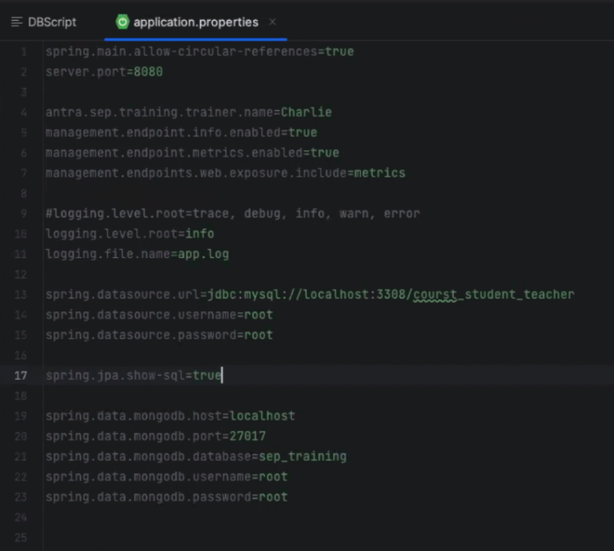
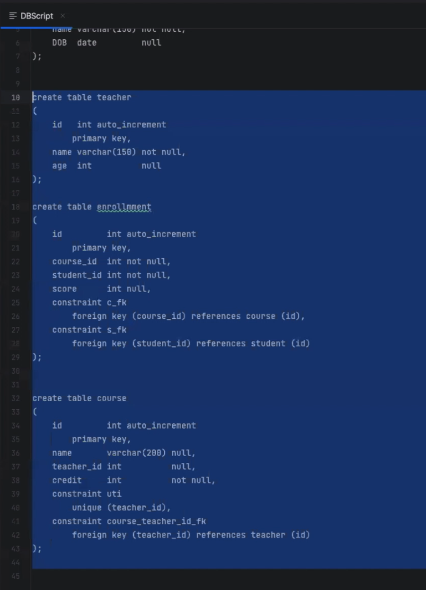

+++
title = 'Spring Data Jpa'
date = 2024-06-01T21:42:22-04:00
+++

## Setup
```xml {filename="pom.xml"}
        <dependency>
            <groupId>org.springframework.boot</groupId>
            <artifactId>spring-boot-starter-data-jpa</artifactId>
        </dependency>

        <!-- for mongodb -->
        <dependency>
            <groupId>org.springframework.boot</groupId>
            <artifactId>spring-boot-starter-data-mongodb</artifactId>
        </dependency>

        <!-- for postgresql -->
        <dependency>
            <groupId>org.postgresql</groupId>
            <artifactId>postgresql</artifactId>
            <version>${postgresql.version}</version>
        </dependency>

        <!-- for mysql -->
        <dependency>
            <groupId>mysql</groupId>
            <artifactId>mysql-connector-java</artifactId>
            <version>8.0.32</version>
        </dependency>

```

```yaml {filename="application.properties"}
```




## Entities
```java {filename="Course.java"}
@Entity
@Table(name="course")
public class Course {
  @Id
  @GeneratedValue(strategy = GenerationType.IDENTITY)
  private Long id;

  private String name;

  @Column
  private Integer credit;

  @OneToOne
  @JoinColumn(name = "teacher_id")
  private Teacher teacher;

  @OneToMany(mappedBy = "course")
  private List<Enrollment> enrollmentList;

  // setter and getter ...
}
```

```java {filename="Enrollment.java"}
@Entity
@Table(name = "enrollment")
public class Enrollment {
  @Id
  @GeneratedValue(strategy = GenerationType.IDENTITY)
  private Long id;

  @ManyToOne
  private Course course;

  @ManyToOne
  private Student student;

  private Integer score;

  // setter and getter ...
}
```

```java {filename="Student.java"}
@Entity
@Table(name = "student")
public class Student {
  @Id
  @GeneratedValue(strategy = GenerationType.IDENTITY)
  private Long id;

  private String name;

  private LocalDate dob;

  @OneToMany(mappedBy = "student")
  List<Enrollment> enrollmentList;

  // setter and getter ...
}
```

### mongodb
```java {filename="mongodb/History.java"}
@Document("enrollment_history")
public class History {
  @Id
  private String id;

  private String action;
  private String studentName;
  private String courseName;

  // setter and getter ...
}
```

## MVC
- package structures:
  - **configuration**
  - **controller**
  - **data**
  - **entity**
    - **mongodb**
      - History.java
    - Course
    - Enrollment
    - Student
    - Teacher
  - **repository**
    - **mongodb**
      - HistoryRepository.java
    - EnrollmentRepository.java
    - StudentRepository.java
    - TeacherRepository.java
  - **service**
    - EnrollmentService.java
    - EnrollmentServiceImpl.java
    - StudentService.java
    - StudentServiceImpl.java
    - TeacherService.java
    - TeacherServiceImpl.java
    - UserService.java
    - UserServiceImpl.java
    - UserServiceImpl2.java
  - **util**
  - **vo**
  - SpringBootDemoApplication.java

### Dao layer
```java {filename="repository/EnrollmentRepository.java"}
// package ...

// import ...Enrollment;
import org.springframework.data.jpa.repository.JpaRepository;
import org.springframework.stereotype.Repository;

@Repository
public interface EnrollmentRepository extends JpaRepository<Enrollment, Long> {

}
```

#### mongodb
```java {filename="repository/mongodb/HistoryRepository.java"}

public interface HistoryRepository extends MongoRepository<History, String> {
  List<History> findByAction(String action);
  List<History> findByCourseName(String courseName);
}
```


### Service layer
```java {filename="EnrollmentServiceImpl.java"}
@Service
public class EnrollmentServiceImpl implements EnrollmentService {
  @Autowired
  EnrollmentRepository enrollmentRepository;

  @Autowired
  HistoryRepository historyRepository;

  @Override
  @Transactional
  public Enrollment enroll(Student student, Course course) {
    History history = new History();
    // history.set....
    historyRepository.save(history);

    Enrollment enrollment = new Enrollment();
    // enrollment.set...
    return enrollmentRepository.save(enrollment);
  }

  @Override
  public EnrollmentVO getEnrollment(Long id) {
    Enrollment enrollment = enrollmentRepository.findById(id).orElse(null);
    EnrollmentVO vo = new EnrollmentVO();
    // vo.set...
    return vo;
  }

  @Override
  public List<Enrollment> getEnrollmentByCourseId(Long courseId) {
    Enrollment enrollmentExample = new Enrollment();
    Course c = new Course();
    c.setId(courseId);
    enrollmentExample.setCourse(c);
    Example<Enrollment> example = Example.of(enrollmentExample);
    List<Enrollment> enrollments = enrollmentRepository.findAll(example);
    List<EnrollmentVO> voList = new ArrayList<>();
    enrollments.forEach(enrollment -> {
      EnrollmentVO vo = new EnrollmentVO();
      // vo.setId(enrollment.getId());
      // vo.setCourseName(enrollment.getCourse().getName());
      // vo.setStudentName(enrollment.getStudent().getName());
      voList.add(vo);
    })
    return voList;
  }

  @Override
  public List<EnrollmentVO> getAll(int page, int rows) {
    Pageable pageRequest = PageRequest.of(page, rows);
    Page<Enrollment> p = enrollmentRepository.findAll(pageRequest);
    List<Enrollment> enrollments = p.getContent();
    List<EnrollmentVO> voList = enrollments.stream().map(enrollment -> {
      EnrollmentVO vo = new EnrollmentVO();
      // vo.set...
      return vo;
    }).toList();
    return voList;
  }
}
```

```java {filename="StudentServiceImpl.java"}
@Service
public class StudentServiceImpl implements StudentService {
  @Autowired
  StudentRepository studentRepository;

  @Override
  public List<StudentVO> getAllStudents() {
    return studentRepository.findAll().stream().map(entity -> {
      StudentVO temp = new StudentVO();
      BeanUtils.copyProperties(entity, temp);
      temp.setDob(Date.valueOf(entity.getDob()));
      return temp;
    }).toList();
  }
}
```