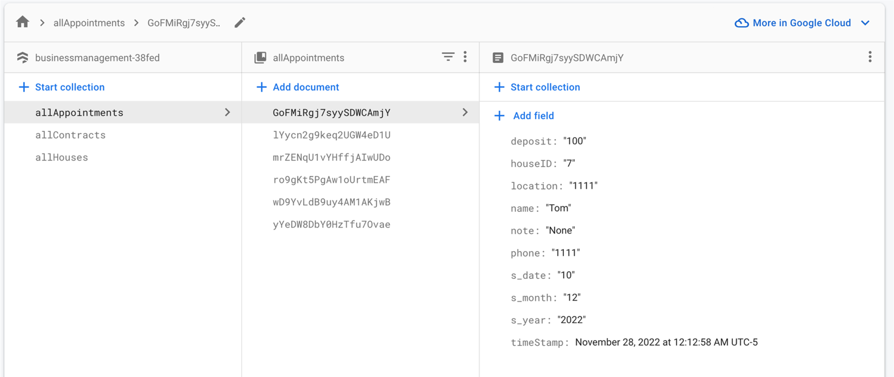
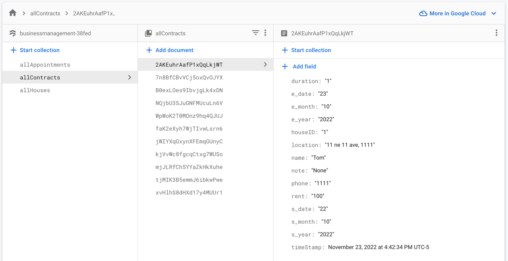
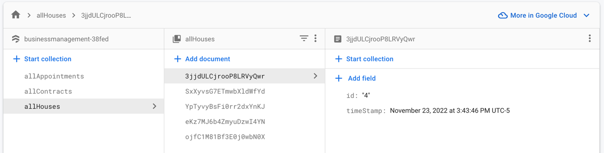

+++
title = 'Android App: Business Management & Accountant'
date = 2023-10-25T00:15:21-04:00
startDate = 'Aug 2022'
endDate = 'Present'
draft = true
+++

- Designed the app for my parents’ real daily business
- Features: cloud-hosted database, interactive charts, automatic accountant, and PDF generator
- Backend jobs: firebase for authentication, firestore for data and SQL query
- Architecture & Language: MVVM, Kotlin
- Third-party libraries: MPAndroid, Itextpdf, Android-pdf-viewer
<!--more-->

## Built & Settings
- Hardware: Pixel 6 API 32
-	The login email: fake@example.com
-	The password: 123456

## App Description
- It is a business management app designed for my parents' real daily business of renting houses. It consists of two essential parts, business management and accounting. The inspiration is only from my parent's business which is handled by their handwriting right now. This app will save them much time creating a new contract or appointment. It can also automatically create an accountant summary and some beautiful graphs simultaneously that give my parents an intuitive view of how the business is running. The firebase is heavily used in this project.

## APIs & Android Features
-	APIs:
    -	Firebase for authentication
    -	Firestore for data backend and SQL query
    -	MPAndroid for graph
    -	PDF Generator
    -	PDF Viewer
    -	PDF Sharing
-	Android features:
    -	RecyclerView and Adapter
    -	Fragment
    -	Intent
    -	Coroutines
    -	CardView
    -	TableView
    -	Action Bar
    -	Date Picker
    -	Bottom Navigation
    -	LiveData

## Third-party Libraries & Services Description
-	MPAndroidChart: I use this library to create beautiful interactive pie charts, line charts, and bar charts. The good thing is that I can choose many different charts and customize them. The challenging part is customizing the x-axis because, from its last GitHub update change, the x-axis data only support float data type. That means I always have to use boilerplate code to customize and cast type in the helper function when using the customized x-axis.

-	Itextpdf: I use this library to customize pdf from the data drawn from firebase. The good thing is that the workflow with it is very straightforward. The challenging part is when I want to add more details to it. The serialized workflow of this library is challenging for adding multiple features or images to the pdf because the previous work can be affected by the latter added features, which might extend pdf page boundaries. 

-	Android-pdf-viewer: I can use this to view pdf smoothly. It provides an efficient pdf viewer service but does not support viewing pdf with other apps.

-	Firebase: I use this to utilize firebase to store the data and keep them saved and stored in the cloud.

## UI/UX/Display
-	For the “Contract” and “Appointment” parts, I use RecyclerView with CardView for each row. There is an insert button on both of them to insert new data into “Contract” or “Appointment.”

-	For the “Home,” there is a manage button on the top left side. We can use it to manage the housing inventory. I also want to mention that only houses in the inventory can be inserted into our “Contract” or “Appointment” list when inserting a new item.

-	For "Accountant," this part is automatically updated with the data in firebase. In addition, TableView has a summary of the current month's and last month's income. It is another essential feature to reduce my parents' workload when any of the homeowners want to cash out anytime. I also added three pdf-related features here: creating, viewing, and sharing pdf.

-	For “Data,” this part is also automatically updated. Here consists of three valuable graphs to give an intuitive and straightforward overlook of how my parents’ business is running.

## Backend Processing Logic
-	I have three tables in the firebase database: “allAppointments,” “allContracts,” and “allHouses.”

-	The first table, “allAppointments” stores all appointments, including past and upcoming appointments.

-	The second table, “allContracts” stores all contracts, including old and current underlying contracts.

-	The third table, “allHouses” handles the housing inventory.

-	I have described how these three tables work with UI in section 6 of this report.

## Firebase Database Schemas

