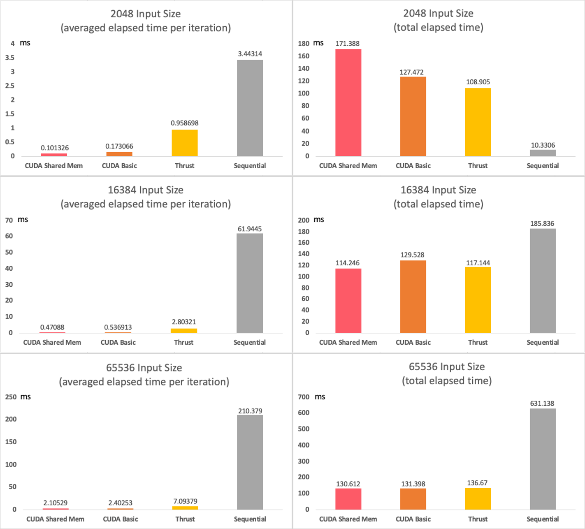
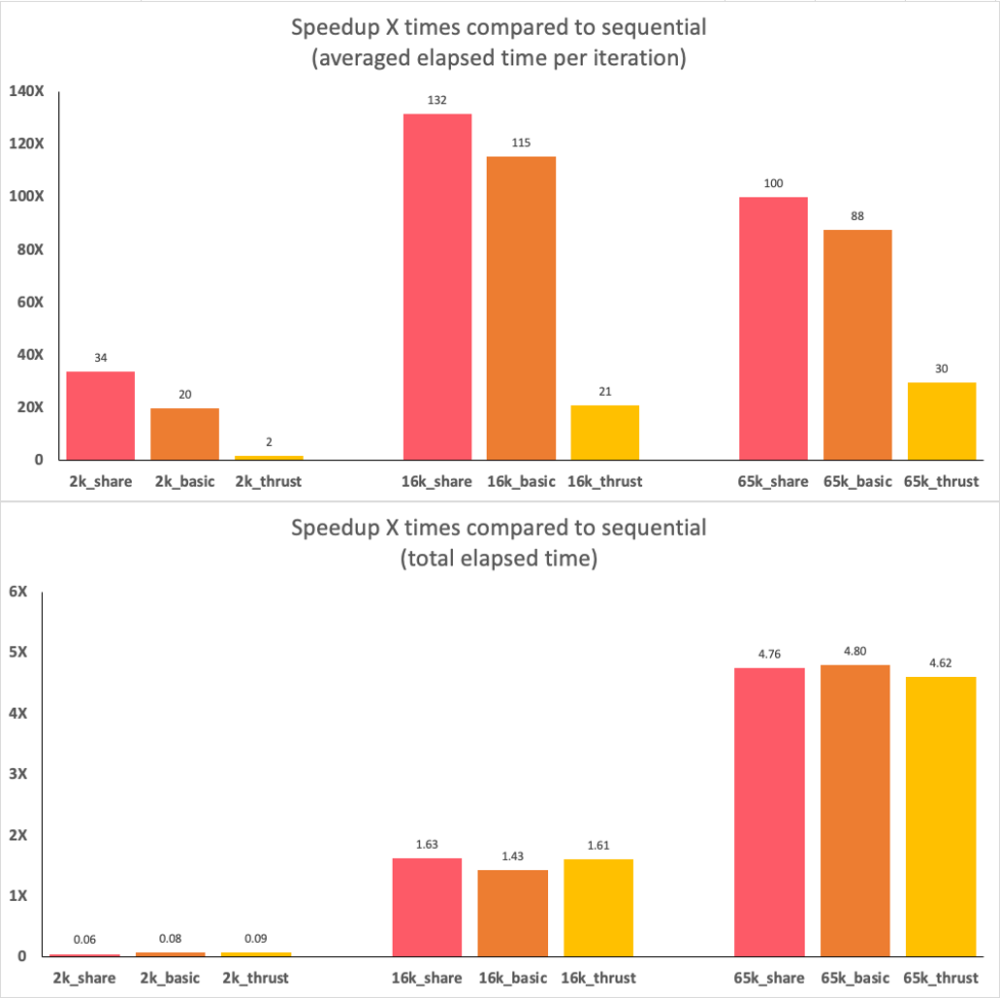

+++
title = 'Exploring GPU Programming with CUDA/CUDA Shared Memory/Thrust Solving K-Means Algorithm'
date = 2023-10-24T15:21:05-04:00
startDate = 'Sep 2021'
endDate = 'Oct 2021'
draft = true
+++

- Implemented base **sequential** version of K-Means algorithm on CPU by C++
- Implemented first parallel version of K-means with **Thrust** primitives and a GroupBy-Aggregate by C++
- Implemented second parallel version of K-means with **CUDA** by C++
- Implemented third parallel version of K-means with **CUDA on Shared Memory** by C++
- Analyzed speedup among all the implementations
<!--more-->

## Hardware Details & OS Version & Settings
- **GPU:** the Codio environment(Tesla T4, Driver Version: 460.91.03 , CUDA Version: 11.2)
- **CPU:** the Codio environment(Intel(R) Xeon(R) Platinum 8259CL CPU @ 2.50GHz, 4 cores)
- **OS:** the Codio environment(Ubuntu 18.04.2 LTS (GNU/Linux 5.4.0-1054-aws x86_64))
> the data in this report was collected when I set “threshold argument” to 1e-6.

## Data
- <a href="/datasets/cuda_kmeans/random-n2048-d16-c16.txt">Data1: size = 2048, dim = 16, c = 16</a>
- <a href="/datasets/cuda_kmeans/random-n16384-d24-c16.txt">Data2: size = 16384, dim = 24, c = 16</a>
- <a href="/datasets/cuda_kmeans/random-n65536-d32-c16.txt">Data3: size = 65536, dim = 32, c = 16</a>

## The Fastest Implementation
- For averaged elapsed time per iteration, **CUDA Shared Memory is always the fastest** implementation on different input sizes. (Fig. 1, left) Because the shared memory in each block is very fast, which means the processing unit for each thread can access data in shared memory very fast after transferring data from global memory to the shared memory.

- For total elapsed time (E2E runtime), **sequential version is the fastest** when the input size is very small and **CUDA Shared Memory is the fastest** when the input size is very large. (Fig. 1, right) The main reason is that the CPU is very powerful in computing a single thread and the CPU doesn’t need to transfer data between host and device. When the input size is very small, it is the fastest. However, when the input size is large, the power and advantage of parallel are obvious, and the overhead over transferring data can be ignored, and in this case, the CUDA Shared Memory is my fastest implementation.

## Compare and Analyze Performance Among Four Implementations
- The **CUDA Shared Memory** has the smallest elapsed time per iteration (Fig. 1, left) but it also has the largest overhead on transferring data between host and device and between the device and shared memory. It is the fastest implementation when the input size is very large. As the amount of input data increases, it can get more benefit from parallelism and the influence of the overhead can be ignored. (Fig. 1, right)

- The **CUDA Basic** is slightly slower than CUDA Shared Memory on converging speed (Fig. 1, left) and it also has a slightly smaller overhead on transferring data than CUDA Shared Memory, because it doesn’t have to transfer data between the device and shared memory. (Fig. 1, right)

- The **Thrust** is always converging slower than CUDA Basic and has a similar overhead as CUDA Basic. However, it can always converge faster than Sequential implementation. (Fig. 1, left)

- The **sequential** has the slowest converge speed but it doesn’t have any overhead on transferring data. The CPU is very powerful the Sequential version is the fastest implementation for the total elapsed time when the input size is small. (Fig. 1, right)

<!--  -->
> Fig. 1. Averaged elapsed time per iteration and Total elapsed time(E2E runtime) measured on different input size.

## Estimate the best-case performance of CUDA implementation should have based on the hardware

> Based on the number of threads in my program and the number of processing contexts actually supported by my hardware

- Because a higher occupancy reduces processor idle time(SM may stall due to unavailability of data or busy functional units) and improves overall performance. The best case of performance of CUDA implementation should have the highest occupancy in theory. 

- At first, I should list my device info in detail and then use this info to deduce the theoretical best performance of CUDA implementation speedup compared to sequential implementation. I use Codio environment for my lab2. In the Codio environment, the device is Tesla T4, the warp size is 32, the maximum number of threads per block is 1024, the maximum number of blocks is 2147483647. I also found out the bandwidth between Host and Device is 6.3GB/s and the bandwidth between Device to Device is 239.4 GB/s. 

- Secondly, I ignore the time cost on data transfer and only focus on elapsed time per iteration when estimating the best-case performance, because, from the device info above, we can see that the bandwidth are too big to measure its performance and the “cudaMemCpy” instruction is not an asynchronous instruction(it will cause different performance each time when I test it because it has “barrier” within this kind of function). In addition, the fraction of the end-to-end runtime in CUDA versions is spent in data transfer are the most time-consuming part(Fig. 3.) and the fraction also decreasing when the input size increasing, this is irrelevant with the number of thread or other settings in the program. For these three reasons, it’s fair to ignore the data transfer part when estimating the best performance case. I also assume that the CPU clock cycle per processor is the same as the GPU.

- In addition, in my program, I set my number of threads per block in my CUDA implementation to 32, because the warp size of Tesla T4 is 32, and thus the warp schedulers can map each thread to their own position without more or less. Another reason I set the block size to 32 is that after I experimented with the different thread numbers from 16 to 1024 for each given input size and I always got the smallest elapsed time per iteration when the number of threads per block is 32. (I also got the best performance when thread number is 86, the only reason I can come up with is the randomness in bank conflict, because I use double data type throughout in my program, this will produce 2-way bank conflict in 32 warp size situation, every second bank is being asked for 2 different values. The warp scheduler will handle the 2-way bank conflict in random in a sequential style.) 

- At last, from all above assumption, the theoretical speedup of my CUDA implementations should have when I set my number of threads in each block to 32, and the hardware in Codio support this setup when the input size smaller than 2147483647 * 32, which is maximum block size times warp size of Tesla T4. In this setup, the warp scheduler won’t let any memory wait for others and thus it has the maximum occupancy.

> Fig. 2. Cuda Shmem, Cuda basic, and Thrust implementations speed up X times compared to sequential kmeans. “2k, 16k and 65k” means “2048, 16384 and 65536” input size. Red color is Cuda Shmem, orange color is Cuda basic and yellow color is Thrust implementation.

## Analyze Why Thrust Is Compromising
- The Thrust is the slowest parallel implementation, and it does match my expectations. (Fig. 1, left and Fig. 2.)

- The first reason is that the advantages of Thrust are abstraction and portability, but under the hood, it has more temporary memory allocations required by the Thrust algorithm during computing than CUDA implementations. For example, in lab2, the Thrust algorithm has additional temporary memory to store the data structure to perform the “reduce_by_key” function. However, we can visually manage every memory in CUDA implementation. Thus, these additional temporary memory allocations can impact Thrust performance.

- The second reason is that Thrust cannot make use of shared memory or constant memory in GPU, both two kinds of memories have almost register speed. The Thrust only can make use of global GPU memory and transfer data to computing units through L1 memory to register.

> Fig. 3. The fraction of the end-to-end runtime in CUDA versions(Shared Memory and Basic) is spent in data transfer.

## Analyze the Fraction of the End-to-End Runtime of CUDA Implementations Spent in Data Transfer
- For both CUDA versions (Shared Memory and Basic), the fraction is decreased with the increasing input data size. This indicates that the impact of the overhead of transferring data is decreasing with the increase of input size. (Fig. 3.)

- For CUDA Shared Memory has slightly more overhead on transferring data than CUDA basic, because to use shared memory in GPU, it must transfer data from device to shared memory whereas the CUDA Basic only has overhead on transferring data between host and device, it doesn’t need shared memory.
