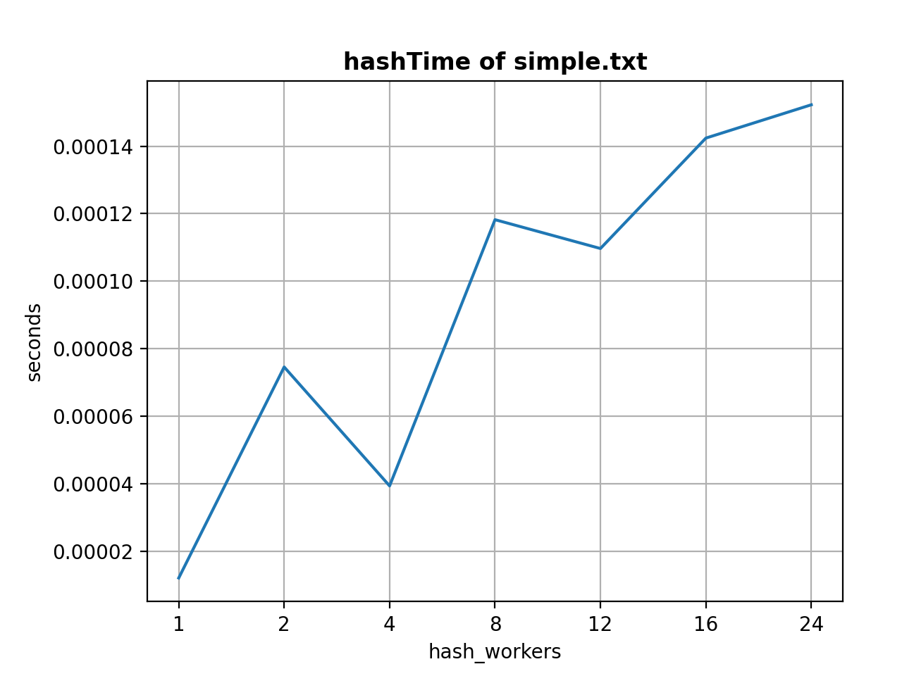
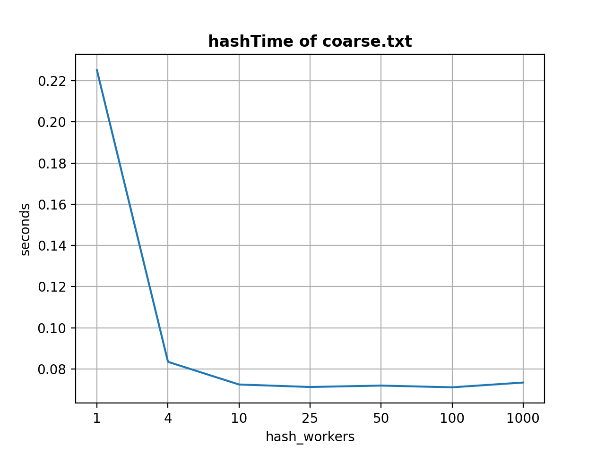
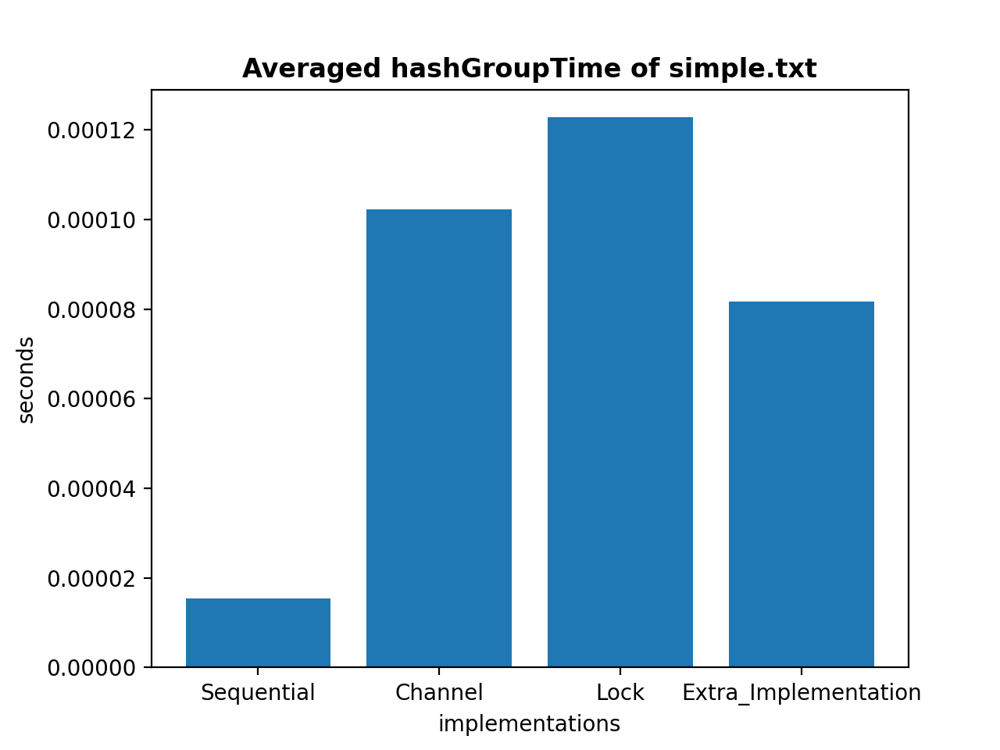
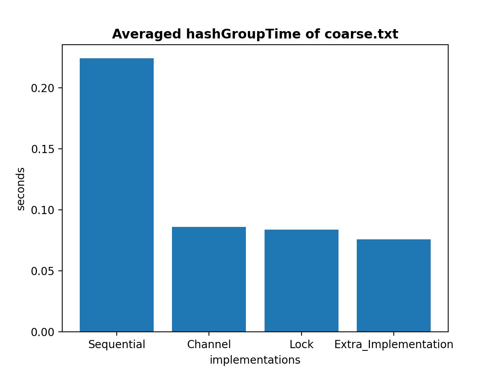
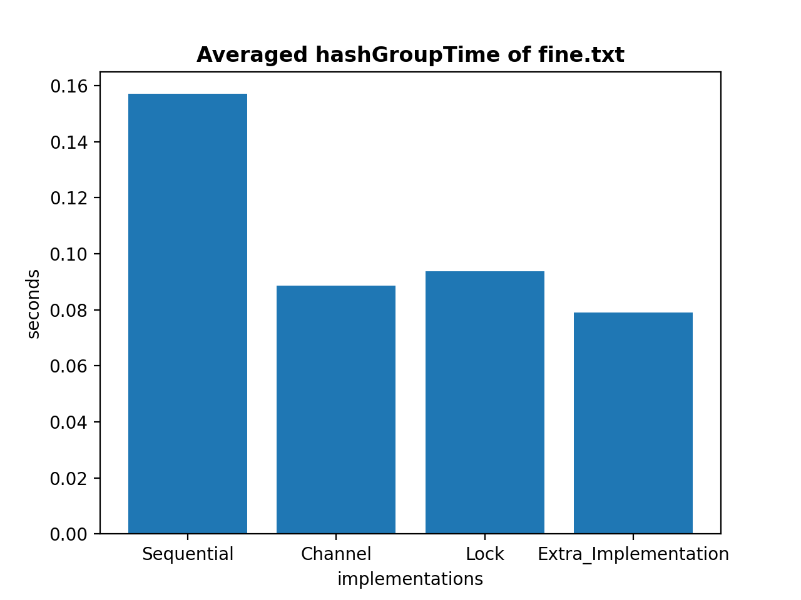

+++
title = 'Exploring Concurrency Programming with Go'
date = 2023-10-24T17:17:01-04:00
startDate = 'Oct 2021'
endDate = 'Oct 2021'
draft = true
+++

- Implemented concurrency programming model to compute BST(binary search tree) equivalence with **Go**
- Used **channels, go-routines, and signaling**
- Spawned threads to parallelize hash operations
- Used a **concurrent buffer** to secure communication among threads
<!--more-->

## Hardware Details & OS Version
- **CPU:** 2 GHz Quad-Core Intel Core i5
- **OS:** macOS Big Sur version 11.6

## Data
- <a href="/datasets/go_tree_comparison/simple.txt">Data1: simple</a>
- <a href="/datasets/go_tree_comparison/coarse.txt">Data2: coarse</a>
- <a href="/datasets/go_tree_comparison/fine.txt">Data3: fine</a>

## Analyze HashTime

> Fig. 1. Hash value computing time compared to Goroutines. Different input files has different hash-workers experiments. Computing time are all measured in seconds.  The x-axis represents the number of hash-workers.

- The above graph shows the computing time for each BST hashes. The red circle indicates the number of hash-workers equal to the input size for a specific input file, for example, “simple.txt” has an input size of 12. When the input size is small, the sequential version is the fastest. The main reason is that our CPU can solve the problem very fast in sequential when the input size is small and the overhead of the data communication in parallel also influence the performance, and thus in small input size case, the sequential version is the fastest. In a small input size case, the sequential version is about 5X times faster than my second implementation that iterates over the available BSTs. However, when the input size increases and the input dimension increases, we can see from the above graph that the program can get benefit from Goroutine implementations compared to the sequential version. 

- My second implementation has better performance than my first implementation in “coarse.txt” and “fine.txt” cases. The main reason is that my laptop has 4 core CPUs, when the number of goroutines reaches the number of cores of my laptop, it can map different jobs to different CPU processors. As the second graph shows, the benefits of parallelism without high amounts of overhead have significant improvement when the number of hash-workers is 4. The third graph above has the same trend when the number of hash-worker is 4. My second implementation performs about 4X times better than my first implementation in both these cases. 

- Go can manage goroutines very well. The main reason is that goroutines have growable segmented stacks and they grows as needed, and the Go runtime does the scheduling, not the OS.

- However, I still think we have to worry about or pay attention to the number of goroutines because when we know the hardware, we can get the best performance for our program. 

- If the number of goroutines is less than the number of CPU cores, the program cannot get the best performance on specific hardware even if the Go runtime can schedule the goroutine very well. If the number of goroutines is much more than the number of CPU cores, it will also have some overhead when creating the segment stack even if only 3 registers need when goroutine switch context, and thus I think we also can’t get ideal performance on this setup. In both “coarse.txt” and “fine.txt” cases, I can get the best performance when my second implementation has 4 hash-workers which is the number of the CPU cores and it can also get ideal performance when the number of hash-workers is in a reasonable range. So I think this is kind of proof.

## Analyze Averaged HashGroupTime

> Fig. 2. Averaged hashGroupTime for different input file. There are four different implementations tested on each input file: Sequential version, Channel version, Lock version and Extra Implementation for extra credit. All computing time are measured in seconds. 

- In the “simple.txt” scenario, the sequential version implementation is the fastest. In both the “coarse.txt” and “fine.txt” scenarios, the Channel version implementation is the fastest. The main reason is that when the input size is small, the concurrency mechanism has the drawback that it has to communicate between other goroutines when modifying shared data and in this scenario, this has a significant influence. However, when the input size is large like in the “coarse.txt” case which almost doesn’t have a high amount of overhead, we can see both the Channel version and Lock version can have better performance than the Sequential version and Channel version is the fastest.

- In addition, when it comes to the “fine.txt” case, the program also has better performance on the Channel version and the Lock version implementation than the Sequential version, this indicates that our program can scale great in both cases and Channel also is the fastest. 

- The third implementation has more overhead because other threads must wait for the lock to unlock, and in this trying to unlock process, increases the complexity and overhead. We have to handle the lock and unlock procedure by ourselves.

- In the “coarse.txt” case, the Channel version is 2.5X faster than a single thread, and the Lock version is 2.4X faster than a single thread. In addition, the channel implementation is much simpler, the main reason is that I don’t have to worry about the lock, the channel is threaded safe and only one channel changes the data at a time. Furthermore, this result in the channel version has a much simpler implementation, because the channel implicitly handles the lock mechanism, and thus the channel in Go is threaded safe. We don’t have to bother with lock explicitly and this decreases lots of complexity.
 
- For extra credits, I also implement fine-grain synchronization to allow up to data-workers threads to access the data structure at once. It was not access to the shared data structure a bottleneck before. The main reason is that even if it has more parallelism it also has more overhead and it also has to wait for other threads to unlock the shared data structure. These extra implementations also are not simpler than the previous three implementations, because we have to handle the different threads to access data and avoid concurrency errors.

## Analyze Averaged CompareTreeTime

> Fig. 3. Averaged compareTreeTime for different input file. There are three different implementation for each input file: Sequential, Goroutine per BST and Concurrent Buffer. All computing time measured in seconds.

- The above graph shows the compareTreeTime for each input file on different implementations. When comparing the performance of different implementations, the Go per BST has better performance than the Concurrent Buffer, and the Go per BST implementation also has less complexity than the Concurrent Buffer implementation. The main reason is that when we explore concurrent buffer implementation we have to contain mutex to prevent concurrency errors and it also has additional conditional variables to deal with the buffer size. And thus the Go per BST has better performance and less complexity and less overhead. 

- Even if the Concurrent buffer is slower than the Go per BST, it still has better performance than a single thread. The Concurrent buffer is 2X faster than single thread implementation and the Go per BST is 2.3X faster than single thread implementation in the “coarse.txt” case. In the “fine.txt” case, the Concurrent buffer is 1.3X faster than single thread implementation and the Go per BST has 2.8X faster than single thread implementation. It is not worth managing the thread pool, because the go can handle the goroutines correctly most of the time if we give a reasonable number of goroutines in our program. In addition, managing the thread pool also increases the complexity and overhead of our program.

- At last, I spent about 11 days in this lab. I don’t have Golang experience before, and thus I spent 3 days on Golang syntax and concurrent knowledge and the other 8 days to work out the result and the report. Although I spent tons of time on this lab, I like the experience in this lab, because I learned a lot from it, like how to debugging and how to manage goroutines and channel correctly, etc. Thanks!
