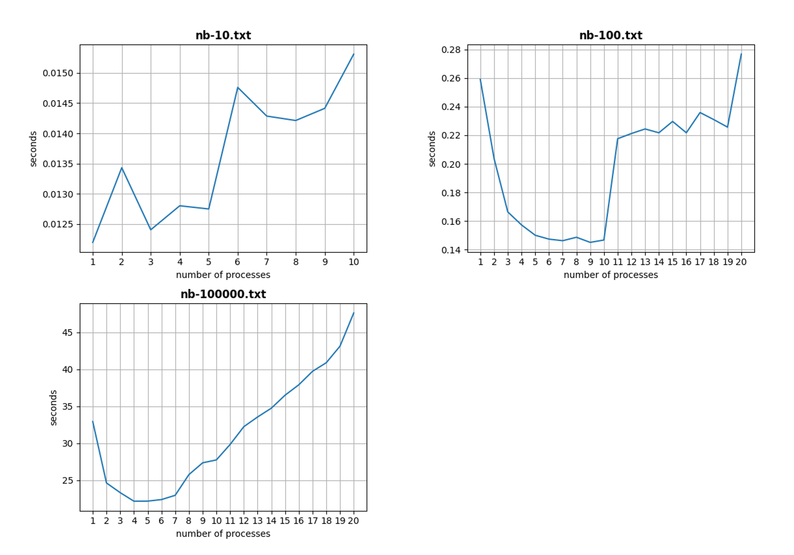
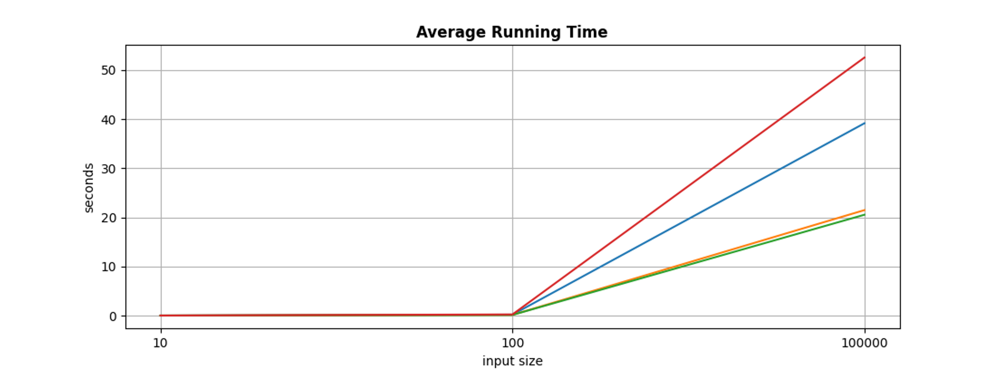

+++
title = 'Exploring Parallel Processes Programming with MPICH Simulating Barnes Hut Algorithm'
date = 2021-12-24T23:24:06-04:00
startDate = 'Nov 2021'
endDate = 'Dec 2021'
draft = true
+++

- Implemented astrophysical simulation solved N-body problem using Barnes-Hut algorithm with **MPICH** by C++
- Programmed **OpenGL** to visualize the movement of the bodies in the domain by C++
- Analyzed performance with the number of bodies, processors, timesteps, iterations
<!--more-->

## Hardware Details & OS Version
- **Processor:** 3.6GHz 10-core Intel Core i9
- **Memory:** 32GB 2667 MHz DDR4
- **OS version:** macOS Big Sur Version 11.6.1

## Data
- <a href="/datasets/mpi_barnes_hut/nb-10.txt">Data1: nb-10.txt</a>
- <a href="/datasets/mpi_barnes_hut/nb-100.txt">Data1: nb-100.txt</a>
- <a href="/datasets/mpi_barnes_hut/nb-100000.txt">Data1: nb-100000.txt</a>

## Analyze
- My approach can be represented by two main parts: the first is constructing a sequential version of the Barnes-Hut Algorithm and implementing OpenGL to visualize the result, the second is implementing API of MPI to take advantage of parallel from different processes.

- In my second part, I tried to implement the method introduced by Grama in the reference paper which is “Scalable Parallel Formulations of the Barnes-Hut Method for n-Body Simulations”, however, in my implementation, after each process computes the trees locally, I cannot get the ideal performance on merging trees part. The paper said the only information that needs to be communicated for merging trees is the number of particles and the center of mass. From my understanding I need to construct a parent node above previous processes, however, I found out that I need to construct the whole new tree in the parent process and other processes need to send the nodes messages of the local tree to parent process because different processes do not share memories and after “Allgather” method, then other processes can traverse the tree during force computing part. These messages passing in tree merging impact performance dramatically in my application and thus in my final submission I didn’t utilize the tree merging method introduced by Grama in the paper. 

- However, I implement force computation with MPI and get an obvious performance boost when running my program in multiple processes scenarios. I split input nodes which used to construct the tree into #(number of inputs/number of processes) parts. I set the last rank to be the root process that implements “Gather” and “Scatter” method because, in this setting, it can handle the situation that processes cannot split input nodes equally. And the root process which implements the “Gather” and “Scatter” method does not need to pay attention to the size of messages, because the unevenly be separated input nodes will within the last rank which is the root process.

> Fig. 1. Performance measurement by fixing the number of steps(-s parameter to 1000), the number of threshold for MAC(-t parameter to 1.0) and the timestep(-d parameter to 0.04).

- In Fig. 1., I measured the performance of my program from different input sizes by fixing other parameters. In a small input size case(“nb-10.txt”), my program cannot take advantage of the parallel and it can get the best performance when the number of processes is one that is sequentially implemented as shown in the first graph in Fig 1. The main reason is that in a modern computer, the CPU is very powerful it can handle instructions very fast in a sequential style in small input size case. In addition, the small input size will have more overhead on message passing if the number of processes is greater than one which is parallelly implemented. Thus when I increase the number of processes, it will have more overhead on message passing and it will impact the performance of the program. In the (“nb-100.txt”) input scenario, our program can get benefit from parallel. It can get the best performance when the number of processes is around 10 shown as in the second graph in Fig 1, the main reason is that my processor has 10 cores and thus different cores in the processor can handle different processes separately. When I increase the number of processes from 1 to 10, the performance is improved significantly, this indicates that we can get benefit from the computing force in a parallel style. However, when the number of processes is greater than 10, the performance is decreased, some processes are idle during the run time because all 10 cores in processor work on 10 processes separately and the scheduler will let other processes wait for these 10 processes. In a large input size case(“nb-100000.txt”) case, my program has similar improvement when increasing the number of processes. It also can get benefit from the parallel and it can get best performance when the number of processes is around five. However, the performance decreased earlier than the (“nb-100.txt”) case, the main reason is that a large input size has more overhead on the communication between processes during computing force. It has to gather all data computed in local processes in each iteration step and thus the running time in large input size case increasing earlier than previous case. 

> Fig. 2. Average running time by fixing the number of processes(-np parameter to 4), the number of steps(-s parameter to 1000) and the timestep(-d parameter to 0.04). NAÏVE is the quadratic relationship.

- The running time results in Fig 2 indicates that the Barnes-Hut approximation can significantly speed up computation about 2.5X when theta is setting to 1.0 or 1.5 comparing to the NAÏVE case. As expected, the naïve approach exhibits a quadratic relationship, whereas increasing the theta parameter leads to faster calculations. It does not fare better than the naïve approach until processing the largest input file. Until that point, the overhead of quadtree construction and center of mass calculation outstrips any gains in force estimation. For theta=1 and theta=1.5, however, we see a significant improvement in running time, with similar performance for each.