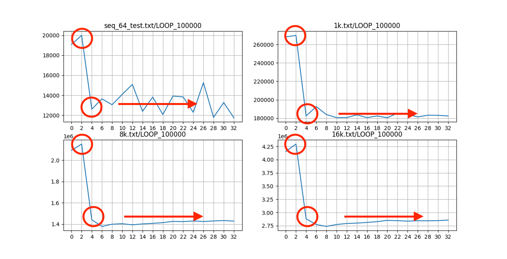
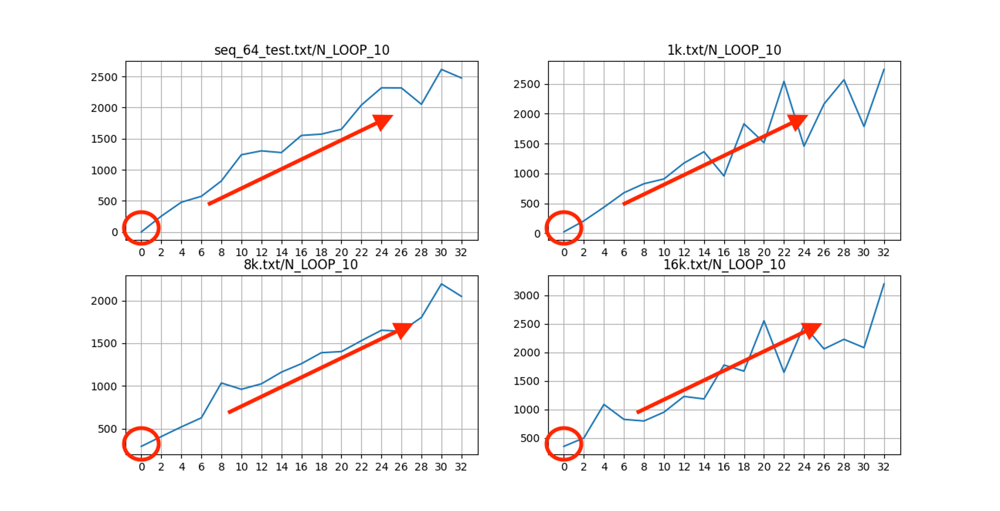
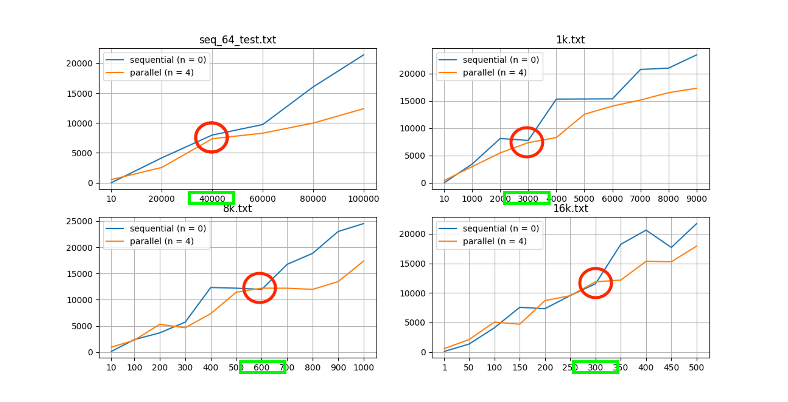
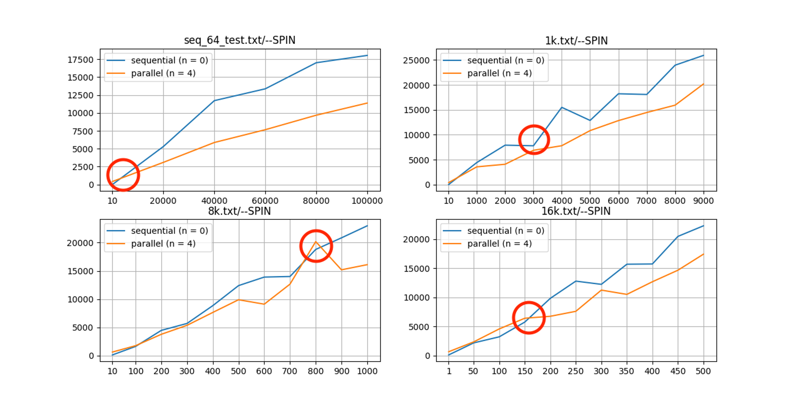
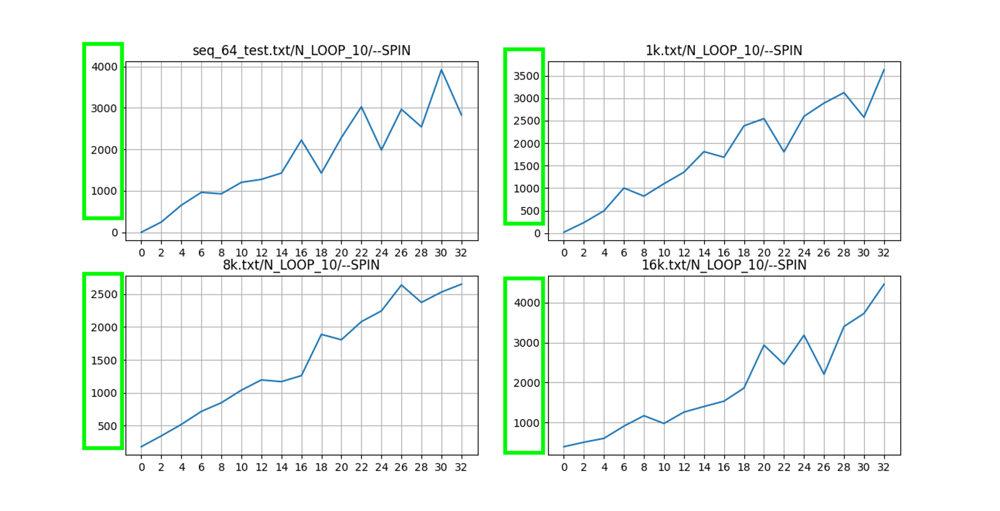

+++
title = 'Exploring Multithreaded Programming with Pthreads Solving Parallel Prefix Scan Algorithm'
date = 2021-09-24T18:44:08-04:00
startDate = 'Sep 2021'
endDate = 'Sep 2021'
draft = true
+++

- Implemented base **sequential** version of work-efficient parallel prefix sum algorithm by C++
- Implemented **parallel** and **barrier** versions of work-efficient parallel prefix sum with **POSIX thread (pthread)** by C++
- Analyzed speedup among the all implantations with respect to the number of threads and data size

<!--more-->

## Data
- <a href="/datasets/pthread_prefix_sum/1k.txt">Data1: 1k</a>
- <a href="/datasets/pthread_prefix_sum/8k.txt">Data2: 8k</a>
- <a href="/datasets/pthread_prefix_sum/16k.txt">Data3: 16k</a>
- <a href="/datasets/pthread_prefix_sum/seq_64_test.txt">Data4: seq_64_test</a>

## Abstract
- I use Work Efficient Algorithm with building blocks style to compute prefix sum of large array. My work-efficient algorithm has O(log N) time and O(N) work.

## Implementation Details for Work-Efficiency Algorithm
1. I separate input data into same size blocks. (num_blocks = ceil(log2(N)))

2.	I compute local prefix sums for these blocks in parallel. It has O(num_blocks) = O(log N) time, and O(num_blocks) * ceil(N / num_blocks) ~ O(N) work.

3.	I store the last element of each blocks into an 2D array, and then I compute prefix sum of this 2D array in parallel, because this 2D array has very small size than input size, so I choose Hillis’s prefix sum algorithm to compute this 2D array in parallel. The main reason is in this step I do care about the time efficiency not the work efficiency in parallel, and this 2D array has very small size which is equal to the number of blocks, so here we should use work-inefficient algorithm which is Hillis’s prefix sum algorithm. It has O(log(N / num_blocks)) = O(log N) time, and O(N/num_blocks * log(N/num_blocks)) = O(n) work. 

4.	At last, add 2D array to each blocks in proper places in parallel. It also has O(num_blocks) = O(log N) time here, and also has O(num_blocks) * ceil(N / num_blocks) ~ O(N) work.

Analysis:
  - Time: O(log N)
  - Work: O(N)

## Analyze Each Step

### Step 1

